The squared error derivative If you are familiar with calculus, the partial derivative of the SSE cost function with respect to the jth weight can be obtained as follows:
$$
\frac{dJ}{dw_j} = \frac{d}{dw_j}\sum_i{(y^{(i)}- \phi(z^{(i)}))^2} = - \sum_i(y^{(i)} - \phi (z^{(i)}))x_j^{(i)}
$$

```python
class LogisticRegression():
    def __init__(self, eta=0.001, epochs=50, random_state=1):
        self.eta = eta
        self.epochs = epochs
        self.random_state = random_state
    
    def fit(self, X, y):
        rgen = np.random.RandomState(self.random_state)
        self.w_ = rgen.normal(loc=0, scale=0.1, size=X.shape[1] + 1)
        self.loss_ = {}
        for i in range(self.epochs):
            predicitons = self.predict(X)
            error = (y - predicitons)
            self.w_[0] += self.eta * error.sum()
            self.w_[1:] += self.eta * X.T.dot(error)
            
            self.loss_[i] = self.loss(predicitons, y)
        return self.w_
    
    def predict(self, X):
        predict = np.dot(X, self.w_[1:]) + self.w_[0]
        return self.sigmoid(predict)
    
    def sigmoid(self, predictions):
        return 1 / (1 + np.exp(-predictions))
    
    
    def loss(self, prediction, y):
        return -np.dot(y, np.log(prediction)) - np.dot((1-y), np.log(1-prediction))
    
    
```


## Logistic Regression


The logit function takes input values in the range 0 to 1 and transforms them to values over the entire real-number range, which we can use to express a linear relationship between feature values and the log-odds:
$$
logit(p(y=1|\bold x)) = \sum_{i=0}^{m}w_ix_i = \bold w^T \bold x 
$$
Now, we are actually interested in predicting the probability that a certain example belongs to a particular class, which is the inverse form of the logit function.  It is also called the logistic sigmoid function, which is sometimes simply abbreviated to sigmoid function due to its characteristic S-shape:
$$
\phi(z) = \frac{1}{1+e^{-z}}
$$
Let's first define the **likelihood**, L, that we want to maximize when we build a logistic regression model, assuming that the individual examples in our dataset are independent of one another. The formula is as follows:
$$
L(\bold w) = P(\bold y | \bold{x;w}) = \prod_{i=1}^{n} P(y^{(i)} | x^{(i)}; \bold w) = \prod_{i=1}^{n} (\phi(z^{i}))^{y^{(i)}} (1 - \phi (z^{(i)}))^{1-y^{(i)}}
$$
In practice, it is easier to maximize the (natural) log of this equation, which is called the **log-likelihood function**:
$$
l(\bold w) = logL(\bold w) = \sum_{i=1}^{n} [y^{(i)}log(\phi(z^{(i)})) + (1-y^{(i)})log(1-\phi(z^{(i)}))] \\ 
\\
J(\bold w) = \sum_{i=1}^{n} [-y^{(i)}log(\phi(z^{(i)})) - (1-y^{(i)})log(1-\phi(z^{(i)}))]
$$
J(w) - cost function. Since maximizing the log-likelihood is equal to minimizing the cost function, J, that we defined earlier, we can write the gradient descent update rule as follows:
$$
\bold w = \bold w + (-\eta \frac{dJ}{dw_j}) = \bold w + \eta \sum_{i=1}^{n} (y^{(i)} - \phi(z^{(i)}))x_j^{(i)}
$$


### Regularization


L2 regularization:
$$
\frac{\lambda}{2}||\bold w||^2 = \frac{\lambda}{2}\sum_{j=1}^{m}w_j^2
$$
L1 regularization:
$$
||w|| = \sum_{j=1}^m |w_j|
$$


In contrast to L2 regularization, L1 regularization usually yields sparse feature vectors and most feature weights will be zero.

## Support Vector Machine


Another powerful and widely used learning algorithm is the support vector machine (SVM), which can be considered an extension of the perceptron. Using the perceptron algorithm, we minimized misclassification errors. However, in SVMs our optimization objective is to maximize the margin. The margin is defined as the distance between the separating hyperplane (decision boundary) and the training examples that are closest to this hyperplane, which are the so-called support vectors. 

The basic idea behind **kernel methods** to deal with such linearly inseparable data is to create nonlinear combinations of the original features to project them onto a higher-dimensional space via a mapping function, 𝜙𝜙, where the data becomes linearly separable. 

To solve a nonlinear problem using an SVM, we would transform the training data into a higher-dimensional feature space via a mapping function, 𝜙𝜙, and train a linear SVM model to classify the data in this new feature space. Then, we could use the same mapping function, 𝜙𝜙, to transform new, unseen data to classify it using the linear SVM model. 

However, one problem with this mapping approach is that the construction of the new features is computationally very expensive, especially if we are dealing with high-dimensional data. This is where the so-called kernel trick comes into play. 

 In order to save the expensive step of calculating this dot product between two points explicitly, we define a so-called kernel function:
$$
k(\bold x^{(i)}, \bold x^{(j)}) = \phi(x^{(i)})^T\phi(x^{(j)})
$$
One of the most widely used kernels is the radial basis function (RBF) kernel, which can simply be called the Gaussian kernel:
$$
k(\bold x^{(i)}, \bold x^{(j)}) = exp(-\frac {||x^{(i)}- x^{(j)}||^2}{2\sigma^2} )
\\
or
\\
k(\bold x^{(i)}, \bold x^{(j)}) = exp(-\gamma||x^{(i)}- x^{(j)}||^2)
$$


## Decision Tree Classifier

In order to split the nodes at the most informative features, we need to define an objective function that we want to optimize via the tree learning algorithm. Here, our objective function is to maximize the IG at each split, which we define as follows:
$$
IG(D_p, f) = I(D_p) - \sum_{i=1}^m \frac{N_j}{N_p}I(D_j)
$$
Here, f is the feature to perform the split; 𝐷𝑝 and 𝐷𝑗 are the dataset of the parent and jth child node; I is our impurity measure; 𝑁𝑝 is the total number of training examples at the parent node; and 𝑁𝑗 is the number of examples in the jth child node. As we can see, the information gain is simply the difference between the impurity of the parent node and the sum of the child node impurities—the lower the impurities of the child nodes, the larger the information gain. However, for simplicity and to reduce the combinatorial search space, most libraries (including scikit-learn) implement binary decision trees:
$$
IG(D_p, f) = I(D_p) - \frac{N_{left}}{N_p}I(D_{left}) - \frac{N_{right}}{N_p}I(D_{right})
$$
The three impurity measures or splitting criteria that are commonly used in binary decision trees are Gini impurity (𝐼𝐺), entropy (𝐼𝐻 ), and the classification error (𝐼𝐸). Let's start with the definition of entropy for all non-empty classes (𝑝(𝑖|𝑡) ≠ 0):
$$
I_H(t) = - \sum_{i=1}^c p(i|t)log_2p(i|t)
$$
Here, 𝑝𝑝(𝑖𝑖|𝑡𝑡) is the proportion of the examples that belong to class i for a particular node, t.

The Gini impurity can be understood as a criterion to minimize the probability of misclassification:
$$
I_G(t) = \sum_{i=1}^c p(i|t)(1 - p(i|t)) = 1 - \sum_{i=1}^c p(i|t)^2
$$

## Random Forest


The random forest algorithm can be summarized in four simple steps: 

1. Draw a random bootstrap sample of size n (randomly choose n examples from the training dataset with replacement). 
2. Grow a decision tree from the bootstrap sample. At each node: 
   * Randomly select d features without replacement. 
   * Split the node using the feature that provides the best split according to the objective function, for instance, maximizing the information gain. 
3. Repeat the steps 1-2 k times. 
4. Aggregate the prediction by each tree to assign the class label by majority vote.


## Naive Bayes Classification


Naive Bayes classifiers are built on Bayesian classification methods. These rely on Bayes’s theorem, which is an equation describing the relationship of conditional probabilities of statistical quantities. In Bayesian classification, we’re interested in finding the probability of a label given some observed features, which we can write as P(L|features) . Bayes’s theorem tells us how to express this in terms of quantities we can compute more directly:
$$
P(L|features) = \frac{P(features| L)P(L)}{P(features)}
$$
If we are trying to decide between two labels—let’s call them L1 and L2 —then one way to make this decision is to compute the ratio of the posterior probabilities for each label:
$$
\frac{P(L_1|features)}{P(L_2|features)} = \frac{P(L_1|features)P(L_1)}{P(L_2|features)P(L_2)}
$$
All we need now is some model by which we can compute P features Li for each label. Such a model is called a generative model because it specifies the hypothetical random process that generates the data. Specifying this generative model for each label is the main piece of the training of such a Bayesian classifier. The general ver‐ sion of such a training step is a very difficult task, but we can make it simpler through the use of some simplifying assumptions about the form of this model. This is where the “naive” in “naive Bayes” comes in: if we make very naive assump‐ tions about the generative model for each label, we can find a rough approximation of the generative model for each class, and then proceed with the Bayesian classification. Different types of naive Bayes classifiers rest on different naive assumptions about the data:

* Gaussian Naive Bayes -  the assumption is that data from each label is drawn from a simple Gaussian distribution.
* Multinomial Naive Bayes - the features are assumed to be generated from a simple multinomial distribution.
* 


## Feature Selection


A classic sequential feature selection algorithm is sequential backward selection (SBS), which aims to reduce the dimensionality of the initial feature subspace with a minimum decay in the performance of the classifier to improve upon computational efficiency.

The idea behind the SBS algorithm is quite simple: SBS sequentially removes features from the full feature subset until the new feature subspace contains the desired number of features. In order to determine which feature is to be removed at each stage, we need to define the criterion function, J, that we want to minimize. 

The criterion calculated by the criterion function can simply be the difference in performance of the classifier before and after the removal of a particular feature. Then, the feature to be removed at each stage can simply be defined as the feature that maximizes this criterion; or in more simple terms, at each stage we eliminate the feature that causes the least performance loss after removal. Based on the preceding definition of SBS, we can outline the algorithm in four simple steps: 

1. Initialize the algorithm with k = d, where d is the dimensionality of the full feature space, 𝑿𝑑. 
2. Determine the feature, 𝒙−, that maximizes the criterion: 𝒙− = argmax 𝐽(𝑿𝑘 − 𝒙), where 𝒙 ∈ 𝑿𝑘. 
3. Remove the feature, 𝒙−, from the feature set: 𝑿𝑘−1 = 𝑿𝑘 − 𝒙− ; 𝑘 = 𝑘 − 1. 
4. Terminate if k equals the number of desired features; otherwise, go to step 2

Also we can select features use random forest importance, l1 regularization.


## Feature Extraction


In this chapter, we will cover the following topics: 

* Principal component analysis (PCA) for unsupervised data compression 
* Linear discriminant analysis (LDA) as a supervised dimensionality reduction technique for maximizing class separability 
* Nonlinear dimensionality reduction via kernel principal component analysis (KPCA)


### Principal component analysis


If we use PCA for dimensionality reduction, we construct a 𝑑𝑑 × 𝑘𝑘-dimensional transformation matrix, W, that allows us to map a vector, x, the features of a training example, onto a new k-dimensional feature subspace that has fewer dimensions than the original d-dimensional feature space. For instance, the process is as follows. Suppose we have a feature vector, x: x = [x_1, x_2, ..., x_d] which is then transformed by a transformation matrix,
$$
\bold {xW} = \bold z
$$
resulting in the output vector: z = [z_1, z_2, ..., z_k]

As a result of transforming the original d-dimensional data onto this new k-dimensional subspace (typically k << d), the first principal component will have the largest possible variance. All consequent principal components will have the largest variance given the constraint that these components are uncorrelated (orthogonal) to the other principal components—even if the input features are correlated, the resulting principal components will be mutually orthogonal (uncorrelated). Note that the PCA directions are highly sensitive to data scaling, and we need to standardize the features prior to PCA if the features were measured on different scales and we want to assign equal importance to all features.

Before looking at the PCA algorithm for dimensionality reduction in more detail, let's summarize the approach in a few simple steps: 

1. Standardize the d-dimensional dataset. 

2. Construct the covariance matrix. For example, the covariance between two features, 𝑥𝑥𝑗𝑗 and 𝑥𝑥𝑘𝑘, on the population level can be calculated via the following equation:
   $$
   \sigma_{jk} = \frac{1}{n-1}\sum_{i=1}^{n}(x_j^{(i)}-\mu_j)(x_k^{(i)} - \mu_k)
   $$
    Note that the sample means are zero if we standardized the dataset. That's mean:
$$
   \sigma_{jk} = \frac{1}{n-1} \sum_{i=1}^n x_j^{(i)}x_k^{(i)}
$$


3. Decompose the covariance matrix into its eigenvectors and eigenvalues. 

4. Sort the eigenvalues by decreasing order to rank the corresponding eigenvectors. 

5. Select k eigenvectors, which correspond to the k largest eigenvalues, where k is the dimensionality of the new feature subspace (𝑘𝑘 ≤ 𝑑𝑑). 

6. Construct a projection matrix, W, from the "top" k eigenvectors.

7. Transform the d-dimensional input dataset, X, using the projection matrix, W, to obtain the new k-dimensional feature subspace.

```python
scaler = StandardScaler()
X_train = scaler.fit_transform(X_train)
X_test = scaler.transform(X_test)
cov_mat = np.cov(X_train.T)
eigen_vals, eigen_vecs = np.linalg.eig(cov_mat)
eigen_pairs = [(np.abs(eigen_vals[i]), eigen_vecs[:, i]) for i in range(len(eigen_vals))]
eigen_pairs.sort(key=lambda k: k[0], reverse=True)
w = np.hstack((eigen_pairs[0][1][:, np.newaxis], eigen_pairs[1][1][:, np.newaxis]))
X_train_pca = X_train.dot(w)
```


### Linear Discriminant Analysis


The general concept behind LDA is very similar to PCA, but whereas PCA attempts to find the orthogonal component axes of maximum variance in a dataset, the goal in LDA is to find the feature subspace that optimizes class separability.

One assumption in LDA is that the data is normally distributed. Also, we assume that the classes have identical covariance matrices and that the training examples are statistically independent of each other. However, even if one, or more, of those assumptions is (slightly) violated, LDA for dimensionality reduction can still work reasonably well.

Before we dive into the code implementation, let's briefly summarize the main steps that are required to perform LDA: 

1. Standardize the d-dimensional dataset (d is the number of features). 
2. For each class, compute the d-dimensional mean vector. 
3. Construct the between-class scatter matrix, 𝑺𝐵, and the within-class scatter matrix, 𝑺𝑤.
4. Compute the eigenvectors and corresponding eigenvalues of the matrix, 𝑺𝑊^(-1) * 𝑺𝐵. 
5. Sort the eigenvalues by decreasing order to rank the corresponding eigenvectors. 
6. Choose the k eigenvectors that correspond to the k largest eigenvalues to construct a 𝑑 × 𝑘-dimensional transformation matrix, W; the eigenvectors are the columns of this matrix. 
7. Project the examples onto the new feature subspace using the transformation matrix, W

 Each mean vector, 𝒎𝑖 , stores the mean feature value, 𝜇𝜇𝑚𝑚, with respect to the examples of class i.

Using the mean vectors, we can now compute the within-class scatter matrix, 𝑺𝑊:
$$
S_W = \sum_{i=1}^c S_i
\\
\\
S_i = \sum_{x э D_i} (x - m_i)(x - m_i)^T
$$
The assumption that we are making when we are computing the scatter matrices is that the class labels in the training dataset are uniformly distributed.  When we divide the scatter matrices by the number of class examples, 𝑛𝑖, we can see that computing the scatter matrix is in fact the same as computing the covariance matrix, Σ𝑖𝑖 —the covariance matrix is a normalized version of the scatter matrix.

After we compute the scaled within-class scatter matrix (or covariance matrix), we can move on to the next step and compute the between-class scatter matrix 𝑺𝑩:
$$
S_B = \sum_{i=1}^c n_i (m_i - m) (m_i - m)^T
$$
Here, m is the overall mean that is computed, including examples from all c classes.

The remaining steps of the LDA are similar to the steps of the PCA. However, instead of performing the eigendecomposition on the covariance matrix, we solve the generalized eigenvalue problem of the matrix, 𝑺𝑊^(-1) * 𝑺𝐵. 

```python
d = 13 # number of features
S_W = np.zeros((d, d))
for label, mv in zip(range(3), means):
    class_scatter = np.zeros((d, d))
    cnt = 0
    for row in features[target == label]:
        row, mv = row.reshape(d, 1), mv.reshape(d, 1)
        class_scatter += (row - mv).dot((row - mv).T)
        cnt += 1
    
    S_W += class_scatter / cnt

m = features.mean(axis=0)
S_B = np.zeros((d, d))
for i, mean in enumerate(means):
    n = features[target == i].shape[0]
    mean = mean.reshape(d, 1)
    m = m.reshape(d, 1)
    S_B += n*(mean - m).dot((mean-m).T)

matrix = np.linalg.inv(S_W).dot(S_B)
eigen_vals, eigen_vecs = np.linalg.eig(matrix)
eigen_pairs = [(np.abs(eigen_vals[i]), eigen_vecs[:,i]) 
               for i in range(len(eigen_vals))] 
eigen_pairs = sorted(eigen_pairs,key=lambda k: k[0], reverse=True)
w = np.hstack((eigen_pairs[0][1][:, np.newaxis].real, eigen_pairs[1][1][:, np.newaxis].real))
X_train_lda = features.dot(w)
```


### Kernel PCA


If we are dealing with nonlinear problems, which we may encounter rather frequently in real-world applications, linear transformation techniques for dimensionality reduction, such as PCA and LDA, may not be the best choice.

We perform a nonlinear mapping via KPCA that transforms the data onto a higher-dimensional space. We then use standard PCA in this higher dimensional space to project the data back onto a lower-dimensional space where the examples can be separated by a linear classifier (under the condition that the examples can be separated by density in the input space). However, one downside of this approach is that it is computationally very expensive, and this is where we use the kernel trick. Using the kernel trick, we can compute the similarity between two high-dimension feature vectors in the original feature space.

Covariance matrix:
$$
\sum = \frac{1}{n} \sum_{i=1}^n \bold x^{(i)} \bold x^{(i)^T}
$$
Bernhard Scholkopf generalized this approach (Kernel principal component analysis, B. Scholkopf, A. Smola, and K.R. Muller, pages 583-588, 1997) so that we can replace the dot products between examples in the original feature space with the nonlinear feature combinations via 𝜙:
$$
\sum = \frac{1}{n}\sum_{i=1}^{n} \phi(\bold x^{(i)}) \phi(\bold x^{(i)^T})
$$
To obtain the eigenvectors—the principal components—from this covariance matrix, we have to solve the following equation:
$$
\sum \bold v = \lambda \bold v
\\
=> \frac{1}{n}\sum_{i=1}^n \phi(\bold x^{(i)}) \phi(\bold x^{(i)^T})\bold v = \lambda \bold v
\\
\bold v = \frac{1}{n\lambda}\sum_{i=1}^n \phi(\bold x^{(i)}) \phi(\bold x^{(i)^T}) \bold v = \frac{1}{n}\sum_{i=1}^{n} \bold a^{(i)} \phi(\bold x ^ {(i)})
\\
\bold K = \phi(\bold X) \phi (\bold X)^ T
$$
Here, 𝜆𝜆 and v are the eigenvalues and eigenvectors of the covariance matrix, Σ, and **a** can be obtained by extracting the eigenvectors of the kernel (similarity) matrix, K, as you will see in the following paragraphs.


To summarize what we have learned so far, we can define the following three steps to implement an RBF  (function of similarity) KPCA: 

 1. We compute the kernel (similarity) matrix, K, where we need to calculate the following:
    $$
    k(x^{(i)}, x^{(j)}) = exp(-\gamma(||x^{(i)} - x^{(j)}||^2))
    $$
    For example, if our dataset contains 100 training examples, the symmetric kernel matrix of the pairwise similarities would be 100 × 100-dimensional.

2. We center the kernel matrix, K, using the following equation:
   $$
   \bold K' = \bold K - 1_n\bold K - \bold K1_n +1_n\bold K1_n
   $$
   Here, 𝟏𝒏 is an 𝑛𝑛 × 𝑛𝑛-dimensional matrix (the same dimensions as the kernel matrix) where all values are equal to 1/𝑛 .

3. We collect the top k eigenvectors of the centered kernel matrix based on their corresponding eigenvalues, which are ranked by decreasing magnitude. In contrast to standard PCA, the eigenvectors are not the principal component axes, but the examples already projected onto these axes.

```python
gamma = 15
n_components = 2
# Calculate pairwise squared Euclidean distances
# in the MxN dimensional dataset
sqdists = pdist(x, 'sqeuclidean')
# Convert pairwise distances into a square matrix
mat_sq_dist = squareform(sqdists)
# Compute the symmetric kernel matrix.
K = exp(-gamma * mat_sq_dist)
# Center the kernel matrix.
N = K.shape[0]
one_n = np.ones((N,N)) / N
K = K - one_n.dot(K) - K.dot(one_n) + one_n.dot(K).dot(one_n)
# Obtaining eigenpairs from the centered kernel matrix
# scipy.linalg.eigh returns them in ascending order
eigvals, eigvecs = eigh(K)
eigvals, eigvecs = eigvals[::-1], eigvecs[:, ::-1]
# Collect the top k eigenvectors (projected examples)
alphas = np.column_stack([eigvecs[:, i] for i in range(n_components)])
# Collect the corresponding eigenvalues
lambdas = [eigvals[i] for i in range(n_components)]

```

To project new data we have to calculate the pairwise RBF kernel (similarity) between each ith example in the training dataset and the new example, 𝒙𝒙′:
$$
\phi (x')^T v = \sum_i a^{(i)}\phi(x')^T \phi(x^{(i)}) = \sum_i a^{(i)} k(x', x^{(i)})
$$
After calculating the similarity between the new examples and the examples in the training dataset, we have to normalize the eigenvector, a, by its eigenvalue. 

```python
def project_x(x_new, X, gamma, alphas, lambdas):
	pair_dist = np.array([np.sum((x_new-row)**2) for row in X])
	k = np.exp(-gamma * pair_dist)
	return k.dot(alphas / lambdas)
```


## Manifold learning


## Learning Best Practices for Model Evaluation and Hyperparameter Tuning


Pipeline:

```python
from sklearn.preprocessing import StandardScaler
from sklearn.decomposition import PCA
from sklearn.linear_model import LogisticRegression
from sklearn.pipeline import make_pipeline
pipl = make_pipeline(StandardScaler(),
                    PCA(n_components=2),
                    LogisticRegression())
```

Select parameter with validation curve:

```python
from sklearn.model_selection import validation_curve
param_range = [0.001, 0.01, 0.1, 1.0, 10.0, 100.0]
train_scores, test_scores = validation_curve(
												estimator=pipe_lr,
												X=X_train,
												y=y_train,
												param_name='logisticregression__C',
												param_range=param_range,
												cv=10)
train_mean = np.mean(train_scores, axis=1)
train_std = np.std(train_scores, axis=1)
test_mean = np.mean(test_scores, axis=1)
test_std = np.std(test_scores, axis=1)
plt.plot(param_range, train_mean,
		color='blue', marker='o',
		markersize=5, label='Training accuracy')
plt.fill_between(param_range, train_mean + train_std,
					train_mean - train_std, alpha=0.15,
					color='blue')
plt.plot(param_range, test_mean,
			color='green', linestyle='--',
			marker='s', markersize=5,
			label='Validation accuracy')
plt.fill_between(param_range,
					test_mean + test_std,
					test_mean - test_std,
					alpha=0.15, color='green')
plt.grid()
plt.xscale('log')
plt.legend(loc='lower right')
plt.xlabel('Parameter C')
plt.ylabel('Accuracy')
plt.ylim([0.8, 1.0])
plt.show()
```

Similar to the learning_curve function, the validation_curve function uses stratified k-fold cross-validation by default to estimate the performance of the classifier. Inside the validation_curve function, we specified the parameter that we wanted to evaluate. In this case, it is C, the inverse regularization parameter of the LogisticRegression classifier, which we wrote as 'logisticregression__C' to access the LogisticRegression object inside the scikit-learn pipeline for a specified value range that we set via the param_range parameter.


### Tuning hyperparameters via grid search


```
from sklearn.model_selection import GridSearchCV
from sklearn.svm import SVC
pipe_svc = make_pipeline(StandardScaler(),
						SVC(random_state=1))
						
param_range = [0.0001, 0.001, 0.01, 0.1,
						1.0, 10.0, 100.0, 1000.0]
						
param_grid = [{'svc__C': param_range,
						'svc__kernel': ['linear']},
						{'svc__C': param_range,
						'svc__gamma': param_range,
						'svc__kernel': ['rbf']}]
						
gs = GridSearchCV(estimator=pipe_svc,
						param_grid=param_grid,
						scoring='accuracy',
						cv=10,
						refit=True,
						n_jobs=-1)
						
gs = gs.fit(X_train, y_train)
print(gs.best_score_)
0.9846153846153847
print(gs.best_params_)
{'svc__C': 100.0, 'svc__gamma': 0.001, 'svc__kernel': 'rbf'}
```

### Precision/recall


$$
precision = \frac{TP}{TP + FP}
\\
recall = \frac{TP}{TP + FN}
\\
F1 = 2 \frac{precision*recall}{precision+recall}
$$
The scoring metrics that we've discussed so far are specific to binary classification systems. However, scikit-learn also implements macro and micro averaging methods to extend those scoring metrics to multiclass problems via one-vs.-all (OvA) classification. The micro-average is calculated from the individual TPs, TNs, FPs, and FNs of the system. For example, the micro-average of the precision score in a k-class system can be calculated as follows:
$$
precision_{micro} = \frac{TP_1 + ... + TP_k}{TP_1 + ... + TP_k + FP_1 + ... FP_k}
\\
precision_{macro} = \frac{precision_1 + ... precision_k}{k}
$$

### Imbalanced classes

One way to deal with imbalanced class proportions during model fitting is to assign a larger penalty to wrong predictions on the minority class. Via scikit-learn, adjusting such a penalty is as convenient as setting the class_weight parameter to class_weight='balanced', which is implemented for most classifiers.

Other popular strategies for dealing with class imbalance include upsampling the minority class, downsampling the majority class, and the generation of synthetic training examples.

```python
from sklearn.utils import resample
X_upsampled, y_upsampled = resample(
									X_imb[y_imb == 1],
									y_imb[y_imb == 1],
									replace=True,
									n_samples=X_imb[y_imb == 0].shape[0],
									random_state=123)
```

Similarly, we could downsample the majority class by removing training examples from the dataset. To perform downsampling using the resample function, we could simply swap the class 1 label with class 0 in the previous code example and vice versa.

### How boosting works


In contrast to bagging, the initial formulation of the boosting algorithm uses random subsets of training examples drawn from the training dataset without replacement; the original boosting procedure can be summarized in the following fou2r key steps: 

1. Draw a random subset (sample) of training examples, 𝑑𝑑1, without replacement from the training dataset, D, to train a weak learner, 𝐶𝐶1. 
2. Draw a second random training subset, 𝑑𝑑2, without replacement from the training dataset and add 50 percent of the examples that were previously misclassified to train a weak learner, 𝐶𝐶2. 
3. Find the training examples, 𝑑𝑑3, in the training dataset, D, which 𝐶𝐶1 and 𝐶𝐶2 disagree upon, to train a third weak learner, 𝐶𝐶3. 
4. Combine the weak learners 𝐶𝐶1, 𝐶𝐶2, and 𝐶𝐶3 via majority voting.

Now that we have a better understanding of the basic concept of AdaBoost, let's take a more detailed look at the algorithm using pseudo code. For clarity, we will denote element-wise multiplication by the cross symbol (×) and the dot-product between two vectors by a dot symbol (∙):

1. Set the weight vector, **w**, to uniform weights, where sum of weights = 1

2. For j in m boosting rounds do following:

   * Train a weighted weak learner:  C_j = train(X, y, w)

   * Predict class labels: y^hat = predict(C_j, X)

   * Compute weighted error rate: 
     $$
     \epsilon = w * (\hat y != y)
     $$

   * Compute coefficient:
     $$
     \alpha_j = 0.5 log(\frac{1 - \epsilon}{\epsilon})
     $$

   * Update weights:
     $$
     w := w×exp(-\alpha_j × \hat y × y)
     $$

   * Normalize weights to sum to 1:
     $$
     w := \frac{w}{\sum_i w_i}
     $$

3. Compute the final prediction:
   $$
   \hat y = (\sum_{j=1}^{m}(\alpha_j × predict(C_j, X)) > 0)
   $$

Note that the expression (𝒚̂ ≠ 𝒚) in step 2c refers to a binary vector consisting of 1s and 0s, where a 1 is assigned if the prediction is incorrect and 0 is assigned otherwise.


## Sentiment analysis


When we are analyzing text data, we often encounter words that occur across multiple documents from both classes. These frequently occurring words typically don't contain useful or discriminatory information. In this subsection, you will learn about a useful technique called the term frequency-inverse document frequency (tf-idf), which can be used to downweight these frequently occurring words in the feature vectors. The tf-idf can be defined as the product of the term frequency and the inverse document frequency: 
$$
𝑡f-𝑖df(𝑡, 𝑑) = 𝑡f(𝑡, 𝑑) × 𝑖df(𝑡, 𝑑) 
\\
or
\\
𝑡f-𝑖df(𝑡, 𝑑) = 𝑡f(𝑡, 𝑑) × (1 + 𝑖df(𝑡, 𝑑))
$$


tf(t, d)—the number of times a term, t, occurs in a document, d. It should be noted that, in the bag-of-words model, the word or term order in a sentence or document does not matter. The order in which the term frequencies appear in the feature vector is derived from the vocabulary indices, which are usually assigned alphabetically.
$$
idf(t, d) = log(\frac{n_d}{1 + df(d, t)})
\\
or
\\
idf(t, d) = log(\frac{1 + n_d}{1 + df(d, t)})
$$
Here, nd is the total number of documents, and df(d, t) is the number of documents, d, that contain the term t. 

```python
import numpy as np
from sklearn.feature_extraction.text import CountVectorizer
count = CountVectorizer()
docs = np.array(['The sun is shining', 
                 'The weather is sweet',
                 'The sun is shining, the weather is sweet,'
                 'and one and one is two'])
bag = count.fit_transform(docs)


from sklearn.feature_extraction.text import TfidfTransformer
tfidf = TfidfTransformer(use_idf=True,
							norm='l2',
							smooth_idf=True)
np.set_printoptions(precision=2)
print(tfidf.fit_transform(count.fit_transform(docs)).toarray())
```

To make sure that we understand how TfidfTransformer works, let's walk through an example and calculate the tf-idf of the word 'is' in the third document. The word 'is' has a term frequency of 3 (tf = 3) in the third document, and the document frequency of this term is 3 since the term 'is' occurs in all three documents (df = 3). Thus, we can calculate the inverse document frequency as follows:
$$
idf('is', d_3) = log\frac{1 + 3}{1 + 3} = 0
\\
tfidf('is', 3) = 3 × (0 + 1) = 3
$$
If we repeated this calculation for all terms in the third document, we'd obtain the following tf-idf vectors: [3.39, 3.0, 3.39, 1.29, 1.29, 1.29, 2.0, 1.69, 1.29]. However, notice that the values in this feature vector are different from the values that we obtained from TfidfTransformer that we used previously. The final step that we are missing in this tf-idf calculation is the L2-normalization, which can be applied as follows:
$$
tfidf(d_3)_{norm} = \frac{[3.39, 3.0, 3.39, 1.29, 1.29, 1.29, 2.0, 1.69, 1.29]}{\sqrt{3.39^2 + 3^2 + 3.39^2 + 1.29^2 + 1.29^2 + 1.29^2 + 2^2 + 1.69^2 + 1.29^2}}=
\\
= [0.5, 0.45, 0.5, 0.19, 0.19, 0.19, 0.3, 0.25, 0.19]
$$


### Cleaning text data


### Latent Dirichlet Allocation


LDA is a generative probabilistic model that tries to find groups of words that appear frequently together across different documents. These frequently appearing words represent our topics, assuming that each document is a mixture of different words. The input to an LDA is the bag-of-words model that we discussed earlier in this chapter. Given a bag-of-words matrix as input, LDA decomposes it into two new matrices: 

* A document-to-topic matrix 
* A word-to-topic matrix

LDA decomposes the bag-of-words matrix in such a way that if we multiply those two matrices together, we will be able to reproduce the input, the bag-of-words matrix, with the lowest possible error. 


### RANSAC


Linear regression models can be heavily impacted by the presence of outliers. In certain situations, a very small subset of our data can have a big effect on the estimated model coefficients. There are many statistical tests that can be used to detect outliers, which are beyond the scope of the book. However, removing outliers always requires our own judgment as data scientists as well as our domain knowledge. As an alternative to throwing out outliers, we will look at a robust method of regression using the RANdom SAmple Consensus (RANSAC) algorithm, which fits a regression model to a subset of the data, the so-called inliers. We can summarize the iterative RANSAC algorithm as follows:

1. Select a random number of examples to be inliers and fit the model. 
2. Test all other data points against the fitted model and add those points that fall within a user-given tolerance to the inliers. 
3. Refit the model using all inliers. 
4. Estimate the error of the fitted model versus the inliers. 
5. Terminate the algorithm if the performance meets a certain user-defined threshold or if a fixed number of iterations were reached; go back to step 1 otherwise.


### Residual plots


Since our model uses multiple explanatory variables, we can't visualize the linear regression line (or hyperplane, to be precise) in a two-dimensional plot, but we can plot the residuals (the differences or vertical distances between the actual and predicted values) versus the predicted values to diagnose our regression model. Residual plots are a commonly used graphical tool for diagnosing regression models. They can help to detect nonlinearity and outliers, and check whether the errors are randomly distributed.

```python
plt.scatter(y_train_pred, y_train_pred - y_train,
			c='steelblue', marker='o', edgecolor='white',
			label='Training data')
plt.scatter(y_test_pred, y_test_pred - y_test,
			c='limegreen', marker='s', edgecolor='white',
			label='Test data')
plt.xlabel('Predicted values')
plt.ylabel('Residuals')
plt.legend(loc='upper left')
plt.hlines(y=0, xmin=-10, xmax=50, color='black', lw=2)
plt.xlim([-10, 50])
plt.show()
```

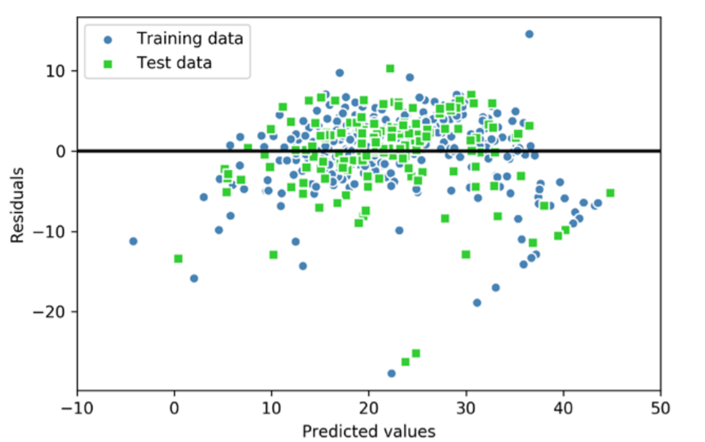

In the case of a perfect prediction, the residuals would be exactly zero, which we will probably never encounter in realistic and practical applications. However, for a good regression model, we would expect the errors to be randomly distributed and the residuals to be randomly scattered around the centerline. If we see patterns in a residual plot, it means that our model is unable to capture some explanatory information, which has leaked into the residuals, as you can slightly see in our previous residual plot. Furthermore, we can also use residual plots to detect outliers, which are represented by the points with a large deviation from the centerline.


### Using regularized methods for regression


The most popular approaches to regularized linear regression are the so-called Ridge Regression, least absolute shrinkage and selection operator (LASSO), and elastic Net.

Ridge Regression is an L2 penalized model where we simply add the squared sum of the weights to our least-squares cost function:
$$
J(\bold w)_{Ridge} = \sum_{i=1}^n (y^{(i)} - \hat y^{(i)})^2 +\lambda ||\bold w||_2^2
\\
||\bold w||_2^2 = \sum_{j=1}^{m} w_j^2
$$
By increasing the value of hyperparameter 𝜆, we increase the regularization strength and thereby shrink the weights of our model. Please note that we don't regularize the intercept term, 𝑤0.

An alternative approach that can lead to sparse models is LASSO. Depending on the regularization strength, certain weights can become zero, which also makes LASSO useful as a supervised feature selection technique:
$$
J(\bold w)_{Lasso} = \sum_{i=1}^n (y^{(i)} - \hat y^{(i)})^2 +\lambda ||\bold w||_1
\\
||\bold w||_1 = \sum_{j=1}^{m} |w_j|
$$
However, a limitation of LASSO is that it selects at most n features if m > n, where n is the number of training examples. In practice, however, this property of LASSO is often an advantage because it avoids saturated models. Saturation of a model occurs if the number of training examples is equal to the number of features, which is a form of overparameterization. As a consequence, a saturated model can always fit the training data perfectly but is merely a form of interpolation and thus is not expected to generalize well.

A compromise between Ridge Regression and LASSO is elastic net, which has an L1 penalty to generate sparsity and an L2 penalty such that it can be used for selecting more than n features if m > n:
$$
J(\bold w)_{ElasticNet} = \sum_{i=1}^n (y^{(i)} - \hat y^{(i)})^2 + \lambda_1\sum_{j=1}^{m} w_j^2 + \lambda_2 \sum_{j=1}^{m} |w_j|
$$


### Dealing with nonlinear relationships using random forests


When we used decision trees for classification, we defined entropy as a measure of impurity to determine which feature split maximizes the information gain (IG). we discussed Gini impurity and entropy as measures of impurity, which are both useful criteria for classification. To use a decision tree for regression, however, we need an impurity metric that is suitable for continuous variables, so we define the impurity measure of a node, t, as the MSE instead:
$$
I(t) = MSE(t) = \frac{1}{N_t} \sum_{i э D_t} (y^{(i)} - \hat y ^{(i)})^2
\\
IG(D_p, x_i) = I(D_p) - \frac{N_{left}}{N_p}I(D_{left}) - \frac{N_{right}}{N_p}I(D_{right})\\
\hat y_t = \frac{1}{N_t}\sum y^{(i)}
$$
Here, 𝑁𝑁𝑡𝑡 is the number of training examples at node t, 𝐷𝐷𝑡𝑡 is the training subset at node t, 𝑦𝑦(𝑖𝑖) is the true target value, and 𝑦𝑦̂𝑡𝑡 is the predicted target value.

In the context of decision tree regression, the MSE is often referred to as within node variance, which is why the splitting criterion is also better known as variance reduction.


## Working with Unlabeled Data – Clustering Analysis

### K means

The k-means algorithm belongs to the category of prototype-based clustering. 

Prototype-based clustering means that each cluster is represented by a prototype, which is usually either the centroid (average) of similar points with continuous features, or the medoid (the most representative or the point that minimizes the distance to all other points that belong to a particular cluster) in the case of categorical features. 

Thus, our goal is to group the examples based on their feature similarities, which can be achieved using the k-means algorithm, as summarized by the following four steps: 

1. Randomly pick k centroids from the examples as initial cluster centers. 
2. Assign each example to the nearest centroid, 𝜇(𝑗) ,𝑗 ∈ {1, … , 𝑘}. 
3. Move the centroids to the center of the examples that were assigned to it. 
4. Repeat steps 2 and 3 until the cluster assignments do not change or a user defined tolerance or maximum number of iterations is reached.

### K means++

So far, we have discussed the classic k-means algorithm, which uses a random seed to place the initial centroids, which can sometimes result in bad clustering or slow convergence if the initial centroids are chosen poorly. One way to address this issue is to run the k-means algorithm multiple times on a dataset and choose the best performing model in terms of the SSE. 

Another strategy is to place the initial centroids far away from each other via the k-means++ algorithm, which leads to better and more consistent results than the classic k-means.

The initialization in k-means++ can be summarized as follows:

1. Initialize an empty set, M, to store the k centroids being selected. 

2. Randomly choose the first centroid, 𝝁(𝑗) , from the input examples and assign it to M. 

3. For each example, 𝒙(𝑖) , that is not in M, find the minimum squared distance, 𝑑(𝒙(𝑖) , 𝚳)^2 , to any of the centroids in M. 

4. To randomly select the next centroid, 𝝁^(𝑝) , use a weighted probability distribution equal to
   $$
   \frac{d(\bold \mu^{(p)}, \bold M)^2}{\sum_i d(\bold x^{(i)}, \bold M)^2}
   $$
   
5. Repeat steps 2 and 3 until k centroids are chosen. 

6. Proceed with the classic k-means algorithm.

### Hard versus soft clustering

Hard clustering describes a family of algorithms where each example in a dataset is assigned to exactly one cluster, as in the k-means and k-means++ algorithms that we discussed earlier in this chapter. In contrast, algorithms for soft clustering (sometimes also called fuzzy clustering) assign an example to one or more clusters. A popular example of soft clustering is the fuzzy C-means (FCM) algorithm (also called soft k-means or fuzzy k-means).  Almost a decade later, James C. Bedzek published his work on the improvement of the fuzzy clustering algorithm, which is now known as the FCM algorithm.

The FCM procedure is very similar to k-means. However, we replace the hard cluster assignment with probabilities for each point belonging to each cluster. Here, each value falls in the range [0, 1] and represents a probability of membership of the respective cluster centroid. The sum of the memberships for a given example is equal to 1. As with the k-means algorithm, we can summarize the FCM algorithm in four key steps: 

1. Specify the number of k centroids and randomly assign the cluster memberships for each point. 
2. Compute the cluster centroids, 𝝁(𝑗) ,𝑗 ∈ {1, … , 𝑘}. 
3. Update the cluster memberships for each point. 
4. Repeat steps 2 and 3 until the membership coefficients do not change or a user-defined tolerance or maximum number of iterations is reached.

The objective function of FCM—we abbreviate it as 𝐽𝑚—looks very similar to the within-cluster SSE that we minimize in k-means:
$$
J_m = \sum_{i=1}^n \sum_{j=1}^k w^{(i, j) ^m}||\bold x^{(i)} - \mu^{(j)}||^2_2
$$
 However, note that the membership indicator, 𝑤𝑤(𝑖𝑖,𝑗𝑗) , is not a binary value as in k-means (𝑤𝑤(𝑖𝑖,𝑗𝑗) ∈ {0, 1}), but a real value that denotes the cluster membership probability (𝑤𝑤(𝑖𝑖,𝑗𝑗) ∈ [0, 1]). You also may have noticed that we added an additional exponent to 𝑤𝑤(𝑖𝑖,𝑗𝑗) ; the exponent m, any number greater than or equal to one (typically m = 2), is the so-called fuzziness coefficient (or simply fuzzifier), which controls the degree of fuzziness.

The larger the value of m, the smaller the cluster membership, 𝑤𝑤(𝑖𝑖,𝑗𝑗) , becomes, which leads to fuzzier clusters. The cluster membership probability itself is calculated as follows:
$$
w^{(i, j)} = [\sum_{c=1}^{k} (\frac{||\bold x ^ {(i)} - \bold \mu ^ {(j)} ||_2}{||\bold x ^ {(i)} - \bold \mu ^ {(c)} ||_2})^{\frac{2}{m-1}}] ^ {-1}
$$
The center, 𝝁^(𝑗𝑗) , of a cluster itself is calculated as the mean of all examples weighted by the degree to which each example belongs to that cluster (𝑤𝑤(𝑖𝑖,𝑗𝑗)𝑚𝑚 ):
$$
\mu ^ {(j)} = \frac{\sum_{i=1}^n w ^{(i, j)^m}x^{(i)}}{\sum_{i=1}^n w ^{(i, j)^m}}
$$

### Quantifying the quality of clustering via silhouette plots

Another intrinsic metric to evaluate the quality of a clustering is silhouette analysis, which can also be applied to clustering algorithms other than k-means, which we will discuss later in this chapter. Silhouette analysis can be used as a graphical tool to plot a measure of how tightly grouped the examples in the clusters are. To calculate the silhouette coefficient of a single example in our dataset, we can apply the following three steps:

1. Calculate the cluster cohesion, 𝑎^(𝑖) , as the average distance between an example, 𝒙^(𝑖) , and all other points in the same cluster. 

2. Calculate the cluster separation, 𝑏^(𝑖) , from the next closest cluster as the average distance between the example, 𝒙^(i) , and all examples in the nearest cluster. 

3. Calculate the silhouette, 𝑠^(𝑖) , as the difference between cluster cohesion and separation divided by the greater of the two, as shown here:
   $$
   s^{(i)} = \frac{b^{(i)} - a^{(i)}}{max(b^{(i)}, a^{(i)})}
   $$
   

The silhouette coefficient is bounded in the range –1 to 1. Based on the preceding equation, we can see that the silhouette coefficient is 0 if the cluster separation and cohesion are equal (𝑏𝑏(𝑖𝑖) = 𝑎𝑎(𝑖𝑖) ). Furthermore, we get close to an ideal silhouette coefficient of 1 if 𝑏𝑏(𝑖𝑖) ≫ 𝑎𝑎(𝑖𝑖) , since 𝑏𝑏(𝑖𝑖) quantifies how dissimilar an example is from other clusters, and 𝑎𝑎(𝑖𝑖) tells us how similar it is to the other examples in its own cluster.


### Organizing clusters as a hierarchical tree


The two main approaches to hierarchical clustering are agglomerative and divisive hierarchical clustering. In divisive hierarchical clustering, we start with one cluster that encompasses the complete dataset, and we iteratively split the cluster into smaller clusters until each cluster only contains one example. In this section, we will focus on agglomerative clustering, which takes the opposite approach. We start with each example as an individual cluster and merge the closest pairs of clusters until only one cluster remains.

The two standard algorithms for agglomerative hierarchical clustering are single linkage and complete linkage. Using single linkage, we compute the distances between the most similar members for each pair of clusters and merge the two clusters for which the distance between the most similar members is the smallest. The complete linkage approach is similar to single linkage but, instead of comparing the most similar members in each pair of clusters, we compare the most dissimilar members to perform the merge. 

```python
import numpy as np
import pandas as pd
from scipy.spatial.distance import pdist, squareform
from scipy.cluster.hierarchy import linkage
from scipy.cluster.hierarchy import dendrogram
import matplotlib.pyplot as plt

variables = ['X', 'Y', 'Z']
labels = ['ID_0', 'ID_1', 'ID_2', 'ID_3', 'ID_4']
X = np.random.random_sample((5,3))*10
df = pd.DataFrame(X, index=labels, columns=variables)

row_clusters = linkage(pdist(df, metric='euclidean'), method='complete')
df2 = pd.DataFrame(row_clusters, columns=['row label 1', 'row label 2', 'distance', 'no. of items in cluster'],
                  index=['cluster %d'%(i+1) for i in range(row_clusters.shape[0])])

row_dendr = dendrogram(row_clusters, labels=labels)
plt.tight_layout()
plt.ylabel('eucl distance')
plt.show()
```


### Locating regions of high density via DBSCAN

 density-based spatial clustering of applications with noise (DBSCAN), which does not make assumptions about spherical clusters like k-means, nor does it partition the dataset into hierarchies that require a manual cut-off point. As its name implies, density-based clustering assigns cluster labels based on dense regions of points. In DBSCAN, the notion of density is defined as the number of points within a specified radius, 𝜀𝜀.

According to the DBSCAN algorithm, a special label is assigned to each example (data point) using the following criteria: 

* A point is considered a core point if at least a specified number (MinPts) of neighboring points fall within the specified radius, 𝜀𝜀. 
* A border point is a point that has fewer neighbors than MinPts within ε, but lies within the 𝜀𝜀 radius of a core point. 
* All other points that are neither core nor border points are considered noise points.

After labeling the points as core, border, or noise, the DBSCAN algorithm can be summarized in two simple steps: 

1. Form a separate cluster for each core point or connected group of core points. (Core points are connected if they are no farther away than 𝜀𝜀.) 
2. Assign each border point to the cluster of its corresponding core point.


With an increasing number of features in our dataset—assuming a fixed number of training examples—the negative effect of the curse of dimensionality increases. This is especially a problem if we are using the Euclidean distance metric. However, the problem of the curse of dimensionality is not unique to DBSCAN: it also affects other clustering algorithms that use the Euclidean distance metric, for example, k-means and hierarchical clustering algorithms. In addition, we have two hyperparameters in DBSCAN (MinPts and 𝜀𝜀) that need to be optimized to yield good clustering results. Finding a good combination of MinPts and 𝜀𝜀 can be problematic if the density differences in the dataset are relatively large.


## Implementing a Multilayer Artificial Neural Network from Scratch


Let's summarize the MLP learning procedure in three simple steps: 

1. Starting at the input layer, we forward propagate the patterns of the training data through the network to generate an output. 
   $$
   z_1^{(h)} = a_0^{(in)}w_{0, 1}^{(in)} + a_1^{(in)}w_{1, 1}^{(in)} + ... + a_m^{(in)}w_{m, 1}^{(in)}
   \\
   a_1^{(h)} = \phi(z_1^{(h)})
   $$
   Here, 𝑧𝑧1 (ℎ) is the net input and 𝜙𝜙(∙) is the activation function, which has to be differentiable to learn the weights that connect the neurons using a gradient-based approach. For example:
   $$
   \phi(z) = \frac{1}{1+e^{-z}}
   $$
   For purposes of code efficiency and readability, we will now write the activation in a more compact form using the concepts of basic linear algebra:
   $$
   \bold Z ^{(h)} = \bold A^{(in)} \bold W^{(h)}
   \\
   \bold A ^ {(h)} = \phi(\bold Z^{(h)})
   \\
   \bold Z ^{(out)} = \bold A^{(h)} \bold W^{(out)}
   \\
   \bold A ^ {(out)} = \phi(\bold Z^{(out)})
   $$
   Here, 𝒂^(𝑖n) is our 1 × 𝑚 dimensional feature vector of a sample 𝒙^(𝑖n) plus a bias unit. 𝑾^(ℎ) is an 𝑚 × 𝑑 dimensional weight matrix where d is the number of units in the hidden layer.

   

2. Based on the network's output, we calculate the error that we want to minimize using a cost function that we will describe later. 

3. We backpropagate the error, find its derivative with respect to each weight in the network, and update the model. In backpropagation, we propagate the error from right to left. We start by calculating the error vector of the output layer: (* - element-wise multiplication)
   $$
   \bold \delta^{(out)} = \bold a ^{(out)} - \bold y
   \\
   \delta ^{(h)} = \delta ^{(out)} (\bold W ^{(out)})^T * \frac{\delta\phi(z^{(h)})}{\delta z^{(h)}}
   \\
   \frac{\delta\phi(z^{(h)})}{\delta z^{(h)}} = (a^{(h)} * (1-a^{(h)}))
   $$
   Eventually, after obtaining the 𝛿𝛿 terms, we can now write the derivation of the cost function as follows:
   $$
   \frac{\delta}{\delta w_{i,j}^{(out)}} J(\bold W) = a_j^{(h)}\delta_i^{(out)}
   \\
   \frac{\delta}{\delta w_{i,j}^{(h)}} J(\bold W) = a_j^{(in)}\delta_i^{(h)}
   $$
   Next, we need to accumulate the partial derivative of every node in each layer and the error of the node in the next layer. However, remember that we need to compute ∆𝑖𝑖,𝑗𝑗 (𝑙𝑙) for every sample in the training dataset. Thus, it is easier to implement it as a vectorized version like in our NeuralNetMLP code implementation:
   $$
   ∆^{(h)} = (\bold A^{(in)})^T \delta^{(h)}
   \\
   ∆^{(out)} = (\bold A^{(h)})^T \delta^{(out)}
   $$
   And after we have accumulated the partial derivatives, we can add the following regularization term: (Please note that the bias units are usually not regularized.)
   $$
   ∆ ^{(l)} = ∆ ^{(l)} + \lambda^{(l)}\bold W^{(l)}
   \\
   \bold W^{(l)} = \bold W^{(l)} - \eta∆ ^{(l)}
   $$
   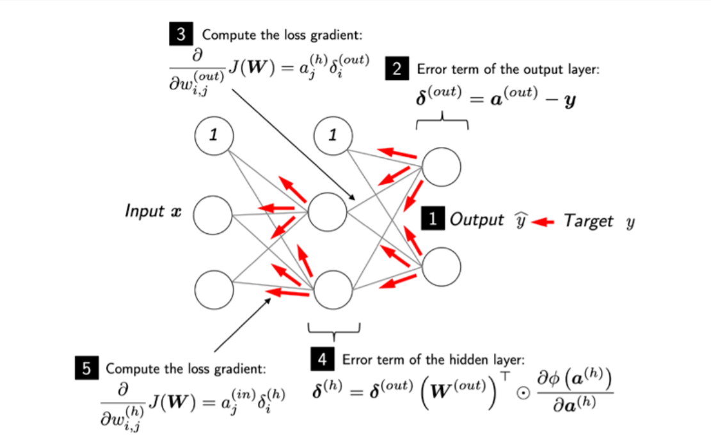

```python
class NeuralNetMLP(object):
    
    def __init__(self, n_hidden=30, l2=0., epochs=100, eta=0.1,
                shuffle=True, minibatch_size=1, seed=None):
        
        self.random = np.random.RandomState(seed)
        self.n_hidden = n_hidden
        self.l2 = l2
        self.epochs = epochs
        self.eta = eta
        self.shuffle = shuffle
        self.minibatch_size = minibatch_size
    
    def _onehot(self, y, n_classes):
        onehot = np.zeros((n_classes, y.shape[0]))
        for idx, val in enumerate(y.astype(int)):
            onehot[val, idx] = 1
        return onehot.T
    
    def _sigmoid(self, z):
        return 1./(1 + np.exp(-np.clip(z, -250, 250)))
    
    def _forward(self, X):
        z_h = np.dot(X, self.w_h) + self.b_h
        a_h = self._sigmoid(z_h)
        
        z_out = np.dot(a_h, self.w_out) + self.b_out
        a_out = self._sigmoid(z_out)
        
        return z_h, a_h, z_out, a_out
    
    def _compute_cost(self, y_enc, output):
        L2_term = (self.l2 * (np.sum(self.w_h ** 2.) + np.sum(self.w_out ** 2.)))
        
        term1 = - y_enc * (np.log(output))
        term2 = (1. - y_enc)*(np.log(1. - output))
        cost = np.sum(term1 - term2) + L2_term
        return cost
    
    def predict(self, X):
        z_h, a_h, z_out, a_out = self._forward(X)
        
        y_pred = np.argmax(z_out, axis=1)
        return y_pred
    
    def fit(self, X_train, y_train, X_valid, y_valid):
        n_output = np.unique(y_train).shape[0]
        n_features = X_train.shape[1]
        
        self.b_h = np.zeros(self.n_hidden)
        self.w_h = np.random.normal(loc=0.0, scale=0.1, size=(n_features, self.n_hidden))
        
        self.b_out = np.zeros(n_output)
        self.w_out = np.random.normal(loc=0.0, scale=0.1, size=(self.n_hidden, n_output))
        
        epoch_strlen = len(str(self.epochs))
        self.eval_ = {'cost':[], 'train_acc':[], 'valid_acc':[]}
        
        y_train_enc = self._onehot(y_train, n_output)
        
        for i in range(self.epochs):
            indices = np.arange(X_train.shape[0])
            
            if self.shuffle:
                self.random.shuffle(indices)
            
            for start_idx in range(0, indices.shape[0] - self.minibatch_size + 1, self.minibatch_size):
                batch_idx = indices[start_idx:start_idx+self.minibatch_size]
                
                z_h, a_h, z_out, a_out = self._forward(X_train[batch_idx])
                
                #backpropogation
                delta_out = a_out - y_train_enc[batch_idx]
                
                sigmoid_derivative_h = a_h * (1. - a_h)
                
                delta_h = (np.dot(delta_out, self.w_out.T)*sigmoid_derivative_h)
                
                grad_w_h = np.dot(X_train[batch_idx].T, delta_h)
                grad_b_h = np.sum(delta_h, axis=0)
                
                grad_w_out = np.dot(a_h.T, delta_out)
                grad_b_out = np.sum(delta_out, axis=0)
                
                delta_w_h = (grad_w_h + self.l2*self.w_h)
                delta_b_h = grad_b_h
                self.w_h -= self.eta * delta_w_h
                self.b_h -= self.eta * delta_b_h
                
                
                delta_w_out = (grad_w_out + self.l2*self.w_out)
                delta_b_out = grad_b_out
                self.w_out -= self.eta * delta_w_out
                self.b_out -= self.eta * delta_b_out
                


            
            #evaluation
            
            z_h, a_h, z_out, a_out = self._forward(X_train)
            cost = self._compute_cost(y_enc=y_train_enc, output=a_out)
            
            y_train_pred = self.predict(X_train)
            y_valid_pred = self.predict(X_valid)
            
            train_acc = ((np.sum(y_train == y_train_pred)).astype(np.float) /
                         X_train.shape[0])
            valid_acc = ((np.sum(y_valid == y_valid_pred)).astype(np.float) /
                         X_valid.shape[0])
            sys.stderr.write('\r%0*d/%d | Cost: %.2f '
                             '| Train/Valid Acc.: %.2f%%/%.2f%% '%
                             (epoch_strlen, i+1, self.epochs, cost,
                              train_acc*100, valid_acc*100))
            sys.stderr.flush()

            self.eval_['cost'].append(cost)
            self.eval_['train_acc'].append(train_acc)
            self.eval_['valid_acc'].append(valid_acc)
            
        return self
```


## Tensorflow


### Tensors

```python
import numpy as np
import tensorflow as tf

a = np.array([1, 2, 3], dtype=np.int32)
b = [4, 5, 6]
#create tensors
t_a = tf.convert_to_tensor(a)
t_b = tf.convert_to_tensor(b)

t_ones = tf.ones((2,3))
#to get access to values
t_ones.numpy()
#creating tensor of constant
const_tensor = tf.constane([1, 5.2, np.pi], dtype=tf.float32)
```

### Manipulating tensors

```python
#change dtype
t_a_new = tf.cast(t_a, tf.int32)
#transpose
t = tf.random.uniform(shape=(3,5))
t_tr = tf.transpose(t)
#reshape
t = tf.zeros((30,))
t_reshape = tf.reshape(t, shape=(5,6))
#removing dimensions
t = tf.zeros((1, 2, 1, 4, 1))
t_sqz = tf.squeeze(t, axis=(2, 4)) # (1, 2, 1, 4, 1) -> (1, 2, 4)
```

### Applying mathematical operations

```python
tf.random.set_seed(1)
t1 = tf.random.uniform(shape=(5, 2), minval=-1.0, maxval=1.0)
t2 = tf.random.normal(shape=(5, 2), mean=0.0, stddev=1.0)
#multiply (element-wise)
t3 = tf.multiply(t1, t2).numpy()

'''To compute the mean, sum, and standard deviation along a certain axis (or axes), we
can use tf.math.reduce_mean(), tf.math.reduce_sum(), and tf.math.reduce_
std().'''

t4 = tf.math.reduce_mean(t1, axis=0)

#matrix-matrix product
t5 = tf.linalg.matmul(t1, t2, transpose_b=True)
#tf.norm()
norm_t1 = tf.norm(t1, ord=2, axis=1).numpy()
```

### Split, stack, and concatenate tensors

```python
#splits with providing number of splits(must be divisible)
t = tf.random.uniform((6,))
t_splits = tf.splits(t, num_or_size_splits=3)
[item.numpy() for item in t_splits]
#specify the sizes of the output tensors directly
t = tf.random.uniformly((5,))
t_splits = tf.splits(t, num_or_size_splits=[3, 2])
#stack and concat
A = tf.ones((3,))
B = tf.zeros((2,))
C = tf.concat([A, B], axis=0) #[1, 1, 1, 0, 0]

A = tf.ones((3,))
B = tf.zeros((3,))
C = tf.concat([A, B], axis=1) #[[1, 1, 1], [0, 0, 0]]
```

### Building input pipelines using tf.data – the TensorFlow Dataset API

If the data already exists in the form of a tensor object, a Python list, or a NumPy array, we can easily create a dataset using the tf.data.Dataset.from_tensor_ slices() function. This function returns an object of class Dataset, which we can use to iterate through the individual elements in the input dataset. As a simple example, consider the following code, which creates a dataset from a list of values:

```python
a = [1.2, 3.4, 7.5, 4.1, 5.0, 1.0]
ds = tf.data.Dataset.from_tensor_slices(a)
#if we want create batches from dataset (size=3)
ds_batch = ds.batch(3)
```

### Combining two tensors into a joint dataset

Often, we may have the data in two (or possibly more) tensors. For example, we could have a tensor for features and a tensor for labels. In such cases, we need to build a dataset that combines these tensors together, which will allow us to retrieve the elements of these tensors in tuples.

Assume that we have two tensors, t_x and t_y. Tensor t_x holds our feature values, each of size 3, and t_y stores the class labels. For this example, we first create these two tensors as follows:

```python
t_x = tf.random.uniform([4,3], dtype=tf.float32)
t_y = tf.range(4)
#joint dataset
ds_x = tf.data.Dataset.from_tensor_slices(t_x)
ds_y = tf.data.Dataset.from_tensor_slices(t_y)

ds_joint = tf.data.Dataset.zip((ds_x, ds_y))

ds_joint = tf.data.Dataset.from_tensor_slices((ds_x, ds_y))
```

Note that a common source of error could be that the element-wise correspondence between the original features (x) and labels (y) might be lost (for example, if the two datasets are shuffled separately). However, once they are merged into one dataset, it is safe to apply these operations

### Shuffle, batch and repeat

```python
ds = ds_joint.shuffle(buffer_size=len(t_x))

ds = ds_joint.batch(batch_size=3, drop_remainder=False)
batch_x, batch_y = next(iter(ds))

#order of function may be changed
#first batch ds, then repeat (copy) this batches and then shuffled them
ds = ds_joint.batch(2).repeat(3).shuffle(4)

for i, (batch_x, batch_y) in enumerate(ds):
  print(i, batch_x.shape, batch_y.numpy())
```


### Load dataset

```python
#first approach
celeba_bldr = tfds.builder('celeb_a')
celeba_bldr.download_and_prepare()
datasets = celeba_bldr.as_dataset(shuffle_files=False)
#second approach - load combines the three steps in one
mnist, mnist_info = tfds.load('mnist', with_info=True, shuffle_files=False)
```

### Building an NN model in TensorFlow

```python
X_train = np.arange(10).reshape((10, 1))
y_train = np.array([1.0, 1.3, 3.1, 2.0, 5.0, 6.3, 6.6, 7.4, 8.0, 9.0])

X_train_norm = (X_train - X_train.mean())/X_train.std()
ds = tf.data.Dataset.from_tensor_slices(tf.cast(X_train_norm, dtype=tf.float32), tf.cast(y_train, dtype=tf.float32))

class MyModel(tf.keras.Model):
  def __init__(self):
    super(MyModel, self).__init__()
    self.w = tf.Variable(0.0, name='weight')
    self.b = tf.Variable(0.0, name='bias')
  def call(self, x):
    return self.w * x + self.b

def loss_fn(y_true, y_pred):
  return tf.reduce_mean(tf.square(y_true - y_pred))

def train(model, inputs, outputs, learning_rate):
  with tf.GradientTape() as tape:
    current_loss = loss_fn(model(inputs), outputs)
  dw, db = tape.gradient(current_loss, [model.w, model.b])
  model.w.assign_sub(learning_rate * dw)
  model.b.assign_sub(learning_rate * db)

model = MyModel()
model.build(input_shape=(None, 1))
model.summary()
tf.random.set_seed(1)
num_epochs = 200
log_steps = 100
learning_rate = 0.001
batch_size = 1
steps_per_epoch = int(np.ceil(len(y_train) / batch_size))
ds_train = ds_train_orig.shuffle(buffer_size=len(y_train))
ds_train = ds_train.repeat(count=None)
ds_train = ds_train.batch(1)
Ws, bs = [], []

for i, batch in enumerate(ds_train):
  if i >= steps_per_epoch * num_epochs:
    # break the infinite loop
    break
  Ws.append(model.w.numpy())
  bs.append(model.b.numpy())
  bx, by = batch
  loss_val = loss_fn(model(bx), by)
  train(model, bx, by, learning_rate=learning_rate)
  if i%log_steps==0:
    print('Epoch {:4d} Step {:2d} Loss {:6.4f}'.format(int(i/steps_per_epoch), i, loss_val))
```


### Activation function

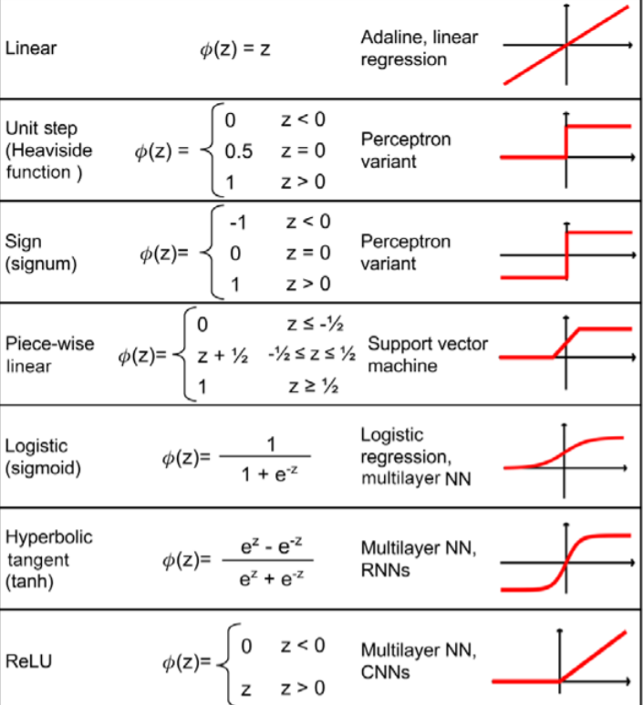


## The mechanics of tensorflow


**Creating a graph in TensorFlow v1.x** 

In the earlier version of the TensorFlow (v1.x) low-level API, this graph had to be explicitly declared. The individual steps for building, compiling, and evaluating such a computation graph in TensorFlow v1.x are as follows: 

1. Instantiate a new, empty computation graph 
2. Add nodes (tensors and operations) to the computation graph 
3. Evaluate (execute) the graph: a. Start a new session b. Initialize the variables in the graph c. Run the computation graph in this session

```python
g = tf.Graph() 
'''
if we do not create a graph, there is default graph to which variables and computations will be added automatically
'''
with g.as_default(): #added nodes to graph
	a = tf.constant(1, name='a')
	b = tf.constant(2, name='b')
	c = tf.constant(3, name='c')
	z = 2*(a-b) + c
```


**Migrating a graph to TensorFlow v2 **

Next, let's look at how this code can be migrated to TensorFlow v2. TensorFlow v2 uses dynamic (as opposed to static) graphs by default (this is also called eager execution in TensorFlow), which allows us to evaluate an operation on the fly. Therefore, we do not have to explicitly create a graph and a session, which makes the development workflow much more convenient:

```python
a = tf.constant(1, name='a')
b = tf.constant(2, name='b')
c = tf.constant(3, name='c')

z = 2*(a-b) + c
```


**Loading input data into a model: TensorFlow v1.x style**

 Another important improvement from TensorFlow v1.x to v2 is regarding how data can be loaded into our models. In TensorFlow v2, we can directly feed data in the form of Python variables or NumPy arrays. However, when using the TensorFlow v1.x low-level API, we had to create placeholder variables for providing input data to a model.

```python
g = tf.Graph()

with g.as_default():
    a = tf.compat.v1.placeholder(shape=None, dtype=tf.int32, name='tf_a')
    b = tf.compat.v1.placeholder(shape=None, dtype=tf.int32, name='tf_b')
    c = tf.compat.v1.placeholder(shape=None, dtype=tf.int32, name='tf_c')
    
    z = 2*(a-b)+c
with tf.compat.v1.Session(graph=g) as sess:
    feed_dict = {a:1, b:2, c:3}
    print(sess.run(z, feed_dict=feed_dict))
```


**Loading input data into a model: TensorFlow v2 style **

In TensorFlow v2, all this can simply be done by defining a regular Python function with a, b, and c as its input arguments, for example:

```python
def compute_z(a, b, c):
	r1 = tf.subtract(a, b)
	r2 = tf.multiply(2, r1)
	z = tf.add(r2, c)
	return z
```

### Improving computational performance with function decoration

```python
'''
@tf.function compile normal python function to a
static TensorFlow graph in order to make computations
more efficient
'''

@tf.function
def compute_z(a, b, c):
  r1 = tf.subtract(a, b)
  r2 = tf.multiply(2, r1)
  z = tf.add(r2, c)
  return z
```

**TensorFlow Variable**

```python
a = tf.Variable(initial_value=3.14, name='var_a')
w = tf.Variable([1, 2, 3], trainable=False)
print(w.assign([3, 1, 4], read_value=True))
w.assign_add([2, -1, 2], read_value=False)
# to initialize weights of NN we can generate a random numbers based on different distrib.
init = tf.keras.initializers.GlorotNormal()
v = tf.Variable(init(shape=(2,3)))

```

When the read_value argument is set to True (which is also the default), these operations will automatically return the new values after updating the current values of the Variable. Setting the read_value to False will suppress the automatic return of the updated value (but the Variable will still be updated in place). 


### Computing the gradients of the loss with respect to trainable variables

Let's work with a simple example where we will compute 𝑧 = 𝑤x+ 𝑏 and define the loss as the squared loss between the target and prediction, 𝐿 = (𝑦 − 𝑧)^2. 

```python
w = tf.Variable(1.0)
b = tf.Variable(0.5)

x = tf.convert_to_tensor([1.4])
y = tf.convert_to_tensor([2.1])
with tf.GradientTape() as tape: #persistent=True - to compute gradient more than once
    z = tf.add(tf.multiply(w, x), b)
    loss = tf.reduce_sum(tf.square(y-z))

dloss_dw = tape.gradient(loss, w)
print(dloss_dw)
```


### Writing custom Keras layers

In cases where we want to define a new layer that is not already supported by Keras, we can define a new class derived from the tf.keras.layers.Layer class. This is especially useful when designing a new layer or customizing an existing layer.

```python
class NoisyLinear(tf.keras.layers.Layer):
  def __init__(self, output_dim, noise_stddev=0.1, **kwargs):
    self.output_dim = output_dim
    self.noise_stddev = noise_stddev
    super(NoisyLinear, self).__init__(**kwargs)
  
  def build(self, input_shape):
    self.w = self.add_weight(name='weight', 
                             shape=(input_shape[1], self.output_dim),
                             initializer='random_normal',
                             trainable=True)
    self.b = self.add_weight(shape=(self.output_dim, ),
                             initializer='zeros',
                             trainable=True)
  
  def call(self, inputs, training=False):
    if training:
      batch = tf.shape(inputs)[0]
      dim = tf.shape(inputs)[1]
      noise = tf.random.normal(shape=(batch, dim),
                               mean=0.0,
                               stddev=self.noise_stddev)
      noisy_inputs = tf.add(inputs, noise)
    else:
      noisy_inputs = inputs
    
    z = tf.matmul(noisy_inputs, self.w) + self.b
    return tf.keras.activations.relu(z)

  def get_config(self):
    config = super(NoisyLinear, self).get_config()
    config.update({'output_dim':self.output_dim,
                   'noise_stddev':self.noise_stddev})
    return config

model = tf.keras.Sequential([
    NoisyLinear(4, noise_stddev=0.1),
    tf.keras.layers.Dense(units=4, activation='relu'),
    tf.keras.layers.Dense(units=4, activation='relu'),
    tf.keras.layers.Dense(units=1, activation='sigmoid')])
```


### TensorFlow estimators


Using pre-made Estimators can be summarized in four steps: 

1. Define an input function for data loading 

   ```python
   def train_input_fn(df_train, batch_size=8):
   	df = df_train.copy()
       train_x, train_y = df, df.pop('MPG')
       dataset = tf.data.Dataset.from_tensor_slices((dict(train_x), train_y))
       # shuffle, repeat, and batch the examples.
       return dataset.shuffle(1000).repeat().batch(batch_size)
   
   def eval_input_fn(df_test, batch_size=8):
       df = df_test.copy()
       test_x, test_y = df, df.pop('MPG')
       dataset = tf.data.Dataset.from_tensor_slices((dict(test_x), test_y))
       return dataset.batch(batch_size)
   ```

2. Convert the dataset into feature columns 

   ```python
   all_feature_columns = (
       numeric_features +
       bucketized_features +
       categorical_indicator_features)
   ```

   

3. Instantiate an Estimator (use a pre-made Estimator or create a new one, for example, by converting a Keras model into an Estimator) 

   ```python
   regressor = tf.estimator.DNNRegressor(
       feature_columns=all_feature_columns,
       hidden_units=[32, 10],
       model_dir='models/autompg-dnnregressor/')
   ```

4. Use the Estimator methods train(), evaluate(), and predict()


### Classifying Images with Deep Convolutional Neural Networks


Certain types of NNs, such as CNNs, are able to automatically learn the features from raw data that are most useful for a particular task. For this reason, it's common to consider CNN layers as feature extractors: the early layers (those right after the input layer) extract low-level features from raw data, and the later layers (often fully connected layers like in a multilayer perceptron (MLP)) use these features to predict a continuous target value or class label.

**Discrete convolutions in one dimension**

Let's start with some basic definitions and notations that we are going to use. A discrete convolution for two vectors, x and w, is denoted by 𝒚𝒚 = 𝒙𝒙 ∗ 𝒘𝒘, in which vector x is our input (sometimes called signal) and w is called the filter or kernel. A discrete convolution is mathematically defined as follows:
$$
y = x*w => y[i] = \sum_{k=-\inf}^{+\inf}x[i-k]w[k]
$$
The sum from -inf to +inf solves with padding:

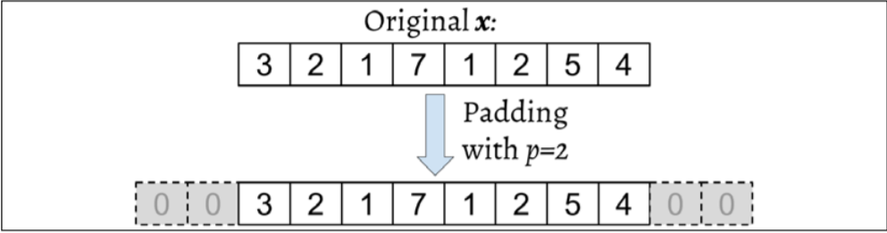

Let's assume that the original input, x, and filter, w, have n and m elements, respectively, where 𝑚𝑚 ≤ 𝑛𝑛. Therefore, the padded vector, 𝒙^𝑝, has size n + 2p. The practical formula for computing a discrete convolution will change to the following:
$$
y = x*w =>y[i] = \sum_{k=0}^{k = m-1} x^p[i+m-k]w[k]
$$
Now that we have solved the infinite index issue, the second issue is indexing x with i + m – k. The important point to notice here is that x and w are indexed in different directions in this summation. Computing the sum with one index going in the reverse direction is equivalent to computing the sum with both indices in the forward direction after flipping one of those vectors, x or w, after they are padded. 

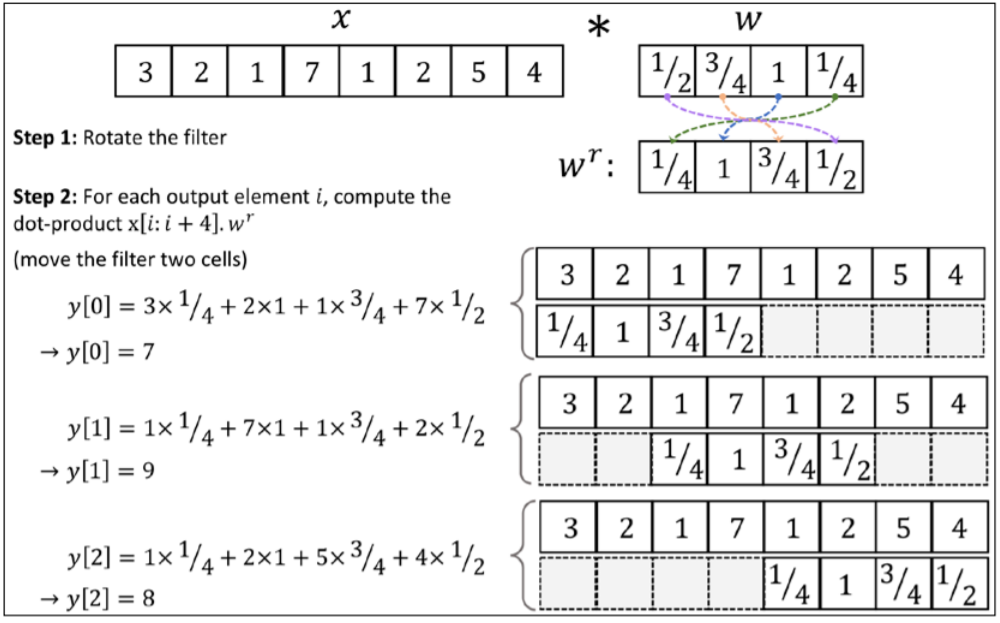

There are three modes of padding that are commonly used in practice: full, same, and valid: 

* In full mode, the padding parameter, p, is set to p = m – 1. Full padding increases the dimensions of the output; thus, it is rarely used in CNN architectures. 
* Same padding is usually used to ensure that the output vector has the same size as the input vector, x. In this case, the padding parameter, p, is computed according to the filter size, along with the requirement that the input size and output size are the same. 
* Finally, computing a convolution in the valid mode refers to the case where p = 0 (no padding).

In practice, it is recommended that you preserve the spatial size using same padding for the convolutional layers and decrease the spatial size via pooling layers instead.


#### Determining the size of the convolution output

The output size of a convolution is determined by the total number of times that we shift the filter, w, along the input vector. Let's assume that the input vector is of size n and the filter is of size m. Then, the size of the output resulting from 𝒚𝒚 = 𝒙𝒙 ∗ 𝒘𝒘, with padding, p, and stride, s, would be determined as follows:
$$
o = floor(\frac{n + 2p - m}{s}) + 1
$$


#### Performing a discrete convolution in 2D


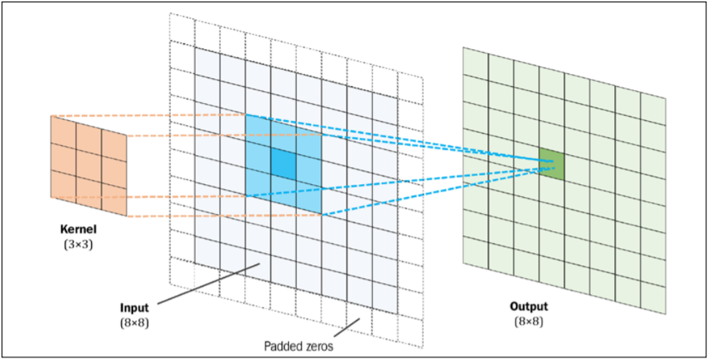

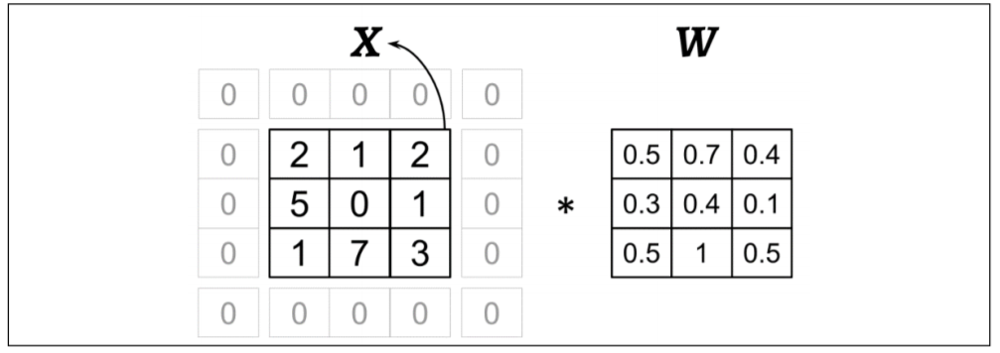

After filter rotate:


```python
import numpy as np
import scipy.signal

def conv2d(X, W, p=(0,0), s=(1,1)):
  W_rot = np.array(W)[::-1, ::-1]
  X_orig = np.array(X)
  n1 = X_orig.shape[0] + 2*p[0]
  n2 = X_orig.shape[0] + 2*p[1]
  X_padded = np.zeros(shape=(n1, n2))
  X_padded[p[0]:p[0]+X_orig.shape[0],
           p[1]:p[1]+X_orig.shape[1]] = X_orig
  res = []
  for i in range(0, int((X_padded.shape[0] - \
                         W_rot.shape[0])/s[0])+1, s[0]):
    res.append([])
    for j in range(0, int((X_padded.shape[1] - \
                           W_rot.shape[1])/s[1])+1, s[1]):
      X_sub = X_padded[i:i+W_rot.shape[0], j:j+W_rot.shape[1]]
      res[-1].append(np.sum(X_sub*W_rot))
  return np.array(res)
```


#### Subsampling layers


Subsampling is typically applied in two forms of pooling operations in CNNs: max-pooling and mean-pooling (also known as average-pooling).

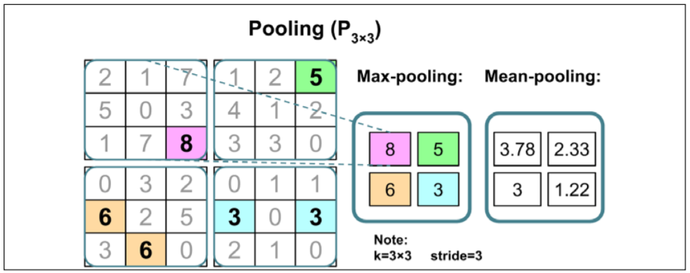

Traditionally, pooling is assumed to be nonoverlapping. Pooling is typically performed on nonoverlapping neighborhoods, which can be done by setting the stride parameter equal to the pooling size.


#### Implementing CNN


How can we incorporate multiple input channels in the convolution operation that we discussed in the previous sections? The answer is very simple: we perform the convolution operation for each channel separately and then add the results together using the matrix summation. 

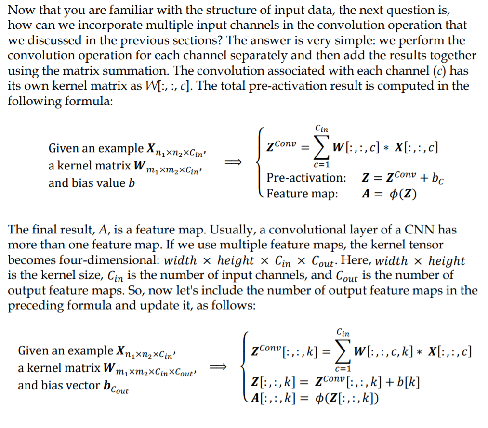

### Recurrent Neural Networks

Since, in this case, each recurrent layer must receive a sequence as input, all the recurrent layers except the last one must return a sequence as output (that is, return_sequences=True). The behavior of the last recurrent layer depends on the type of problem.

**Different architectures of RNN**

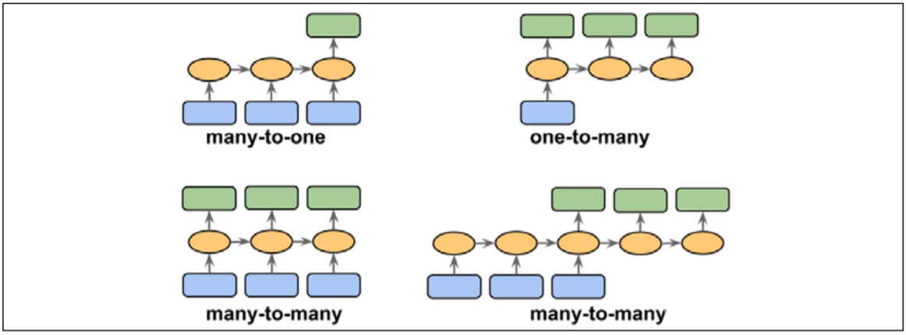

* Many-to-one: The input data is a sequence, but the output is a fixed-size vector or scalar, not a sequence. For example, in sentiment analysis, the input is text-based (for example, a movie review) and the output is a class label (for example, a label denoting whether a reviewer liked the movie). 
* One-to-many: The input data is in standard format and not a sequence, but the output is a sequence. An example of this category is image captioning— the input is an image and the output is an English phrase summarizing the content of that image
* Many-to-many: Both the input and output arrays are sequences. This category can be further divided based on whether the input and output are synchronized. An example of a synchronized many-to-many modeling task is video classification, where each frame in a video is labeled. An example of a delayed many-to-many modeling task would be translating one language into another. For instance, an entire English sentence must be read and processed by a machine before its translation into German is produced.


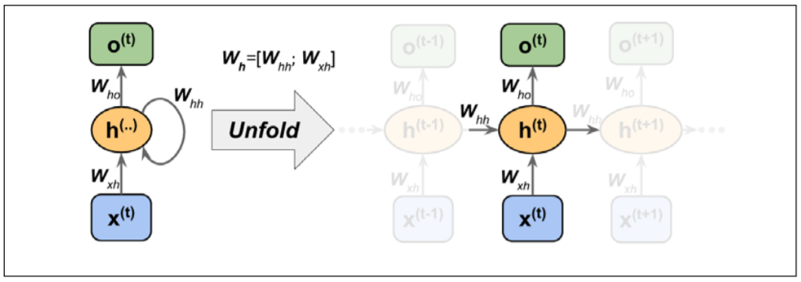

Each directed edge (the connections between boxes) in the representation of an RNN that we just looked at is associated with a weight matrix. Those weights do not depend on time, t; therefore, they are shared across the time axis. The different weight matrices in a single-layer RNN are as follows:

* 𝑾𝑥ℎ: The weight matrix between the input, 𝒙(𝑡) , and the hidden layer, h 
* 𝑾ℎℎ: The weight matrix associated with the recurrent edge 
* 𝑾ℎ𝑜: The weight matrix between the hidden layer and output layer

Computing the activations:
$$
\bold z_h^{(t)} = \bold W _{xh} \bold x^{(t)} + \bold W_{hh} \bold h ^{t-1} + \bold b _h
\\
\bold h^{(t)} = \phi_h(\bold z_h^{(t)})
$$
**Backpropagation through time**


The derivation of the gradients might be a bit complicated, but the basic idea is that the overall loss, L, is the sum of all the loss functions at times t = 1 to t = T. Since the loss at time t is dependent on the hidden units at all previous time steps 1 : t, the gradient will be computed as follows:
$$
L = \sum_{t=1}^T L^{(t)}
\\
\frac{dL^{(t)}}{d\bold W_{hh}} = \frac{dL^{(t)}}{d\bold o^{(t)}} \frac{d\bold o^{(t)}}{d\bold h^{(t)}}(\sum_{k=1}^t \frac {d\bold h^{(t)}}{d\bold h^{(k)}} \frac{d\bold h^{(k)}}{d\bold W_{hh}})
\\
\frac {d\bold h^{(t)}}{d\bold h^{(k)}} = \prod_{i=k+1}^{t} \frac {d\bold h^{(i)}}{d\bold h^{(i-1)}}
$$


**Hidden-recurrence versus output-recurrence**


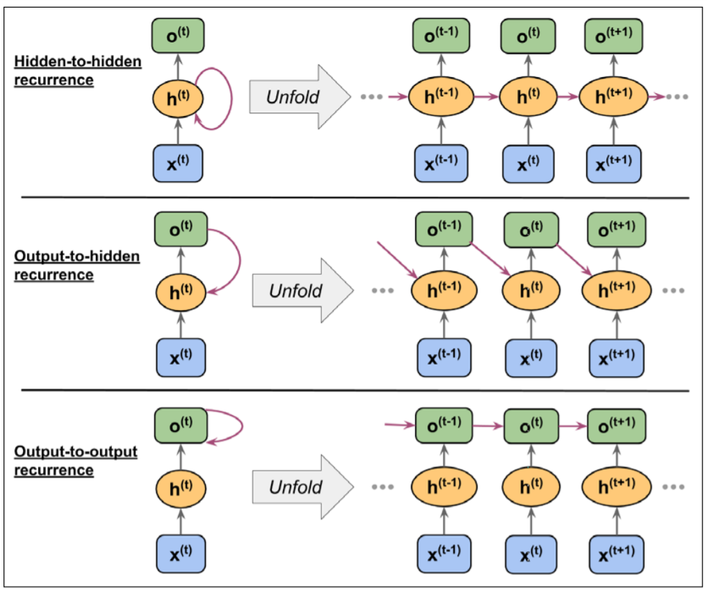


### LSTM


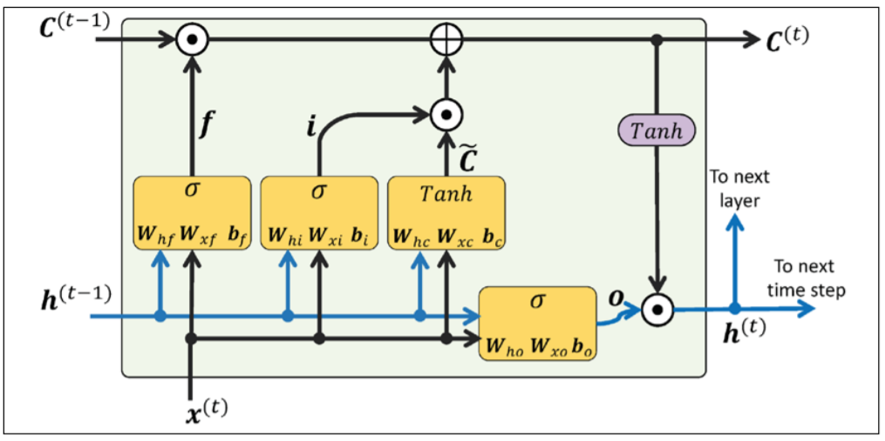

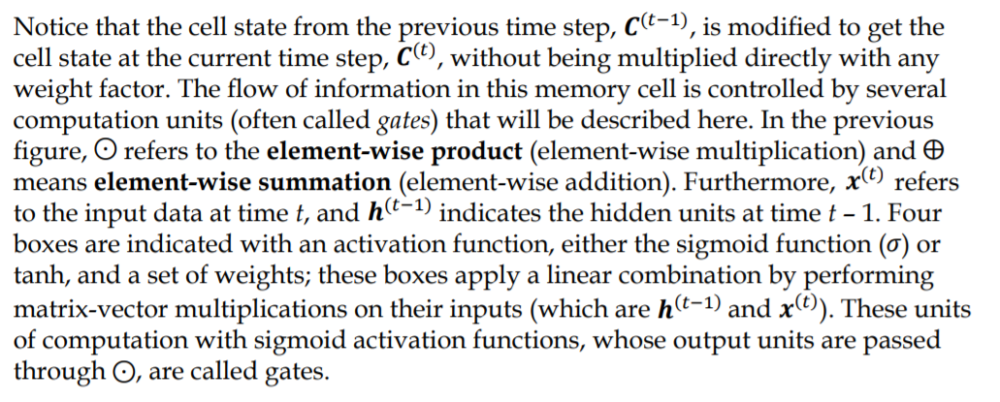

In an LSTM cell, there are three different types of gates, which are known as the forget gate, the input gate, and the output gate: 

* The forget gate ( 𝒇𝑡) allows the memory cell to reset the cell state without growing indefinitely. In fact, the forget gate decides which information is allowed to go through and which information to suppress. Now, 𝒇𝑡 is computed as follows:
  $$
  \bold f_t = \sigma(\bold W_{xf} \bold x^{(t)} + \bold W_{hf} \bold h ^{(t-1)} + \bold b_f)
  $$

* The input gate (𝒊𝑡) and candidate value {\hat C_t} are responsible for updating the cell state. They are computed as follows:
  $$
  \bold i _t = \sigma (\bold W _{xi} \bold x^{(t)} + \bold W _{hi}\bold h ^{(t-1)} + \bold b_i)
  \\
  \bold{\hat C_t} = tanh(\bold W_{xc}\bold x^{(t)} + \bold W_{hc} \bold h^{(t-1)} +\bold b_c)
  $$
  The cell state at time t is computed as follows:
  $$
  C^{(t)} = (C^{(t-1)} ⊙f_t) ⨁ (i_t ⊙{\hat  C_t})
  $$
  
* The output gate (𝒐𝑡) decides how to update the values of hidden units:
  $$
  \bold o_t = \sigma(\bold W_{xo} \bold x^{(t)} + \bold W_{ho} \bold h ^{(t-1)} + \bold b_o)
  $$

Given this, the hidden units at the current time step are computed as follows: 
$$
\bold h_t = \bold o_t ⊙ tanh(\bold C ^{(t)})
$$


```python
# import necessary libraries
import numpy as np
import tensorflow as tf
from google.colab import drive
import os
drive.mount('drive')
os.chdir('drive/My Drive/vern/')


#read file
with open('1268-0.txt', 'r') as tf:
  text = tf.read()

#crop useful text
start_index = text.find('THE MYSTERIOUS ISLAND')
end_index = text.find('End of the Project Gutenberg')
text = text[start_index:end_index]
#find unique characters in text
char_set = set(text)
#create dict to convert characters to integers
char_sorted = sorted(char_set)
chr2int = {ch:i for i, ch in enumerate(char_sorted)}
char_array = np.array(char_sorted)
int2chr = {i:ch for i, ch in enumerate(char_sorted)}
#encode data, create tensor
text_encoded = np.array([chr2int[ch] for ch in text], dtype=np.int32)
ds_text_encoded = tf.data.Dataset.from_tensor_slices(text_encoded)
#create x (input) and y(target) sequences
seq_length = 40
chunk_size = seq_length + 1
ds_chunks = ds_text_encoded.batch(chunk_size, drop_remainder=True)
def split_input_target(chunk):
  input_seq = chunk[:-1]
  target_seq = chunk[1:]
  return input_seq, target_seq
ds_sequences = ds_chunks.map(split_input_target)

#create batches
BATCH_SIZE = 64
BUFFER_SIZE = 10000
ds = ds_sequences.shuffle(BUFFER_SIZE).batch(BATCH_SIZE)

#build model
def build_model(vocab_size, embedding_dim,rnn_units):
  model = tf.keras.models.Sequential([
                                      tf.keras.layers.Embedding(vocab_size, embedding_dim),
                                      tf.keras.layers.LSTM(rnn_units,
                                                           return_sequences=True),
                                      tf.keras.layers.Dense(vocab_size)
  ])
  return model

charset_size = len(char_array)
embedding_dim = 256
rnn_units = 512

tf.random.set_seed(1)
#compile and train
model = build_model(charset_size, embedding_dim, rnn_units)
model.compile(optimizer='adam',
              loss=tf.keras.losses.SparseCategoricalCrossentropy(from_logits=True))
model.fit(ds, epochs=20)
```


### Transformer


**Self-attention**

More formally, the output of self-attention is the weighted sum of all input sequences. For instance, for the ith input element, the corresponding output value is computed as follows:
$$
\bold o ^{(i)} = \sum_{j=0}^T\bold W_{ij}\bold x^{(j)}
$$
Here, the weights, 𝑊𝑖j, are computed based on the similarity between the current input element, 𝒙𝒙(𝑖𝑖) , and all other elements in the input sequence. More concretely, this similarity is computed as the dot product between the current input element, 𝒙^(𝑖) , and another element in the input sequence, 𝒙^(𝑗) :
$$
\omega_{ij} = \bold x^{(i)^T}\bold x^{(j)}
$$
After computing these similarity-based weights for the ith input and all inputs in the sequence (𝒙^(𝑖) to 𝒙^(𝑇) ), the "raw" weights (𝜔i0 to 𝜔𝑖T) are then normalized using the familiar softmax function, as follows:
$$
W_{ij} = \frac{exp(\omega_{ij})}{\sum_{j=0}^T exp(\omega_{ij})} = softmax([\omega_{ij}]_{j=0...T})
$$
To recap, let's summarize the three main steps behind the self-attention operation: 

1. For a given input element, 𝒙^(𝑖) , and each jth element in the range [0, T], compute the dot product, 𝒙^(𝑖)^⊤ 𝒙(𝑗) 

2. Obtain the weight, 𝑊𝑖j, by normalizing the dot products using the softmax function 

3. Compute the output, 𝒐(𝑖) , as the weighted sum over the entire input sequence:
   $$
   \bold o ^{(i)} = \sum_{j=0}^T W_{ij}\bold x^{j}
   $$

These steps are further illustrated in the following figure:

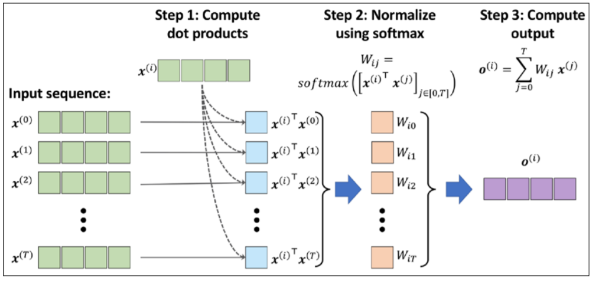

 To make the self-attention mechanism more flexible and amenable to model optimization, we will introduce three additional weight matrices that can be fit as model parameters during model training. We denote these three weight matrices as 𝑼𝑼𝑞𝑞, 𝑼𝑼𝑘𝑘, and 𝑼𝑼𝑣𝑣. They are used to project the inputs into query, key, and value sequence elements:

* query sequence: q^(i) = U_q * x^(i) for i in [0, ..., T]
* key sequence: k^(i) = U_k * x^(i) for i in [0, ... ,T]
* value sequence v^(i) = U_v * x^(i) for i in [0, ..., T]


Another trick that greatly improves the discriminatory power of the self-attention mechanism is multi-head attention (MHA), which combines multiple self-attention operations together.

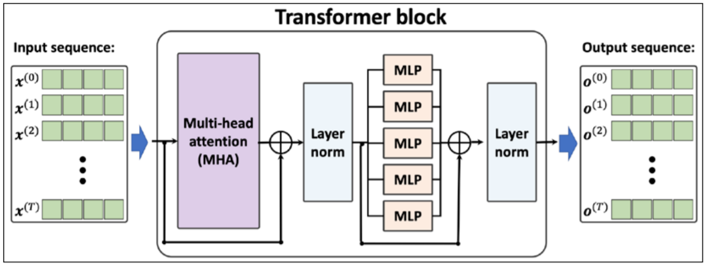

First, the input sequence is passed to the MHA layers, which is based on the self-attention mechanism that we discussed earlier. In addition, the input sequences are added to the output of the MHA layers via the residual connections—this ensures that the earlier layers will receive sufficient gradient signals during training, which is a common trick that is used to improve training speed and convergence.

After the input sequences are added to the output of the MHA layers, the outputs are normalized via layer normalization. These normalized signals then go through a series of MLP (that is, fully connected) layers, which also have a residual connection. Finally, the output from the residual block is normalized again and returned as the output sequence, which can be used for sequence classification or sequence generation.


## Generative Adversarial Networks for Synthesizing New Data


### Starting with autoencoders


Autoencoders can be used as a dimensionality reduction technique as well. In fact, when there is no nonlinearity in either of the two subnetworks (encoder and decoder), then the autoencoder approach is almost identical to PCA. 


### Generative models for synthesizing new data


Autoencoders are deterministic models, which means that after an autoencoder is trained, given an input, x, it will be able to reconstruct the input from its compressed version in a lower-dimensional space. Therefore, it cannot generate new data beyond reconstructing its input through the transformation of the compressed representation. A generative model, on the other hand, can generate a new example, 𝒙𝒙̃, from a random vector, z (corresponding to the latent representation).

However, the major difference between the two is that we do not know the distribution of z in the autoencoder, while in a generative model, the distribution of z is fully characterizable. It is possible to generalize an autoencoder into a generative model, though. One approach is VAEs.

In a VAE receiving an input example, x, the encoder network is modified in such a way that it computes two moments of the distribution of the latent vector: the mean, 𝝁𝝁, and variance, 𝝈𝝈2. During the training of a VAE, the network is forced to match these moments with those of a standard normal distribution (that is, zero mean and unit variance). Then, after the VAE model is trained, the encoder is discarded, and we can use the decoder network to generate new examples, 𝒙𝒙̃, by feeding random z vectors from the "learned" Gaussian distribution.


The objective function of GANs:
$$
V(\theta^{(D)}, \theta^{(G)}) = E_{\bold x ..p_{data}(x)}[log(D(x))] + E_{z..p_z(z)}[log(1 - D(G(z)))]
$$


One training step of a GAN model with such a value function requires two optimization steps: (1) maximizing the payoff for the discriminator and (2) minimizing the payoff for the generator. 

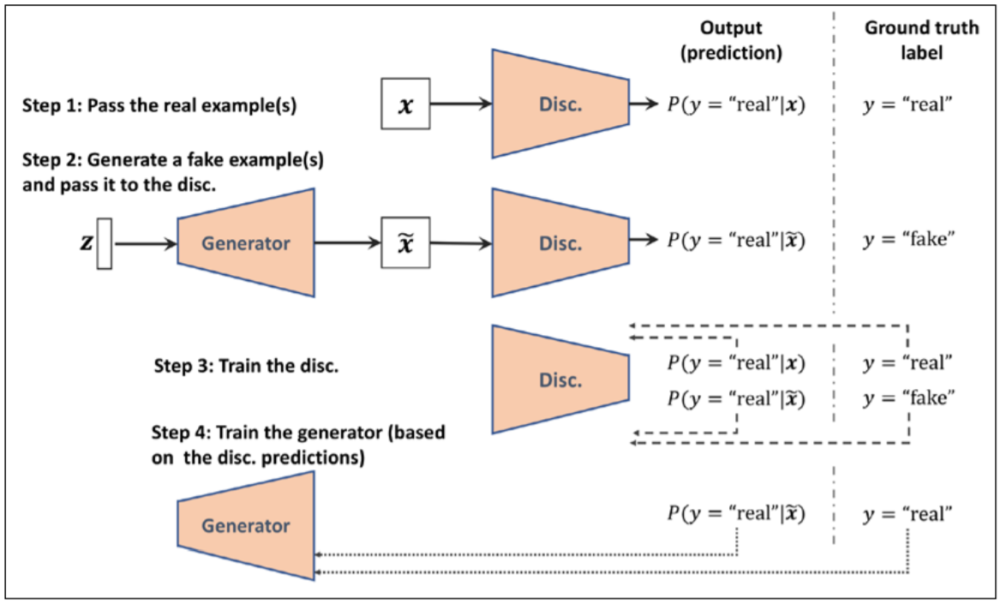


### Transposed convolution


 While a convolution operation is usually used to downsample the feature space, a transposed convolution operation is usually used for upsampling the feature space. Upsampling feature maps using transposed convolution works by inserting 0s between the elements of the input feature maps.

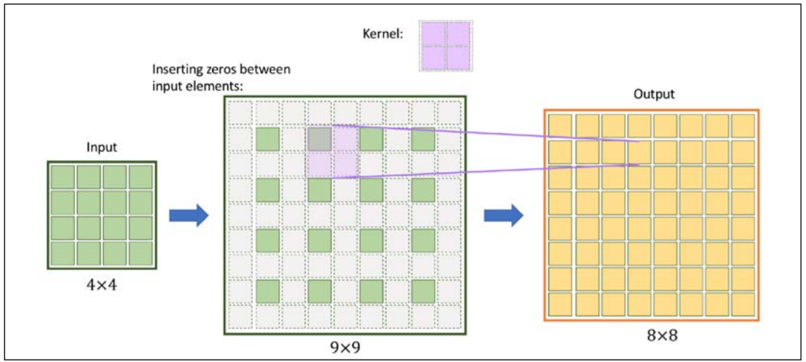


### Batch Normalization

One of the main ideas behind BatchNorm is normalizing the layer inputs and preventing changes in their distribution during training, which enables faster and better convergence.

Assume that we have the net preactivation feature maps obtained after a convolutional layer in a four-dimensional tensor, Z, with the shape [𝑚𝑚 × ℎ × 𝑤𝑤 × 𝑐𝑐] , where m is the number of examples in the batch (i.e., batch size), ℎ × 𝑤𝑤 is the spatial dimension of the feature maps, and c is the number of channels. BatchNorm can be summarized in three steps, as follows:

1. Compute the mean and standard deviation of the net inputs for each mini-batch:
   $$
   \mu_B = \frac{1}{m * h*w}\sum_{i,j,k}Z^{[i,j,k,]}
   \\
   \sigma_B^2 = \frac{1}{m * h*w}\sum_{i,j,k}(Z^{[i,j,k,]} - \mu_B)^2
   $$

2. Standardized the net inputs for all example in the batch

3. Scale and shifts the normalized net inputs using two learnable parameter vector, \gamma and \beta, of size c (number of channels):
   $$
   \bold A^{[i]}_{pre} = \gamma \bold Z_{std} ^{[i]} + \beta
   $$


### Dissimilarity measures between two distributions


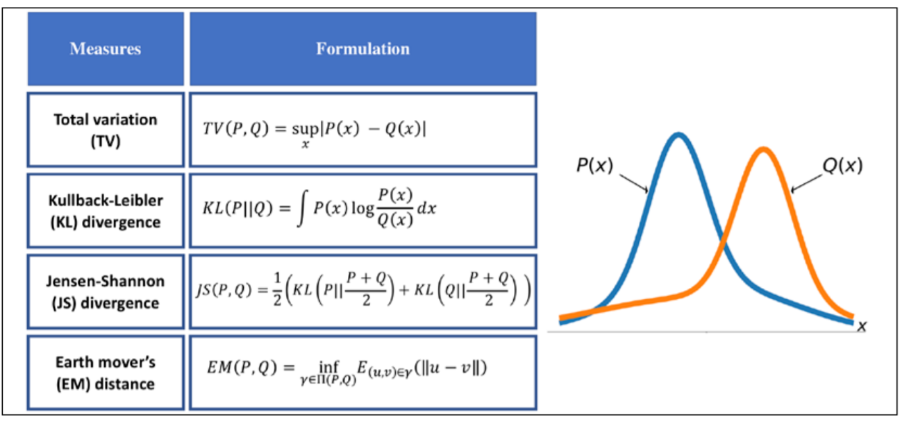

The function supremum, sup(S), used in the total variation (TV) measure, refers to the smallest value that is greater than all elements of S. In other words, sup(S) is the least upper bound for S. Vice versa, the infimum function, inf(S), which is used in EM distance, refers to the largest value that is smaller than all elements of S. 

* The first one, TV distance, measures the largest difference between the two distributions at each point. 
* The EM distance can be interpreted as the minimal amount of work needed to transform one distribution into the other. The infimum function in the EM distance is taken over Π(P,Q), which is the collection of all joint distributions whose marginals are P or Q. Then, 𝛾𝛾(𝑢𝑢, 𝑣𝑣) is a transfer plan, which indicates how we redistribute the earth from location u to v, subject to some constraints for maintaining valid distributions after such transfers. Computing EM distance is an optimization problem by itself, which is to find the optimal transfer plan, 𝛾𝛾(𝑢𝑢, 𝑣𝑣). 
* The Kullback-Leibler (KL) and Jensen-Shannon (JS) divergence measures come from the field of information theory. Note that KL divergence is not symmetric, that is, 𝐾L(𝑃‖𝑄) ≠ KL(𝑄‖𝑃) in contrast to JS divergence.


## Reinforcement Learning for Decision Making in Complex Environments


With RL, the model (also called an agent) interacts with its environment, and by doing so generates a sequence of interactions that are together called an episode. Through these interactions, the agent collects a series of rewards determined by the environment. These rewards can be positive or negative, and sometimes they are not disclosed to the agent until the end of an episode.


### Markov decision processes


The standard approach for solving MDP problems is by using dynamic programming, but RL offers some key advantages over dynamic programming.

The types of problems that require learning an interactive and sequential decisionmaking process, where the decision at time step t affects the subsequent situations, are mathematically formalized as Markov decision processes (MDPs).
$$
p(s',r|s,a) =^{def} P(S_{t+1}=s', R_{t+1} = r | S_t = s, A_t = a) 
$$
Where p() - conditional probability over the preceding state S_t and taken action A_t.

This probability distribution completely defines the dynamics of the environment (or model of the environment) because, based on this distribution, all transition probabilities of the environment can be computed. Therefore, the environment dynamics are a central criterion for categorizing different RL methods. The types of RL methods that require a model of the environment or try to learn a model of the environment (that is, the environment dynamics) are called model-based methods, as opposed to model-free methods.

The environment dynamics can be considered deterministic if particular actions for given states are always or never taken, that is,p () ∈ {0,1}. Otherwise, in the more general case, the environment would have stochastic behavior.

A Markov process can be represented as a directed cyclic graph in which the nodes in the graph represent the different states of the environment. The edges of the graph (that is, the connections between the nodes) represent the transition probabilities between the states.

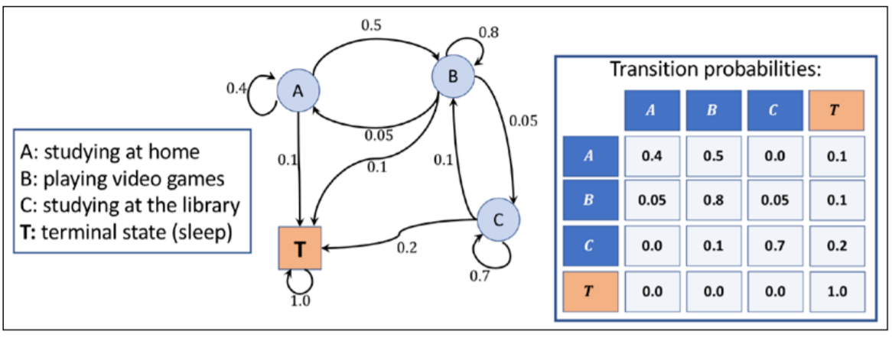

As the agent interacts with the environment, the sequence of observations or states forms a trajectory. There are two types of trajectories. If an agent's trajectory can be divided into subparts such that each starts at time t = 0 and ends in a terminal state 𝑆_𝑇 (at t = T), the task is called an episodic task. On the other hand, if the trajectory is infinitely continuous without a terminal state, the task is called a continuing task. The task related to a learning agent for the game of chess is an episodic task, whereas a cleaning robot that is keeping a house tidy is typically performing a continuing task. 


The so-called **return** at time t is the cumulated reward obtained from the entire duration of an episode. The return at time t can then be calculated from the immediate reward as well as the subsequent ones, as follows:
$$
G_t = R_{t+1} + \gamma R_{t+2} + \gamma^2 R_{t+3} + ... = \sum_{k=0}\gamma^k R_{t+k+1}
$$
Here, 𝛾𝛾 is the discount factor in range [0, 1]. The parameter 𝛾𝛾 indicates how much the future rewards are "worth" at the current moment (time t). Note that by setting 𝛾𝛾 = 0, we would imply that we do not care about future rewards

A **policy** typically denoted by 𝜋𝜋(𝑎𝑎|𝑠𝑠) is a function that determines the next action to take, which can be either deterministic, or stochastic (that is, the probability for taking the next action). A stochastic policy then has a probability distribution over actions that an agent can take at a given state:
$$
\pi(a|s) = P[A=a|S=s]
$$
The **value function**, also referred to as the state-value function, measures the goodness of each state—in other words, how good or bad it is to be in a particular state. Now, based on the return 𝐺𝐺𝑡𝑡, we define the value function of state s as the expected return (the average return over all possible episodes) after following policy 𝜋𝜋:
$$
v_{\pi}(s) = E_{\pi}[G_t | S_t = s] = E_{\pi}[\sum_{k=0} \gamma^{k+1} R_{t+k+1} | S_t = s]
$$
Moreover, we can also define a value for each state-action pair, which is called the action-value function and is denoted by 𝑞𝑞𝜋𝜋(𝑠𝑠, 𝑎𝑎). The action-value function refers to the expected return 𝐺𝐺𝑡𝑡 when the agent is at state 𝑆𝑆𝑡𝑡 = 𝑠𝑠 and takes action 𝐴𝐴𝑡𝑡 = 𝑎𝑎. Extending the definition of state-value function to state-action pairs, we get the following:
$$
q_{\pi}(s, a) = E_{\pi}[G_t | S_t = s, A_t = a] = E_{\pi}[\sum_{k=0} \gamma^{k+1} R_{t+k+1} | S_t = s, A_t = a]
$$
In short, the return is the weighted sum of rewards for an entire episode, which would be equal to the discounted final reward in our chess example (since there is only one reward). The value function is the expectation over all possible episodes, which basically computes how "valuable" it is on average to make a certain move.


### Dynamic programming using Bellman equation


The Bellman equation simplifies the computation of the value function, such that rather than summing over multiple time steps, it uses a recursion that is similar to the recursion for computing the return:
$$
v_{\pi}(s) = E_{\pi}[G_t|S_t = s]  \\ = E_{\pi} [r + \gamma G_{t+1} | S_t = s]  \\ = r + \gamma E_{\pi}[G_{t+1} |S_t = s]
$$
Notice that the immediate reward r is taken out of the expectation since it is a constant and known quantity at time t.

Similarly, for the action-value function, we could write:
$$
q_{\pi} (s,a) = E_{\pi} [G_t | S_t = s, A_t = a]  \\ = E_{\pi} [r + \gamma G_{t+1} | S_t = s, A_t = a]  \\ = r + \gamma E_{\pi} [G_{t+1} | S_t = s, A_t = a]
$$
Bellman equation:
$$
v_{\pi} (s) = \sum_a \pi(a|s) \sum_{s', r'} p(s', r'|s, a)[r' + \gamma v_{pi}(s')]
$$


### Dynamic programming

* We have full knowledge about the environment dynamics; that is, all transition probabilities 𝑝𝑝(𝑠𝑠′ , 𝑟𝑟′ |𝑠𝑠, 𝑎𝑎) are known
* The agent's state has the Markov property, which means that the next action and reward only depend on the current state and the choice of action we make at this moment or current time step.


$$
v^{<i+1>}(s) = \sum_a\pi(a|s) \sum_{s', r} p(s', r|s,a)[r+\gamma v^{<i>}(s')]
$$
Now that we have computed the value function 𝑣𝑣𝜋𝜋(𝑠𝑠) by following the existing policy, 𝜋𝜋, we want to use 𝑣𝑣𝜋𝜋(𝑠𝑠) and improve the existing policy, 𝜋𝜋.

 Now, in order to find 𝜋𝜋′ that always has a better or equal value for each state, we first compute the action-value function, 𝑞𝑞𝜋𝜋(𝑠𝑠, 𝑎𝑎), for each state, s, and action, a, based on the computed state value using the value function 𝑣𝑣𝜋𝜋(𝑠𝑠). We iterate through all the states, and for each state, s, we compare the value of the next state 𝑠𝑠′ , that would occur if action a was selected.

After we have obtained the highest state value by evaluating all state-action pairs via 𝑞𝑞𝜋𝜋(𝑠𝑠, 𝑎𝑎), we can compare the corresponding action with the action selected by the current policy. If the action suggested by the current policy (that is, arg max  𝜋𝜋(𝑎𝑎|𝑠𝑠)) is different than the action suggested by the action-value function (that is, arg max  𝑞𝑞𝜋𝜋(𝑠𝑠, 𝑎𝑎)), then we can update the policy by reassigning the probabilities of actions to match the action that gives the highest action value, 𝑞𝑞𝜋𝜋(𝑠𝑠, 𝑎𝑎). This is called the policy improvement algorithm.


However, it can be more efficient if we combine the two tasks of policy evaluation and policy improvement into a single step. The following equation updates the value function for iteration i + 1 (denoted by 𝑣𝑣⟨𝑖𝑖+1⟩ ) based on the action that maximizes the weighted sum of the next state value and its immediate reward (𝑟𝑟 + 𝛾𝛾𝑣𝑣⟨𝑖𝑖⟩ (𝑠𝑠′ )):
$$
v^{<i+1>}(s) = max \sum_{s', r}p(s', r | s, a) [r + \gamma v^{<i>}(s')]
$$


### Reinforcement Learning with Monte Carlo


Moving away from the dynamic programming approach, we now assume that we do not have any knowledge about the environment dynamics. That is, we do not know the state-transition probabilities of the environment, and instead, we want the agent to learn through interacting with the environment. Using MC methods, the learning process is based on the so-called simulated experience.

For MC-based RL, we define an agent class that follows a probabilistic policy, 𝜋𝜋, and based on this policy, our agent takes an action at each step. This results in a simulated episode.

After generating a set of episodes, for each state, s, the set of episodes that all pass through state s is considered for calculating the value of state s. Let's assume that a lookup table is used for obtaining the value corresponding to the value function, 𝑉𝑉(𝑆𝑆𝑡𝑡 = 𝑠𝑠). MC updates for estimating the value function are based on the total return obtained in that episode starting from the first time that state s is visited. This algorithm is called first-visit Monte Carlo value prediction.

MC control refers to the optimization procedure for improving a policy. Similar to the policy iteration approach in previous section (Dynamic programming), we can repeatedly alternate between policy evaluation and policy improvement until we reach the optimal policy. So, starting from a random policy, 𝜋𝜋0, the process of alternating between policy evaluation and policy improvement can be illustrated as follows:

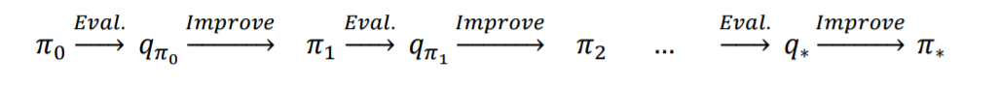

Given an action-value function, q(s, a), we can generate a greedy (deterministic) policy as follows:
$$
\pi (s) = argmax(q (s,a))
$$
In order to avoid the lack-of-exploration problem, and to consider the non-visited state-action pairs as discussed earlier, we can let the non-optimal actions have a small chance (𝜖𝜖) to be chosen. This is called the 𝜖𝜖-greedy policy, according to which, all non-optimal actions at state s have a minimal (1)  probability of being selected (instead of 0), and the optimal action has a probability of (2) (instead of 1).
$$
\frac{\epsilon}{|A(s)|} (1)
\\
1 - \frac{(|A(s)| - 1)*\epsilon}{|A(s)|}(2)
$$


### Temporal difference learning


In TD learning, we can leverage some of the learned properties to update the estimated values before reaching the end of the episode. 

Let's first revisit the value prediction by MC. At the end of each episode, we are able to estimate the return 𝐺𝐺𝑡𝑡 for each time step t. Therefore, we can update our estimates for the visited states as follows:
$$
V(S_t) = V(S_t) + \alpha(G_t - V(S_t))
$$


### Q-learning

```python
class Agent(object):
 def __init__(
 self, env,
 learning_rate=0.01,
 discount_factor=0.9,
 epsilon_greedy=0.9,
 epsilon_min=0.1,
 epsilon_decay=0.95):
 self.env = env
 self.lr = learning_rate
 self.gamma = discount_factor
 self.epsilon = epsilon_greedy
 self.epsilon_min = epsilon_min
 self.epsilon_decay = epsilon_decay
 ## Define the q_table
 self.q_table = defaultdict(lambda: np.zeros(self.env.nA))
 def choose_action(self, state):
 if np.random.uniform() < self.epsilon:
 action = np.random.choice(self.env.nA)
 else:
 q_vals = self.q_table[state]
 perm_actions = np.random.permutation(self.env.nA)
 q_vals = [q_vals[a] for a in perm_actions]
perm_q_argmax = np.argmax(q_vals)
 action = perm_actions[perm_q_argmax]
 return action
 def _learn(self, transition):
 s, a, r, next_s, done = transition
 q_val = self.q_table[s][a]
 if done:
 q_target = r
 else:
 q_target = r + self.gamma*np.max(self.q_table[next_s])
 ## Update the q_table
 self.q_table[s][a] += self.lr * (q_target - q_val)
 ## Adjust the epislon
 self._adjust_epsilon()
 def _adjust_epsilon(self):
 if self.epsilon > self.epsilon_min:
 self.epsilon *= self.epsilon_decay
```

