**Linear Algebra**

* [Eigen decomposition](#Eigen-decomposition)
* [Singular Value Decomposition](#Singular-value-decomposition)

**Statistic**

* [The main divisions of DS questions](#the-main-divisions-of-ds-questions)
* [Basic statistic](#basic-statistic)
  * [Estimates of location](#estimates-of-location)
  * [Estimates of variability](#estimates-of-variability)
  * [Correlation and Covariance](#correlation-and-covariance)
* [Distributions](#distributions)
  * [PMF, CDF, PDF](#PMF,-CDF,-PDF)
  * [Kernel density estimation](#Kernel density estimation)
  * [Sampling distribution of statistics](#Sampling distribution of statistics)
  * [The Bootstrap](#The Bootstrap)
  * [Confidence Interval](#Confidence interval)
  * [Skewness](#Skewness)
  * [Estimate Distribution](#Estimate distribution)
  * [Chebyshev’s Theorem](#Chebyshev's Theorem)
  * [Common Distributions](#common-distributions)
  * [Determine Unknow Parameters of Normal Distribution](#Determine Unknow Parameters of Normal Distribution)
  * Dissimilarity measures between two distributions

**Statistical Experiments and Significance testing**

* A/B Testing
* [Hypothesis Test](#Hypothesis Test)
* [Example: Flipping a Coin](#Example: Flipping a Coin)
* Example: Running an A/B Test
* [P-value](#P-value)
* Resampling
* Statistical Significance and P-Values
* [t-Tests](#t-Tests)
* Однофакторный дисперсионный анализ
* Двухфакторный анализ дисперсии
* Multiple Testing
* [ANOVA ](#ANOVA)
* [Chi-Square Test](#Chi-Square Test)
* [Multi-Arm Bandit Algorithm](#Multi-Arm Bandit Algorithm)
* [Power and Sample Size](#Power-and-Sample-Size)
* Experimental Design


[Probability](#Probability)


* [Central limit theorem](#Central limit theorem)
* [Bayesian curve fitting](#bayesian-curve-fitting)
* Curse of dimensionality


[**Machine Learning techniques and tasks**](#Machine-Learning-techniques-and-tasks)

* [Learning to label sequence](#Learning-to-label-sequence)
* [Active learning](#Active learning)
* [Semi-supervised learning](#Semi-supervised learning)
* [One-shot learning](#One-shot learning)
* [Zero-shot learning](#Zero-shot learning)
* [Handling Multiple Inputs](#Handling-Multiple-Inputs)
* [Handling Multiple Outputs](#Handling-Multiple-Outputs)
* [Transfer Learning](#Transfer Learning)
* [Learning to Rank](#Learning to Rank)
* [Learning to Recommend](#Learning to Recommend)
* [Прогнозирование временных рядов](#Прогнозирование временных рядов)


[**Working with data**](#Working-with-data)


1. Tabular data

* [Data imputation](#Data imputation)
* [Standardization and Normalization](#Standardization and Normalization)
* [Feature Selection](#Feature-selection)
* [Feature Extraction](#feature-extraction)
* [Feature importance](#Feature importance)
* [Strategies for Imbalance Data](#strategies-for-imbalance-data)
* [Dealing with categorical variables](#Dealing-with-categorical-variables)


2. NLP

* [n-Gram Language Models](#n-gram-language-models)
* [TFIDF](#tfidf)
* [Word Vectors](#Word Vectors)


3. Computer Vision

* [Contrast Normalization](#Contrast Normalization)


[**Machine learning models**](#Machine-learning-models)


1. Regression models:

* [Linear Regression](#linear-regression)
* [Polynomial Regression](#Polynomial Regression)
* [RANSAC](#RANSAC)
* [SVM](#support-vector-machine)
* [Generalized Additive Models](#Generalized Additive Models)
* [K-Nearest Neighboors](#k-nearest-neighboors)
* [Decision Tree](#Decision-tree)
* [Random Forest](#Random-Forest)
* 


2. Classification models:

* [Logistic regression](#logistic-regression)
* [Generalized linear model](#Generalized linear model)
* [SVM](#support-vector-machine)
* [Naive Bayes](#naive-bayes)
* [Not so Naive Bayes](#Not so Naive Bayes)
* [K-Nearest Neighboors](#k-nearest-neighboors)
* [Decision Tree](#Decision-tree)
* [Random Forest](#Random-Forest)


3. Clustering

* [K-means](#k-means)
* [K-means++](#k-means++)
* [Hierarchical Clustering](#hierarchical-clustering)
* [Locating regions of high density via DBSCAN](#Locating regions of high density via DBSCAN)
* [Gaussian Mixture Models](#Gaussian-Mixture-Models)
* [Fuzzy K-means](#fuzzy-k-means)
* [Кластеризация с помощью минимального остовного дерева](#Кластеризация-с-помощью-минимального-остовного-дерева)


4. Dimensionality reduction

* [Principal Components Analysis](#principal-components-analysis)
* [Linear Discriminant Analysis](#Linear Discriminant Analysis)
* [Kernel PCA](#Kernel PCA)
* [UMAP](#UMAP)


[**Models fitting and estimating**](#Models-fitting-and-estimating)

* [Train/validation split](#Train/validation-split)
* [Maximum Likelihood](#Maximum Likelihood)
* [Maximum a Posteriori Estimation](#Maximum-a-Posteriori-Estimation)
* [Gradient Descent](#Gradient-Descent)
* [Newton's Method](#Newton's-Method)
* [Iteratively Reweighted Least Squares](#Iteratively-Reweighted-Least-Squares)
* [Regression metrics](#Regression metrics)
* [Regression residuals plot](#Regression-residuals-plot)
* [Classification metrics](#Classification metrics)
* [Quantifying the quality of clustering via silhouette plots](#Quantifying-the-quality-of-clustering-via-silhouette-plots)


[**Models improvement**](#Models-improvement)

* [Regularization](#regularization)
* [Hyperparameter Tuning](#Hyperparameter-Tuning)
* [Bagging](#bagging)
* [Boosting](#boosting)
* [Combining models](#Combining-models)


**[Practical methodology](#Practical-methodology)**


[**Neural Networks**](#neural-networks)

* [MLP units choice](#MLP units choice)
* Implementing a Multilayer Artificial Neural Network from Scratch
* Activation Functions
* [Exploding gradient and vanishing gradient](#Exploding gradient and vanishing gradient)
* Transformer
* GAN
* Temporal difference learning


[**Convolutional Neural Networks**](#**Convolutional Neural Networks**)

* [Discrete convolutions in one dimension](#Discrete convolutions in one dimension)

* [Determining the size of the convolution output](#Determining the size of the convolution output)

* [Performing a discrete convolution in 2D](#Performing a discrete convolution in 2D)

* [Transposed convolution](#Transposed-convolution)

* [Subsampling layers](#Subsampling layers)

* [Implementing CNN](#Implementing CNN)


[**Recurrent Neural Networks**](#Recurrent Neural Networks)

* [Different architectures of RNN](#Different architectures of RNN)
* [Backpropagation through time](#Backpropagation through time)
* [Hidden-recurrence versus output-recurrence](#Hidden-recurrence versus output-recurrence)
* [LSTM](#LSTM)


[**Reinforcement Learning**](#Reinforcement-Learning)

* [Markov decision processes](#Markov-decision-processes)
* [The Thompson Sampling model - multi arm bandit example](#The-Thompson-Sampling-model)
* [Q-Learning](#Q-Learning)
* [Deep Q-learning](#Deep-Q-learning)
* [Reinforcement Learning with Monte Carlo](#Reinforcement Learning with Monte Carlo)


[**Computer Vision**](#computer vision)

* Histogram of Oriented Gradients


[**NLP**](#Natural language processing)

* [Latent Dirichlet Allocation](#Latent Dirichlet Allocation)


[**MapReduce**](#MapReduce)

* [Example: Counting Words](#Example: Counting Words)


## Linear Algebra


### Eigen decomposition

$$
\bold A \bold v = \lambda \bold v
$$

\lambda = eigenvalue, **v** - eigenvector. We can form a matrix **V** by concatenating vectors **v** with one vector per column. Likewise, we can concatenate the eigenvalues to form a vector **λ**. The eigendecomposition of **A** is given by:
$$
\bold A = \bold V diag(\bold λ) \bold V^{-1}
$$
Every real symmetric matrix can be decomposed into an expression using only real-valued eigenvectors and eigenvalues:
$$
\bold A = \bold Q \bold Λ \bold Q^T
$$
Where **Q** - orthogonal matrix composed of eigenvectors of **A**, and **Λ** is a diagonal matrix, Λ_i,i is associated with eigenvector in column i of **Q**, denoted as **Q**_:,i

Ортогона́льная ма́трица — квадратная матрица с вещественными  элементами, результат умножения которой на транспонированную матрицу  равен единичной матрице: или, что эквивалентно, её обратная матрица равна транспонированной  матрице.


### Singular Value Decomposition


Every real matrix has a SVD, but the same is not true of the eigen decomposition. The SVD is similar to eigen decomposition, except A is the product of three matrices:
$$
\bold A = \bold U \bold D \bold V^T
$$
**U** and **V** - orthogonal matrices, **D** - diagonal. The elements along the diagonal of **D** are known as the singular values of matrix **A**. The columns of **U** - left-singular vectors; the columns of **V** - right-singular vectors.

We can interpret SVD in terms of eigen decomposition of **A**. The left-singular vectors of **A** are the eigenvectors of **A**^T; the right-singular vectors are the eigenvectors **A**^T **A**. The non-zero singular values of **A** are the square root of eigenvalues of **A**^T **A**.

U: u_j - собственные векторы матрицы A * A^T

V: v_j - собственные векторы матрицы A^T * A

D: на диагонали - корни из собственных значений матриц A^T * A и  A * A^T


## Statistic


### The main divisions of DS questions

There are, broadly speaking, six categories in which data analyses fall. In the approximate order of difficulty, they are:

* Descriptive statistics - generate statistics that **describe** or **summarize** a set of data.
* Exploratory data analysis - the goal is to examine or **explore** the data and find **relationships** that weren’t previously known.  It can allow you to formulate hypotheses and drive the design of future studies and data collection, but exploratory analysis alone should never be used as the final say on why or how data might be related to each other.
* Inferential analysis - the goal is to use a relatively **small sample** of data to **infer** or say something about the **population** at large. Inferential analysis typically involves using the data you have to estimate that value in the population and then give a measure of your uncertainty about your estimate.
* Predictive analysis - the goal is to use **current** data to make **predictions** about **future** data. Essentially, you are using current and historical data to find patterns and predict the likelihood of future outcomes.
* Causal analysis - the goal is to see what happens to one variable when we manipulate another variable - looking at the **cause** and **effect** of a **relationship**.
* Mechanistic analyses - the goal is to understand the **exact changes in variables** that lead to **exact changes in other variables**.


### Basic statistic

#### Estimates of location

* Raw moment - A raw moment of order k is the average of all numbers in the set, with each number raised to the kth power before you average it. So the first raw moment is the arithmetic mean.
  $$
  \frac{1}{n} \sum_i x_i^k
  $$

* Mean - the sum of all values divided by the number of values
  $$
  \frac{\sum_{i=1}^{n}x_i}{n}
  $$

* Trimmed mean - The average of all values after dropping a fixed number of extreme values
  $$
  \frac{\sum_{i=p+1}^{n-p}x_i}{n-2p}
  $$

* Weighted mean - The sum of all values times a weight divided by the sum of the weights
  $$
  \frac{\sum_{i=1}^{n}w_ix_i}{\sum_{i=1}^{n}w_i}
  $$

* Median = The value such that the one-half of the data lies above and below

* Weighted median - The value such that one-half of the sum of the weights lies above and below the sorted data

* Mode - the most commonly occurring category or value in data set

* Expected value - The expectation of some function f(x) with respect to a probability distribution P(x) is the averaged or mean value that f takes on when x is drawn from P. For discrete variables this can be computed with a summation, while for continuous variables, it is computed with an integral:
  $$
  E_{x∼P}[f(x)] = \sum_x P(x)f(x)
  \\
  E_{x∼p}[f(x)] = \int p(x)f(x)dx
  $$
  
  If we are given a finite number N of points drawn from the probability distribution or probability density, then the expectation can be approximated as a finite sum over these points:
  $$
  E[f] \simeq \frac{1}N \sum_{n=1}^N f(x_n)
  $$
  We can also consider a conditional expectation with respect to a conditional distribution, so that:
  $$
  E_x[f|y] = \sum_x p(x|y)f(x)
  $$
  with an analogous definition for continuous variables.
  
  


#### Estimates of variability

* Deviation - The difference between the observed values and the estimate of location

* Central moments - is based on the average of deviations of numbers from their mean. When k = 2 the result is the second central moment, which you might recognize as variance.
  $$
  \frac{1}{n} \sum_i (x_i - \bar x)^k
  $$

* Variance - The sum of squared deviations from the mean divided by n-1 where n is the number of data values
  $$
  \frac{\sum{(x - \bar{x})^2}}{n-1}
  $$
The variance gives a measure of how much values of a function of a random variable x vary as we sample different values of x from its probability distribution.
  $$
  Var(f(x)) = E[(f(x)-E[f(x)])^2]
  $$
  
* Standard deviation - The square root of the variance
  $$
  \sqrt{variance}
  $$

* Mean absolute deviation - The mean of the absolute value of the deviations from the mean.
  $$
  \frac{\sum_{i=1}^{n}{\lvert x_i - \bar{x} \rvert}}{n}
  $$

* Median absolute deviation from the median - The median of the absolute value of the deviations from the median. **Robust estimate.**
  $$
  median(\lvert x_1 - m \rvert, \lvert x_2 - m \rvert, ... , \lvert x_n - m \rvert)
  $$

* Range - The difference between the largest and smallest value in data set

* Order statistics - Metrics based on the data values sorted from smallest to biggest

* Percentile - The value such that P percent of the values take on this value or less and (100 - P) percent take on this value or more. **Robust estimate.** **In machine learning it's just weighted average**:
  $$
  (1 - w)x_j + wx_{j+1}
  $$
  

  ```python
  def PercentileRank(scores, your_score):
      count = 0
      for score in scores:
          if score <= your_score:
              count += 1
      percentile_rank = 100.0 * count / len(scores)
      return percentile_rank
  
  def Percentile(scores, percentile_rank):
  	scores.sort()
  	for score in scores:
  		if PercentileRank(scores, score) >= percentile_rank:
  			return score
  
  ```

* Interquartile range - The difference between 75th percentile and the 25th percentile

* z-score - Distance from mean in the units of standard deviation
  $$
  z = \frac{x - \bar x}{\sigma}
  $$
  


#### Correlation and Covariance

A correlation is a statistic intended to quantify the stren4gth of the relationship between two variables. Correlation shows linear dependencies between variable. **Sensitive to outliers.**

A challenge in measuring correlation is that the variables we want to compare are often not expressed in the same units. And even if they are in the same units, they come from different distributions. There are two common solutions to these problems: 

1. Transform each value to a standard score, which is the number of standard deviations from the mean. This transform leads to the “Pearson product-moment correlation coefficient.” 
   
   For sample:
   $$
   \frac{\sum_{i=1}^{n}(x_i - \bar{x})(y_i - \bar{y})}{(n - 1)\sigma_x\sigma_y} \\
   $$
   For population:
$$
p = \frac{Cov(X,Y)}{S_XS_Y}
$$

2. Transform each value to its rank, which is its index in the sorted list of values. This transform leads to the “Spearman rank correlation coefficient.” To compute Spearman’s correlation, we have to compute the rank of each value, which is its index in the sorted sample. Spearman’s rank correlation is an alternative that mitigates the effect of outliers and skewed distributions.

**The covariance** gives some sense of how much two values are linearly related to each other, as well as the scale of this variables:
$$
Cov(f(x), g(y)) = E[(f(x) - E[f(x)])(g(y) - E[g(y)])]
$$


Covariance is the mean of these products:
$$
Cov(X, Y) = \frac{1}{n}\sum dx_i dy_i
\\
dx_i = x_i - \bar x
\\
dy_i = y_i - \bar y
$$


### Distributions


#### PMF, CDF, PDF

* **Probability mass function** - a function that gives the probability that a discrete random variable is exactly equal to some value. Probability mass function is the probability distribution of a discrete random variable, and provides the possible values and their associated probabilities.

* **Cumulative distribution function** (функция распределения) - function that maps from a value to its percentile rank. To evaluate CDF(x) for a particular value of x, we compute the fraction of values in the distribution less than or equal to x

  ```python
  def eval_cdf(sample, x):
      count = 0
      for score in sample:
          if score <= x:
              count += 1
              
      prob = count/len(sample)
      return prob
  ```

* **Probability density function** (функция плотности вероятности) - The derivative of a CDF. Evaluating a PDF for a particular value of x is usually not useful. The result is not a probability; it is a probability density.

  

#### Kernel density estimation

https://www.youtube.com/watch?v=x5zLaWT5KPs

Density estimation involves selecting a probability distribution function and the parameters of that distribution that best explains the joint probability distribution of the observed data (*X*).

A density estimator is an algorithm that seeks to model the probability distribution that generated a dataset. For one-dimensional data, you are probably already familiar with one simple density estimator: the histogram. A histogram divides the data into discrete bins, counts the number of points that fall in each bin, and then visualizes the results in an intuitive manner.

Kernel density estimation (KDE) is an algorithm that takes a sample and finds an appropriately smooth PDF that fits the data.

We started with PMFs, which represent the probabilities for a discrete set of values. To get from a PMF to a CDF, you add up the probability masses to get cumulative probabilities. To get from a CDF back to a PMF, you compute differences in cumulative probabilities. A PDF is the derivative of a continuous CDF; or, equivalently, a CDF is the integral of a PDF. Remember that a PDF maps from values to probability densities; to get a probability, you have to integrate. To get from a discrete to a continuous distribution, you can perform various kinds of smoothing. One form of smoothing is to assume that the data come from an analytic continuous distribution (like exponential or normal) and to estimate the parameters of that distribution. Another option is kernel density estimation. The opposite of smoothing is discretizing, or quantizing. If you evaluate a PDF at discrete points, you can generate a PMF that is an approximation of the PDF. You can get a better approximation using numerical integration. To distinguish between continuous and discrete CDFs, it might be better for a discrete CDF to be a “cumulative mass function,” but as far as I can tell no one uses that term.


The free parameters of kernel density estimation are the kernel, which specifies the shape of the distribution placed at each point, and the kernel bandwidth, which con‐ trols the size of the kernel at each point. 


Let {xi}N i=1 be a one-dimensional dataset (a multi-dimensional case is similar) whose examples were drawn from a distribution with an unknown pdf f with xi œ R for all i = 1,...,N. We are interested in modeling the shape of f. Our kernel model of f, denoted as ˆfb, is given by
$$
\hat f_b(x) = \frac{1}{Nb} \sum_{i=1}^N k (\frac{x-\bar x}{b})
$$
where b is a hyperparameter that controls the tradeoff between bias and variance of our model and k is a kernel. We use a Gaussian kernel:
$$
k(z) = \frac{1}{\sqrt{2\pi}}exp(\frac{-z^2}{2})
$$


We look for such a value of b that minimizes the difference between the real shape of f and the shape of our model ˆfb. A reasonable choice of measure of this difference is called the mean integrated squared error (MISE):
$$
MISE(b) = E[\int_R(\hat f_b(x) - f(x))^2dx]
$$
Now, to find the optimal value b* for b, we minimize the cost defined as:
$$
\int_R \hat f^2_b(x)dx - \frac{2}{N} \sum_{i=1}^N \hat f^{(i)}_b(x_i)
$$


We can find b* using grid search. 


**Selecting the bandwidth via cross-validation** 

The choice of bandwidth within KDE is extremely important to finding a suitable density estimate, and is the knob that controls the bias–variance trade-off in the esti‐ mate of density: too narrow a bandwidth leads to a high-variance estimate (i.e., over‐ fitting), where the presence or absence of a single point makes a large difference. Too wide a bandwidth leads to a high-bias estimate (i.e., underfitting) where the structure in the data is washed out by the wide kernel. In machine learning contexts, we’ve seen that such hyperparameter tuning often is done empirically via a cross-validation approach. With this in mind, the KernelDen sity estimator in Scikit-Learn is designed such that it can be used directly within Scikit-Learn’s standard grid search tools. Here we will use GridSearchCV to optimize the bandwidth for the preceding dataset. 

```python
from sklearn.grid_search import GridSearchCV
from sklearn.cross_validation import LeaveOneOut
bandwidths = 10 ** np.linspace(-1, 1, 100)

grid = GridSearchCV(KernelDensity(kernel='gaussian'), 
                    {'bandwidth': bandwidths},
                    cv=LeaveOneOut(len(x)))
grid.fit(x[:, None]);
```


#### Sampling distribution of statistics

* Sample statistic - A metric calculate for a subset of data set (mean, median, variance).

* Data distribution - The frequency distribution of individual values in a data set.

* Sampling distribution - The frequency distribution of a sample statistic over many samples or resamples

  Data distribution is the distribution of the observations in your data (for example: the scores of students taking statistics course).

  Sampling distribution of the sample mean: Let imagine you sample the data from population n times (randomly, each sample has N observations), for each sample you compute the mean. So you have n means of n samples. Then you have the distribution of the sample mean.

* **Central limit theorem** - The tendency of the sampling distribution to take a normal shape as sample size rises.

* Standard error - The variability (standard deviation) of a sample statistic over many samples (not to be confused with standard deviation, which, by itself, refers to variability of individual data values)


#### The Bootstrap

One easy and effective way to estimate the sampling distribution of a statistic, or of model parameters, is to draw additional samples, with replacement, from the sample itself and recalculate the statistic or model for each resample. Conceptually, you can imagine the bootstrap as replicating the original sample thousands or millions of times so that you have a hypothetical population that embodies all the knowledge from your original sample (it’s just larger).

1. Draw a sample value, record, replace it.

2. Repeat *n* times.

3. Record the mean of the *n* resampled values.

4. Repeat steps 1-3 *R* times.

5. Use the R results to:

   a. Calculate their standard deviation (this estimates sample standard error).

   b. Produce histogram or boxplot.

   c. Find a confidence interval.

#### Confidence interval


Suppose a dataset x1,...,xn is given, modeled as realization of random variables X1,...,Xn. Let θ be the parameter of interest, and γ a number between 0 and 1. If there exist sample statistics Ln = g(X1,...,Xn) and Un = h(X1,...,Xn) such that:
$$
P(L_n < \theta < U_n) = \gamma \text{ for every value of } \theta \text{, then}
\\
(l_n, u_n), 
$$
where ln = g(x1,...,xn) and un = h(x1,...,xn), is called a 100γ% confidence interval for θ. The number γ is called the confidence level.

**Normal distribution confidence interval for the mean:**

1. Variance known. If X1,...,Xn is a random sample from an N(µ, σ2) distribution, then X¯n has an N(µ, σ2/n) distribution, and from the properties of the normal distribution (see page 106), we know that:
   $$
   \frac{\bar X_n - \mu}{\sigma / \sqrt{n}} \text{ has an N(0, 1) distribution}
   $$
   If cl and cu are chosen such that P(c_l < Z < c_u) = \gamma for an N(0, 1) distributed random variable Z, then:
   $$
   \gamma = P(c_l < \frac{\bar X_n - \mu}{\sigma / \sqrt{n}} < c_u)
   \\
   = P(c_l \frac{\sigma}{\sqrt{n}}< \bar X_n - \mu < c_u \frac{\sigma}{\sqrt{n}})
   \\
   = P(\bar X_n - c_u \frac{\sigma}{\sqrt{n}} < \mu < \bar X_n - c_l \frac{\sigma}{\sqrt{n}})
   $$
   A common choice is to divide α = 1 − γ evenly between the tails,2 that is, solve cl and cu so that cu = zα/2 and cl = z1−α/2 = −zα/2 (z - critical value). Summarizing, the 100(1 − α)% confidence interval for µ is:
   $$
   (\bar x_n - z_{\alpha/2} \frac{\sigma}{\sqrt n}, \bar x_n + z_{\alpha/2} \frac{\sigma}{\sqrt n})
   $$

2. Variance unknown. If we substitute the estimator Sn for σ, the resulting random variable:
   $$
   \frac{\bar X_n - \mu}{S_n / \sqrt n}
   $$
   has a distribution that only depends on n and not on µ or σ. Moreover, its density can be given explicitly. A continuous random variable has a t-distribution with parameter m, where m ≥ 1 is an integer, if its probability density is given by:
   $$
   f(x) = k_m (1 + \frac{x^2}{m})^{- \frac{m+1}2} \text{ for } -\inf < x < \inf
   \\
   k_m = Γ(\frac{m+1}{2}) / (Γ(\frac{m}{2})\sqrt{mn})
   $$
   This distribution is denoted by t(m) and is referred to as the t-distribution with m degrees of freedom. The critical value tm,p is the number satisfying:
   $$
   P(T >= t_{m,p}) = p
   $$
   where T is a t(m) distributed random variable. Because the t-distribution is symmetric around zero, using the same reasoning as for the critical values of the standard normal distribution, we find that t_{m, 1-p} = - t_{m,p}

   For a random sample X1,...,Xn from an N(µ, σ2) distribution, the studentized mean has a t(n − 1) distribution, regardless of the values of µ and σ. From this fact and using critical values of the t-distribution, we derive that:
   $$
   P(-t_{n-1, \alpha/2} < \frac{\bar X_n - \mu}{S_n / \sqrt n} < t_{n-1, \alpha/2}) = 1 - \alpha 
   $$
   and in the same way as when σ is known it now follows that a 100(1 − α)% confidence interval for µ is given by:
   $$
   (\bar x - t_{n-1, \alpha/2}\frac{s_n}{\sqrt n}, \bar x + t_{n-1, \alpha/2}\frac{s_n}{\sqrt n})
   $$

3. Variance unknown, large samples. If n is large enough, we may use:
   $$
   (\bar x_n - z_{\alpha/2} \frac{s_n}{\sqrt n}, \bar x_n + z_{\alpha/2} \frac{s_n}{\sqrt n})
   $$
   


An x% confidence interval around a sample estimate should, on average, contain similar sample estimates x% of the time.

Given a sample of size n, and a sample statistic of interest, the algorithm for a bootstrap confidence interval is as follows:

1. Draw a random sample of size n with replacement from the data.
2. Record the statistic of interest for the resample.
3. Repeat steps 1-2 many (R)s times.
4. For an x% confidence interval, trim [(1 - [x/100])/2]% of the R resample results from either end of distribution.
5. The trim points are endpoints of an x% bootstrap confidence interval. 

**The lower the level of confidence you can tolerate, the narrower the confidence interval will be.**

**Here is a bootstrap algorithm for generating confidence intervals for regression parameters** (coefficients) for a data set with P predictors and n records (rows): 

1. Consider each row (including outcome variable) as a single “ticket” and place all the n tickets in a box. 
2. Draw a ticket at random, record the values, and replace it in the box. 
3. Repeat step 2 n times; you now have one bootstrap resample. 
4. Fit a regression to the bootstrap sample, and record the estimated coefficients.
5. Repeat steps 2 through 4, say, 1,000 times. 
6. You now have 1,000 bootstrap values for each coefficient; find the appropriate percentiles for each one (e.g., 5th and 95th for a 90% confidence interval).

A **prediction interval** pertains to uncertainty around a single value, while a confidence interval pertains to a mean or other statistic calculated from multiple values. 

**100 (1 - \alpha) Confidence interval for the difference between two population means: large, independent samples**
$$
(\bar x_1 - \bar x_2) \pm z_{\alpha/2} \sqrt{\frac{s_1^2}{n_1} + \frac{s_2^2}{n_2}}
$$
**100 (1 - \alpha) Confidence interval for the difference between two population means: small, independent samples**
$$
(\bar x_1 - \bar x_2) \pm t_{\alpha/2} \sqrt{ s_p^2 (\frac{1}{n_1} + \frac{1}{n_2})}
\\
s_p^2 = \frac{(n_1 - 1) s^2_1 + (n_2 - 1)s_2^2}{n_1 + n_2 - 2}
$$


**Example:**

Suppose the estimator T is unbiased for the speed of light θ. For the moment, also suppose that T has standard deviation σT = 100 km/sec (we shall drop this unrealistic assumption shortly). Then, applying formula, which was derived from Chebyshev’s inequality, we find:
$$
P(|T- \theta| < 2\sigma_T) >= 3/4
$$
In words this reads: with probability at least 75%, the estimator T is within 2σT = 200 of the true speed of light θ. We could rephrase this as:
$$
T ∈(\theta - 200, \theta + 200) \text{ with probability at least 75%}
$$
However, if I am near the city of Paris, then the city of Paris is near me: the statement “T is within 200 of θ” is the same as “θ is within 200 of T ,” and we could equally well rephrase as:
$$
\theta ∈ (T - 200, T + 200) \text{ with probability at least 75%}
$$
Note that of the last two equations the first is a statement about a random variable T being in a fixed interval, whereas in the second equation the interval is random and the statement is about the probability that the random interval covers the fixed but unknown θ. The interval (T − 200, T + 200) is sometimes called an interval estimator, and its realization is an interval estimate. Evaluating T for the Michelson data we find as its realization t = 299 852.4, and this yields the statement:
$$
\theta ∈ (299652.4 , 300052.4) \text{ with probability at least 75%}
$$


#### Skewness

Skewness is a property that describes the shape of a distribution. If the distribution is symmetric around its central tendency, it is unskewed. If the values extend farther to the right, it is “right skewed” and if the values extend left, it is “left skewed.”

Several statistics are commonly used to quantify the skewness of a distribution. Given a sequence of values, xi , the sample skewness, g1, can be computed like this:

```python
def StandardizedMoment(xs, k):
	var = CentralMoment(xs, 2)
	std = math.sqrt(var)
	return CentralMoment(xs, k) / std**k
def Skewness(xs):
	return StandardizedMoment(xs, 3)
```

g1 is the third standardized moment, which means that it has been normalized so it has no units.

In practice, computing sample skewness is usually not a good idea. If there are any outliers, they have a disproportionate effect on g1. Another way to evaluate the asymmetry of a distribution is to look at the relationship between the mean and median. Extreme values have more effect on the mean than the median, so in a distribution that skews left, the mean is less than the median. In a distribution that skews right, the mean is greater. Pearson’s median skewness coefficient is a measure of skewness based on the difference between the sample mean and median:
$$
g_p = 3(\bar x - m) / S
$$
Where ¯x is the sample mean, m is the median, and S is the standard deviation. 

#### Estimate distribution

Choose statistic(mean, median, etc.) that minimize RMSE between estimator and true value for central. You can also use maximum likelihood estimator.

*Guess the variance*. For large samples, S^2 is an adequate estimator, but for small samples it tends to be too low.  Because of this unfortunate property, it is called a biased estimator. An estimator is unbiased if the expected total (or mean) error, after many iterations of the estimation game, is 0. Fortunately, there is another simple statistic that is an unbiased estimator of σ^2 :
$$
S_{n-1}^2 = \frac{1}{n-1} \sum (x_i - \bar x)^2
$$


After you choose an estimator with appropriate properties, and use it to generate an estimate, the next step is to characterize the uncertainty of the estimate, which is the topic of the next section.

There are two common ways to summarize the sampling distribution: 

*  Standard error (SE) is a measure of how far we expect the estimate to be off, on average. For each simulated experiment, we compute the error, ¯x − µ, and then compute the root mean squared error (RMSE). In this example, it is roughly 2.5 kg.  
*  A confidence interval (CI) is a range that includes a given fraction of the sampling distribution. For example, the 90% confidence interval is the range from the 5th to the 95th percentile. In this example, the 90% CI is (86, 94) kg.

It is important to remember that confidence intervals and standard errors only quantify sampling error; that is, error due to measuring only part of the population. The sampling distribution does not account for other sources of error, notably sampling bias and measurement error, which are the topics of the next section.

### Chebyshev’s Theorem

For any numerical data set, 

1. at least 3/4 of the data lie within two standard deviations of the mean
2. at least 8/9 of the data lie within three standard deviations of the mean
3. at least 1−1/k^2 of the data lie within k standard deviations of the mean

#### Common Distributions

**Normal Distribution**
$$
PDF_{normal}(x) = \frac{1}{\sigma \sqrt{2 \pi}} e^{-\frac{1}{2}(\frac{x-\mu}{\sigma})^2}
$$


Two parameters: mu and sigma. Its CDF is defined by an integral that does not have a closed form solution, but there are algorithms that evaluate it efficiently.

For the exponential distribution, and a few others, there are simple transformations we can use to test whether an analytic distribution is a good model for a dataset. For the normal distribution there is no such transformation, but there is an alternative called a normal probability plot.

1. Sort the values in the sample. 
2. From a standard normal distribution (µ = 0 and σ = 1), generate a random sample with the same size as the sample, and sort it. 
3. Plot the sorted values from the sample versus the random values.

If the distribution of the sample is approximately normal, the result is a straight line with intercept mu and slope sigma.  (QQ plot).


A QQ-Plot is used to visually determine how close a sample is to the normal distribution. The QQ-Plot orders the z-scores from low to high, and plots each value’s z-score (individual point standardizing) on the y-axis; the x-axis is the corresponding quantile of a normal distribution for that value’s rank. If the points roughly fall on the diagonal line, then the sample distribution can be considered close to normal.

**Провекра распределения на нормальность**

1. QQ-plot
2. Тест Шапиро-Уилка
3. Тест Колмогорова-Смирнова

**Long-Tailed Distribution**

* Skew - one tail of distribution is longer than the other.

In the QQ-Plot, the points are far below the line for low values and far above the line for high values. **Most data is not normally distributed.**

**The lognormal distribution**

If the logarithms of a set of values have a normal distribution, the values have a lognormal distribution.
$$
CDF_{lognormal}(x) = CDF_{normal}(logx)
$$
If a sample is approximately lognormal and you plot its CDF on a log-x scale, it will have the characteristic shape of a normal distribution. To test how well the sample fits a lognormal model, you can make a normal probability plot using the log of the values in the sample.

**The Pareto distribution**
$$
PDF(x) = \frac{\alpha}{x^{\alpha + 1}}
\\
CDF(x) = 1 - (\frac{x}{x_m})^{-\alpha}
$$


The parameters xm and α determine the location and shape of the distribution. xm is the minimum possible value. There is a simple visual test that indicates whether an empirical distribution fits a Pareto distribution: on a log-log scale, the CCDF looks like a straight line. 

**Student's t-Distribution**

The t-distribution is a normally shaped distribution, but a bit thicker and longer on the tails. Distributions of sample means are typically shaped like a t-distribution, and there is a family of t-distributions that differ depending on how large the sample is. The larger the sample, the more normally shaped the t-distribution becomes.

The t-distribution is actually a family of distributions resembling the normal distribution, but with thicker tails. It is widely used as a reference basis for the distribution of sample means, differences between two sample means, regression parameters, and more.

Используется для проверки гипотез, если неизвестно стандартное отклонение генеральной совокупности, необходимое для расчета стандартной ошибки, даже если объем выборки больше 30.

**Binomial distribution**

* Trial - event with discrete outcome


The binomial distribution is the frequency distribution of the number of successes (x) in a given number of trials (n) with specified probability (p) of success in each trial.
$$
Mean = n*p
\\
Variance = n*p(1-p)
$$

With large n, and provided p is not too close to 0 or 1, the binomial distribution can be approximated by the normal distribution.

Binomial distribution:
$$
p_{X}(k) = P(X= k) = C_n^k p^k (1-p)^{n-k}   \text{ for k = 0, 1, 2, ..., n}
$$


**Poisson (Пуассона) and Related Distributions**

* Lambda - The rate (per unit of time or space) at which events occur.

* Poisson distribution - The frequency distribution of the number of events in sampled units of time or space.

* Exponential distribution - The frequency distribution of the time or distance from one event to the next event.

* Weibull distribution - A generalized version of the exponential, in which the event rate is allowed to shift over time


From prior data we can estimate the average number of events per unit of time or space, but we might also want to know how different this might be from one unit of time/space to another. The **Poisson distribution** tells us the distribution of events per unit of time or space when we sample many such units. Variance of Poisson distribution is lambda.

Using the same parameter lambda that we used in the Poisson distribution, we can also model the distribution of the time between events: time between visits to a website or between cars arriving at a toll plaza. **It is exponential distribution**:
$$
CDF(X) = 1 - e^{-\lambda x}
\\
PDF_{expo}(x) = \lambda e ^ {-\lambda x}
\\
mean = 1/\lambda
$$


Complementary CDF, which is 1 − CDF(x), on a log-y scale. If CDF is not exactly straight, its indicates that the exponential distribution is not a perfect model for this data.

The **Weibull distribution** is an extension of the exponential distribution, in which the event rate is allowed to change, as specified by a shape parameter, beta. If beta > 1, the probability of an event increases over time, if beta < 1, it decreases. This is likely to be the case in mechanical failure—the risk of failure increases as time goes by. Because the Weibull distribution is used with time-to-failure analysis instead of event rate, the second parameter is expressed in terms of characteristic life, rather than in terms of the rate of events per interval. The symbol used is the Greek letter eta. It is also called the scale parameter. With the Weibull, the estimation task now includes estimation of both parameters, beta and eta. 

* For events that occur at a constant rate, the number of events per unit of time or space can be modeled as a Poisson distribution. 

* In this scenario, you can also model the time or distance between one event and the next as an exponential distribution. 

* A changing event rate over time (e.g., an increasing probability of device failure) can be modeled with the Weibull distribution.


#### Determine Unknow Parameters of Normal Distribution

Now suppose that we have a data set of observations x = (x1,...,xN )^T, representing N observations of the scalar variable x. We shall suppose that the observations are drawn independently from a Gaussian distribution whose mean µ and variance σ2 are unknown, and we would like to determine these parameters from the data set. Data points that are drawn independently from the same distribution are said to be independent and identically distributed, which is often abbreviated to i.i.d. We have seen that the joint probability of two independent events is given by the product of the marginal probabilities for each event separately. Because our data set x is i.i.d., we can therefore write the probability of the data set (likelihood function), given µ and σ2, in the form
$$
p(\bold x|\mu \sigma^2) = \prod_{n=1}^N N(x_n|\mu \sigma^2)
$$
One common criterion for determining the parameters in a probability distribution using an observed data set is to find the parameter values that maximize the likelihood function. 

In practice, it is more convenient to maximize the log of the likelihood function. Because the logarithm is a monotonically increasing function of its argument, maximization of the log of a function is equivalent to maximization of the function itself. The log likelihood function:
$$
ln(p(\bold x | \mu \sigma^2)) = - \frac{1}{2\sigma^2} \sum_{n=1}^N (x_n - \mu)^2 - \frac{N}{2} ln(\sigma^2) - \frac{N}{2}ln(2\pi)
$$


Maximizing (1.54) with respect to µ and σ2, we obtain the maximum likelihood solution given by:
$$
\mu_{ML} = \frac{1}{N} \sum_{n=1}^N x_n
\\
\sigma^2_{ML} = \frac{1}{N} \sum_{n=1}^N(x_n - \mu_{ML})^2
$$

### Dissimilarity measures between two distributions


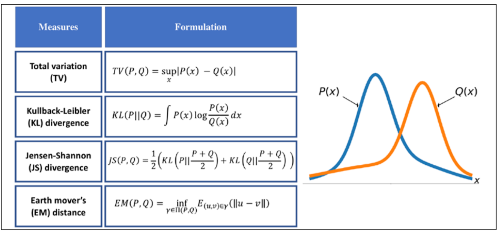

The function supremum, sup(S), used in the total variation (TV) measure, refers to the smallest value that is greater than all elements of S. In other words, sup(S) is the least upper bound for S. Vice versa, the infimum function, inf(S), which is used in EM distance, refers to the largest value that is smaller than all elements of S. 

* The first one, TV distance, measures the largest difference between the two distributions at each point. 
* The EM distance can be interpreted as the minimal amount of work needed to transform one distribution into the other. The infimum function in the EM distance is taken over Π(P,Q), which is the collection of all joint distributions whose marginals are P or Q. Then, 𝛾𝛾(𝑢𝑢, 𝑣𝑣) is a transfer plan, which indicates how we redistribute the earth from location u to v, subject to some constraints for maintaining valid distributions after such transfers. Computing EM distance is an optimization problem by itself, which is to find the optimal transfer plan, 𝛾𝛾(𝑢𝑢, 𝑣𝑣). 
* The Kullback-Leibler (KL) and Jensen-Shannon (JS) divergence measures come from the field of information theory. Note that KL divergence is not symmetric, that is, 𝐾L(𝑃‖𝑄) ≠ KL(𝑄‖𝑃) in contrast to JS divergence.


## Statistical Experiments and Significance testing


### A/B Testing

An A/B test is an experiment with two groups to establish which of two treatments, products, procedures, or the like is superior. Often one of the two treatments is the standard existing treatment, or no treatment. If a standard (or no) treatment is used, it is called the control. A typical hypothesis is that treatment is better than control.

* Treatment - Something to which a subject is exposed.
* Treatment group - A group of subjects exposed to a specific treatments.
* Control group - A group of subjects exposed to no (or standard) treatment.
* Subjects - The items that are exposed to treatments.
* Test statistic - The metric used to measure the effect of treatment.

1. Subjects are assigned to two (or more) groups that are treated exactly alike, except that the treatment under study differs from one to another. 

2. Ideally, subjects are assigned randomly to the groups

### Hypothesis Test

https://medium.com/dataseries/hypothesis-testing-in-machine-learning-what-for-and-why-ad6ddf3d7af2

Hypothesis tests, also called significance tests, are ubiquitous in the traditional statistical analysis of published research. Their purpose is to help you learn whether random chance might be responsible for an observed effect.

* Null hypothesis - The hypothesis that chance is to blame. (Гипотеза о том, что разница между двумя группами возникает только благодаря шансу)
* Alternative hypothesis - Counterpoint to the null (what you hope to prove).
* One-way test - Hypothesis test that counts chance results only in one direction.
* Two-way test - Hypothesis test that counts chance results in two directions.

Hypothesis tests use the following logic: “Given the human tendency to react to unusual but random behavior and interpret it as something meaningful and real, in our experiments we will require proof that the difference between groups is more extreme than what chance might reasonably produce.” This involves a baseline assumption that the treatments are equivalent, and any difference between the groups is due to chance. This baseline assumption is termed the null hypothesis. Our hope is then that we can, in fact, prove the null hypothesis wrong, and show that the outcomes for groups A and B are more different than what chance might produce.

A null hypothesis is a logical construct embodying the notion that nothing special has happened, and any effect you observe is due to random chance. The hypothesis test assumes that the null hypothesis is true, creates a “null model” (a probability model), and tests whether the effect you observe is a reasonable outcome of that model.

The goal of classical hypothesis testing is to answer the question, “Given a sample and an apparent effect, what is the probability of seeing such an effect by chance?” Here’s how we answer that question:  

* The first step is to quantify the size of the apparent effect by choosing a test statistic. In the NSFG example, the apparent effect is a difference in pregnancy length between first babies and others, so a natural choice for the test statistic is the difference in means between the two groups. 
* The second step is to define a null hypothesis, which is a model of the system based on the assumption that the apparent effect is not real. In the NSFG example the null hypothesis is that there is no difference between first babies and others; that is, that pregnancy lengths for both groups have the same distribution. 
* The third step is to compute a p-value, which is the probability of seeing the apparent effect if the null hypothesis is true. In the NSFG example, we would compute the actual difference in means, then compute the probability of seeing a difference as big, or bigger, under the null hypothesis. 
* The last step is to interpret the result. If the p-value is low, the effect is said to be statistically significant, which means that it is unlikely to have occurred by chance. In that case we infer that the effect is more likely to appear in the larger population.

### Example: Flipping a Coin

Imagine we have a coin and we want to test whether it’s fair. We’ll make the assumption that the coin has some probability p of landing heads, and so our null hypothesis is that the coin is fair—that is, that p = 0.5. We’ll test this against the alternative hypothesis p ≠ 0.5. In particular, our test will involve flipping the coin some number, n, times and counting the number of heads, X. Each coin flip is a Bernoulli trial, which means that X is a Binomial(n,p) random variable, which we can approximate using the normal distribution:

```python
from typing import Tuple
import math
def normal_approximation_to_binomial(n: int, p: float) -> Tuple[float, float]:
	"""Returns mu and sigma corresponding to a Binomial(n, p)"""
	mu = p * n
	sigma = math.sqrt(p * (1 - p) * n)
	return mu, sigma
```

Whenever a random variable follows a normal distribution, we can use normal_cdf to figure out the probability that its realized value lies within or outside a particular interval:

```python
def normal_cdf(x: float, mu: float = 0, sigma: float = 1) -> float:
    return (1 + math.erf((x - mu) / math.sqrt(2) / sigma) / 2
            
normal_probability_below = normal_cdf
# It's above the threshold if it's not below the threshold
def normal_probability_above(lo: float,
	mu: float = 0,
	sigma: float = 1) -> float:
	"""The probability that an N(mu, sigma) is greater than lo."""
	return 1 - normal_cdf(lo, mu, sigma)

# It's between if it's less than hi, but not less than lo
def normal_probability_between(lo: float,
                               hi: float,
                               mu: float = 0,
                               sigma: float = 1) -> float:
	"""The probability that an N(mu, sigma) is between lo and hi."""
    return normal_cdf(hi, mu, sigma) - normal_cdf(lo, mu, sigma)

# It's outside if it's not between
def normal_probability_outside(lo: float,
                               hi: float,
                               mu: float = 0,
                               sigma: float = 1) -> float:
	"""The probability that an N(mu, sigma) is not between lo and hi."""
	return 1 - normal_probability_between(lo, hi, mu, sigma)
```

We can also do the reverse—find either the nontail region or the (symmetric) interval around the mean that accounts for a certain level of likelihood. For example, if we want to find an interval centered at the mean and containing 60% probability, then we find the cutoffs where the upper and lower tails each contain 20% of the probability (leaving 60%):

```python
def normal_upper_bound(probability: float,
                       mu: float = 0,
                       sigma: float = 1) -> float:
	"""Returns the z for which P(Z <= z) = probability"""
	return inverse_normal_cdf(probability, mu, sigma)

def normal_lower_bound(probability: float,
                       mu: float = 0,
                       sigma: float = 1) -> float:
	"""Returns the z for which P(Z >= z) = probability"""
	return inverse_normal_cdf(1 - probability, mu, sigma)
def normal_two_sided_bounds(probability: float,
                            mu: float = 0,
                            sigma: float = 1) -> Tuple[float, float]:
	"""
	Returns the symmetric (about the mean) bounds
	that contain the specified probability
	"""
	tail_probability = (1 - probability) / 2
	# upper bound should have tail_probability above it
	upper_bound = normal_lower_bound(tail_probability, mu, sigma)
	# lower bound should have tail_probability below it
	lower_bound = normal_upper_bound(tail_probability, mu, sigma)
	return lower_bound, upper_bound
```

In particular, let’s say that we choose to flip the coin n = 1,000 times. If our hypothesis of fairness is true, X should be distributed approximately normally with mean 500 and standard deviation 15.8:

```python
mu_0, sigma_0 = normal_approximation_to_binomial(1000, 0.5)
```

We need to make a decision about significance—how willing we are to make a type 1 error (“false positive”), in which we reject H0 even though it’s true. For reasons lost to the annals of history, this willingness is often set at 5% or 1%. Let’s choose 5%. Consider the test that rejects H0 if X falls outside the bounds given by:

```python
# (469, 531)
lower_bound, upper_bound = normal_two_sided_bounds(0.95, mu_0, sigma_0)
```

Assuming p really equals 0.5 (i.e., H0 is true), there is just a 5% chance we observe an X that lies outside this interval, which is the exact significance we wanted. Said differently, if H0 is true, then, approximately 19 times out of 20, this test will give the correct result.

We are also often interested in the power of a test, which is the probability of not making a type 2 error (“false negative”), in which we fail to reject H0 even though it’s false. In order to measure this, we have to specify what exactly H0 being false means. (Knowing merely that p is not 0.5 doesn’t give us a ton of information about the distribution of X.) In particular, let’s check what happens if p is really 0.55, so that the coin is slightly biased toward heads.

```python
# 95% bounds based on assumption p is 0.5
lo, hi = normal_two_sided_bounds(0.95, mu_0, sigma_0)
# actual mu and sigma based on p = 0.55
mu_1, sigma_1 = normal_approximation_to_binomial(1000, 0.55)
# a type 2 error means we fail to reject the null hypothesis,
# which will happen when X is still in our original interval
type_2_probability = normal_probability_between(lo, hi, mu_1, sigma_1)
power = 1 - type_2_probability # 0.887
```

Imagine instead that our null hypothesis was that the coin is not biased toward heads, or that p ≤ 0. 5. In that case we want a one-sided test that rejects the null hypothesis when X is much larger than 500 but not when X is smaller than 500. So, a 5% significance test involves using normal_probability_below to find the cutoff below which 95% of the probability lies:

```python
hi = normal_upper_bound(0.95, mu_0, sigma_0)
# is 526 (< 531, since we need more probability in the upper tail)
type_2_probability = normal_probability_below(hi, mu_1, sigma_1)
power = 1 - type_2_probability # 0.936
```

This is a more powerful test, since it no longer rejects H0 when X is below 469 (which is very unlikely to happen if H1 is true) and instead rejects H0 when X is between 526 and 531 (which is somewhat likely to happen if H1 is true).


### Example: Running an A/B Test

Being a scientist, you decide to run an experiment by randomly showing site visitors one of the two advertisements and tracking how many people click on each one. If 990 out of 1,000 A-viewers click their ad, while only 10 out of 1,000 B-viewers click their ad, you can be pretty confident that A is the better ad. But what if the differences are not so stark? Here’s where you’d use statistical inference.

Let’s say that NA people see ad A, and that nA of them click it. We can think of each ad view as a Bernoulli trial where pA is the probability that someone clicks ad A. Then (if NA is large, which it is here) we know that nA/NA is approximately a normal random variable with mean pA and standard deviation σA = √pA (1 − pA) /NA. 

Similarly, nB/NB is approximately a normal random variable with mean pB and standard deviation σB = √pB (1 − pB) /NB. We can express this in code as:

```python
def estimated_parameters(N: int, n: int) -> Tuple[float, float]:
 p = n / N
 sigma = math.sqrt(p * (1 - p) / N)
 return p, sigma
```

If we assume those two normals are independent (which seems reasonable, since the individual Bernoulli trials ought to be), then their difference should also be normal with mean pB − pA and standard deviation √σ 2 A + σ 2 B .

**Note:** This is sort of cheating. The math only works out exactly like this if you know the standard deviations. Here we’re estimating them from the data, which means that we really should be using a t-distribution. But for large enough datasets, it’s close enough that it doesn’t make much of a difference.

This means we can test the null hypothesis that pA and pB are the same (that is, that pA − pB is 0) by using the statistic:

```python
def a_b_test_statistic(N_A: int, n_A: int, N_B: int, n_B: int) -> float:
 p_A, sigma_A = estimated_parameters(N_A, n_A)
 p_B, sigma_B = estimated_parameters(N_B, n_B)
 return (p_B - p_A) / math.sqrt(sigma_A ** 2 + sigma_B ** 2)
```

which should approximately be a standard normal. For example, if “tastes great” gets 200 clicks out of 1,000 views and “less bias” gets 180 clicks out of 1,000 views, the statistic equals and the probability of seeing such a large difference if the means were actually equal would be:

```python
z = a_b_test_statistic(1000, 200, 1000, 180) # -1.14
two_sided_p_value(z) # 0.254 - probability
```


### **P-value**

An alternative way of thinking about the preceding test involves p-values. Instead of choosing bounds based on some probability cutoff, we compute the probability—assuming H0 is true—that we would see a value at least as extreme as the one we actually observed.

For our two-sided test of whether the coin is fair, we compute:

```python
def two_sided_p_value(x: float, mu: float = 0, sigma: float = 1) -> float:
	"""
	How likely are we to see a value at least as extreme as x (in either
	direction) if our values are from an N(mu, sigma)?
	"""
	if x >= mu:
		# x is greater than the mean, so the tail is everything greater than x
        return 2 * normal_probability_above(x, mu, sigma)
	else:
        # x is less than the mean, so the tail is everything less than x
		return 2 * normal_probability_below(x, mu, sigma)
```

If we were to see 530 heads, we would compute:

```python
two_sided_p_value(529.5, mu_0, sigma_0) # 0.062
```

Why did we use a value of 529.5 rather than using 530? This is what’s called a continuity correction. It reflects the fact that normal_probability_between(529.5, 530.5, mu_0, sigma_0) is a better estimate of the probability of seeing 530 heads than normal_probability_between(530, 531, mu_0, sigma_0) is. Correspondingly, normal_probability_above(529.5, mu_0, sigma_0) is a better estimate of the probability of seeing at least 530 heads.

One way to convince yourself that this is a sensible estimate is with a simulation:

```python
import random
extreme_value_count = 0
for _ in range(1000):
	num_heads = sum(1 if random.random() < 0.5 else 0 # Count # of heads
                    for _ in range(1000)) # in 1000 flips,
	
    if num_heads >= 530 or num_heads <= 470: # and count how often
        extreme_value_count += 1 # the # is 'extreme'
# p-value was 0.062 => ~62 extreme values out of 1000
assert 59 < extreme_value_count < 65, f"{extreme_value_count}"
```

Since the p-value is greater than our 5% significance, we don’t reject the null. If we instead saw 532 heads, the p-value would be:

```python
two_sided_p_value(531.5, mu_0, sigma_0) # 0.0463
```

which is smaller than the 5% significance, which means we would reject the null. It’s the exact same test as before. It’s just a different way of approaching the statistics.

**P-hacking**

What this means is that if you’re setting out to find “significant” results, you usually can. Test enough hypotheses against your dataset, and one of them will almost certainly appear significant. Remove the right outliers, and you can probably get your p-value below 0.05.

If you want to do good science, you should determine your hypotheses before looking at the data, you should clean your data without the hypotheses in mind, and you should keep in mind that p-values are not substitutes for common sense. 


### Resampling

Resampling in statistics means to repeatedly sample values from observed data, with a general goal of assessing random variability in a statistic. There are two main types of resampling procedures: the **bootstrap** and **permutation tests**. The bootstrap is used to assess the reliability of an estimate; it was discussed in the previous chapter. 

* Permutation tests - The procedure of combining two or more samples together, and randomly (or exhaustively) reallocating the observations to resamples.

* With or without replacement  - In sampling, whether or not an item is returned to the sample before the next draw.


Permutation tests are used to test hypotheses, typically involving two or more groups. Permute means to change the order of a set of values. The first step in a permutation test of a hypothesis is to combine the results from groups A and B (and, if used, C, D, …) together. We then test that hypothesis by randomly drawing groups from this combined set, and seeing how much they differ from one another. The permutation procedure is as follows:

1. Combine the results from the different groups in a single data set. 
2. Shuffle the combined data, then randomly draw (without replacing) a resample of the same size as group A.
3. From the remaining data, randomly draw (without replacing) a resample of the same size as group B. 
4. Do the same for groups C, D, and so on. 
5. Whatever statistic or estimate was calculated for the original samples (e.g., difference in group proportions), calculate it now for the resamples, and record; this constitutes one permutation iteration. 
6. Repeat the previous steps R times to yield a permutation distribution of the test statistic.

Now go back to the observed difference between groups and compare it to the set of permuted differences. If the observed difference lies well within the set of permuted differences, then we have not proven anything—the observed difference is within the range of what chance might produce.

In addition to the preceding random shuffling procedure, also called a random permutation test or a randomization test, there are two variants of the permutation test:

1. An exhaustive permutation test. 

2. A bootstrap permutation test.


In an exhaustive permutation test, instead of just randomly shuffling and dividing the data, we actually figure out all the possible ways it could be divided. This is practical only for relatively small sample sizes.

In a bootstrap permutation test, the draws outlined in steps 2 and 3 of the random permutation test are made with replacement instead of without replacement.

### Statistical Significance and P-Values

* P-Value (Достигаемый уровень значимости) - Given a chance model that embodies the null hypothesis, the p-value is the probability of obtaining results as unusual or extreme as the observed results (Вероятность при справедливости нулевой гипотезы получить значение статистики как в эксперементе или еще более экстремальное, чем меньше p-value, тем сильнее данные свидетельствуют против нулевой гипотезы в пользу альтернативе)
* Alpha - The probability threshold of “unusualness” that chance results must surpass, for actual outcomes to be deemed statistically significant. (Если P-value < alpha нулевая гипотеза отвергается)
* Type 1 error - Mistakenly concluding an effect is real (when it is due to chance). (Отвержение нулевой гипотезы когда она верна).
* Type 2 error - Mistakenly concluding an effect is due to chance (when it is real) (Принятие нулевой гипотезы когда она не верна).

The real problem is that people want more meaning from the p-value than it contains. Here’s what we would like the p-value to convey: 

*The probability that the result is due to chance.*

We hope for a low value, so we can conclude that we’ve proved something. This is how many journal editors were interpreting the p-value. But here’s what the p-value actually represents: 

*The probability that, given a chance model, results as extreme as the observed results could occur.*

**The ASA statement stressed six principles for researchers and journal editors: **

1. P-values can indicate how incompatible the data are with a specified statistical model. 
2. P-values do not measure the probability that the studied hypothesis is true, or the probability that the data were produced by random chance alone. 
3. Scientific conclusions and business or policy decisions should not be based only on whether a p-value passes a specific threshold. 
4. Proper inference requires full reporting and transparency. 
5. A p-value, or statistical significance, does not measure the size of an effect or the importance of a result. 
6. By itself, a p-value does not provide a good measure of evidence regarding a model or hypothesis.

For a data scientist, a p-value is a useful metric in situations where you want to know whether a model result that appears interesting and useful is within the range of normal chance variability. As a decision tool in an experiment, a p-value should not be considered controlling, but merely another point of information bearing on a decision. For example, p-values are sometimes used as intermediate inputs in some statistical or machine learning models—a feature night be included in or excluded from a model depending on its p-value.

### t-Tests

* Test statistic - A metric for the difference or effect of interest. 
* t-statistic - A standardized version of test statistic.
* t-distribution - A reference distribution which the observed t-statistic can be compared.

A test statistic could then be standardized and compared to the reference distribution.

One such widely used standardized statistic is the t-statistic.

**One sample**

Tests whether the mean of a normally distributed population is different from a specified value.

*Null hypothesis (H_0)*: states that the population mean is equal to some value (mu_0).

*Alternative hypothesis (H_1)*: states that the population mean is not equal/is greater than/is less than value (mu_0).

t-statistic: standardized the difference between mean(X) and mu_0
$$
t = \frac{\bar x - \mu_0}{\frac{s}{\sqrt{n{}}}}
$$


Read the table of t-distribution critical values for the p-value using calculated t-statistic and degrees of freedom.

H_a: mu > mu_0 --> the t-statistic is likely positive; read tables as given

H_a: mu < mu_0 --> the t-statistic is likely negative; the t-distribution is symmetrical so read probability as if the t-statistic were positive

Note: if the t-statistic is of the wrong sign, the p-value is 1 minus p given in the chart

H_a: mu != mu_0 --> read the p-value as if the t-statistic were positive and double it

If the p-value is less than the predetermined value for significance, reject the null hypothesis and accept alternative hypothesis.

**Example**

You are experiencing hair loss and skin discoloration and think it might be because of selenium toxicity. You decide to measure the selenium levels in your tap water once a day for one week. Your results are given below. The EPA maximum containment level for safe drinking water is 0.05mg/L. Does the selenium level in your tap water exceed the legal limit?

| Day  | Selenium mg/L |
| ---- | ------------- |
| 1    | 0.051         |
| 2    | 0.0505        |
| 3    | 0.049         |
| 4    | 0.0516        |
| 5    | 0.052         |
| 6    | 0.0508        |
| 7    | 0.0506        |

H_0: mu = 0.05; H_a: mu > 0.05;

Calculate the mean and standard deviation of your sample:

mean(x) = 0.0508

std(x) = 9.56 * 1e-4
$$
t = \frac{\bar x - \mu_0}{\frac{s}{\sqrt{n{}}}} = \frac{0.0508 - 0.05}{\frac{9.56 * 10^{-4}}{\sqrt{7}}} = 2.17
$$


And degrees of freedom are n-1 = 7-1 =6

Looking at the t-distribution of critical values table, 2.17 with 6 degrees of freedom is between p=0.05 and p=0.025. This means that the p-value is less than 0.05, so you can reject H_0 and conclude that the selenium level in your tap water exceed legal limit.

**Two sample**

Tests whether the means of two populations are significantly different from one another.

*Paired* - Each value of one group corresponds directly to a value in the other group; ie. before and after values after drug treatment for each individual patient.

Subtract the two values for each individual to get one set of values (the differences) and use mu_0 = 0 to perform a one-sample t-test

*Unpaired* - The two populations are independent.

H_0: states that the means of the two populations are equal.

H_a: states that the means of the two populations are unequal or one is greater than the other

t-statistic: (1) - assuming equal variances, (2) - assuming unequal variances:
$$
t = \frac{\bar x_1 - \bar x_2}{\sqrt{s^2(\frac{1}{n_1}+\frac{1}{n_2})}} (1)
\\
t = \frac{\bar x_1 - \bar x_2}{\sqrt{(\frac{s^2_1}{n_1}+\frac{s^2_2}{n_2})}} (2)
$$


degrees of freedom = (n_1 - 1) + (n_2 - 1)

Read the table of t-distribution critical values for the p-value using the calculated t-statistic and degrees of freedom. Remember to keep the sign of the t-statistic clear (order or subtracting the sample means) and to double the p-value for an H_a of mu_1 != mu_2.

**Example**

Consider the lifespan of 18 rats. 12 were fed a restricted calorie diet and lived an average 700 days (std = 21 days). The other 6 had unrestricted access to food and lived an average 668 days (std = 30 days). Does a restricted calorie diet increase the lifespan of rats?

H_0: mu_1 = mu_2

H_a: mu_1 > mu_2

We cannot assume that the variance of the two populations are equal because the different diets could also affect the variability in lifespan.
$$
t = \frac{\bar x_1 - \bar x_2}{\sqrt{(\frac{s^2_1}{n_1}+\frac{s^2_2}{n_2})}} = \frac{700 - 668}{\sqrt{(\frac{21^2}{12}+\frac{30^2}{6})}} = 2.342
\\
df = (n_1 - 1) + (n_2 - 1) = 16
$$


From the t-distribution table, the p-value falls between 0.01 and 0.02, so we do reject H_0. The restricted calorie diet does increase the lifespan of rats.

### Однофакторный дисперсионный анализ

Представим набор данных из трех групп:

| a    | b    | c    |
| ---- | ---- | ---- |
| 3    | 5    | 7    |
| 1    | 3    | 6    |
| 2    | 4    | 5    |

H_0: средние трех групп равны

H_a: средние групп не равны


Рассмотрим все наблюдения как одну выборку, посчитаем среднее:
$$
\bar{\bar x} = \frac{3+1+2+5+3+4+7+6+5}{9} = 4
$$
Рассчитаем:
$$
SST = \sum_i (x_i - \bar{\bar x})^2 = (3-4)^2 + (1-4)^2 + (2-4)^2 + (5 - 4)^2 + (4 - 4)^2 + (3-4)^2 + (7-4)^2 + (6-4)^2 + (5-4)^2 =30
\\
SST = SSB + SSW
\\
df = 9 - 1
\\
x_a = 2, x_b= 4, x_c = 6
\\
SSW = \sum_i \sum_j (x_{ij} - \bar x_i)  = (3-2)^2 + (1-2)^2 + (2-2)^2 + \\ + (5-4)^2 + (3-4)^2 + (4-4)^2 + (7 - 6)^2 + (6 -6 )^2 + (5 - 6)^2 = 6
\\
df = N - m = 9 - 3 = 6
\\
SSB = \sum_i n_i(\bar x_i - \bar{\bar x}) = 3(2-4)^2 + 3(4-4)^2+(6-4)^2 = 24
\\
df = m - 1 = 3 - 1 = 2
$$


где SST - total sum of squares, показатель который характеризует изменчивость данных без учета разбиения их на группы. 

SSB - сумма квадратов между групп. SSW - сумма квадратов внутри групп.

Если большая часть общей изменчивости обеспечивается благодаря сумме квадратов между групп это значит что группы значительно различаются между собой. 

Основной статистический показатель дисперсионного анализа:
$$
F = \frac{\frac{SSB}{m-1}}{\frac{SSW}{N - m}} = 12
$$


Если выборки не отличаются между собой то числитель дроби стремится к нулю.


**Множественные сравнения**

Дисперсионный анализ показывает что между хотя бы две группы отличаются. Для того чтобы узнать какие можно провести между всеми группами t-test, однако с ростом числа групп растет и вероятность того, что тест покажет различия в группах, даже если его нет (при фиксированном пороге p-value). Для того чтобы исправить это используется **поправка Бонферонни**, при которой порог p-value делится на число междугрупповых сравнений, и соответственно уровень значимости сравнивается с этим новым порогом.

Более корректным способом является использование **поправки Тьюки**.

Без поправок возрастает вероятность совершить ошибку первого рода.


### Двухфакторный анализ дисперсии

SST = SSW + SSB_A + SSB_B + SSB_A*SSB_B 
### Multiple Testing

* False discovery rate - Across multiple tests, the rate of making a Type 1 error.
* Adjustment of p-values - Accounting for doing multiple tests on the same data.

Multiplicity in a research study or data mining project (multiple comparisons, many variables, many models, etc.) increases the risk of concluding that something is significant just by chance. For situations involving multiple statistical comparisons (i.e., multiple tests of significance) there are statistical adjustment procedures. In a data mining situation, use of a holdout sample with labeled outcome variables can help avoid misleading results.

### ANOVA 

The statistical procedure that tests for a statistically significant difference among the groups is called analysis of variance, or ANOVA

* Pairwise comparison - A hypothesis test (e.g., of means) between two groups among multiple groups. 
* Omnibus test - A single hypothesis test of the overall variance among multiple group means. 
* Decomposition of variance - Separation of components. contributing to an individual value (e.g., from the overall average, from a treatment mean, and from a residual error). 
* F-statistic - A standardized statistic that measures the extent to which differences among group means exceeds what might be expected in a chance model.
* SS - “Sum of squares,” referring to deviations from some average value.

“Could all the pages have the same underlying stickiness, and the differences among them be due to the random way in which a common set of session times got allocated among the four pages?” 

The procedure used to test this is ANOVA. The basis for ANOVA can be seen in the following resampling procedure (specified here for the A-B-C-D test of web page stickiness): 

1. Combine all the data together in a single box.
2. Shuffle and draw out four resamples of five values each.
3. Record the mean of each of the four groups.
4. Record the variance among the four group means.
5. Repeat steps 2–4 many times (say 1,000)

What proportion of the time did the resampled variance exceed the observed variance? This is the p-value.

The **F-statistic** is based on the ratio of the variance across group means (i.e., the treatment effect) to the variance due to residual error.

ANOVA is a statistical procedure for analyzing the results of an experiment with multiple groups. It is the extension of similar procedures for the A/B test, used to assess whether the overall variation among groups is within the range of chance variation. A useful outcome of an ANOVA is the identification of variance components associated with group treatments, interaction effects, and errors.

### Chi-Square Test

**For goodness of Fit**

Checks whether or not an observed pattern of data fits some given distribution

H_0: The observed pattern fits the given distribution

H_a: The observed pattern does not fit the given distribution

The chi-square statistic is:
$$
\chi^2= \sum \frac{(O-E)^2}{E}
$$


O is observed value and E is expected;

Degrees of freedom = number of categories in the distribution - 1

Get the p-value from the table of \chi^2 critical value using the calculated \chi^2 and df values. If the p-value is less then \alpha, the observed data does not fit the expected distribution. If p>\alpha, the data likely fits the expected distribution.

**Example**

You breed puffskeins and would like to determine the pattern of inheritance for coat colar and purring ability. Puffskeins come in either pink or purple and can either purr or hiss. You breed a purebred, pink purring male with a purebred, purple hissing female. All individuals of the F1 generation are pink and purring. The F2 offspring a shown below. Do the alleles for coat color and purring ability assort independently?

| Pink and purring | Pink and Hissing | Purple and Purring | Purple and Hissing |
| ---------------- | ---------------- | ------------------ | ------------------ |
| 143              | 60               | 55                 | 18                 |

Independent assortment means a phenotypic ratio of 9:3:3:1, so:

H_0: the observed distribution of F2 offspring fits 9:3:3:1 distribution

H_a: the observed distribution of F2 offspring does not fit a 9:3:3:1 distribution

The expected values are:

| Pink and purring | Pink and Hissing | Purple and Purring | Purple and Hissing |
| ---------------- | ---------------- | ------------------ | ------------------ |
| 155.25           | 51.75            | 51.75              | 17.25              |

$$
\chi^2 = \sum \frac{(O - E)^2}{E} = 2.519
\\
df = 4-1= 3
$$


From the table of \chi^2 critical values, the p-value is greater than 0.25, so the alleles for coat color and purring ability do assort independently in puffskeins.

**For independence**

Checks whether two categorical variables are related or not 

H_0: the two variables are independent

H_a: the two variables are not independent

*Does not make any assumptions about an expected distribution*

The observed values (#1, #2, #3, #4) are usually presented as a table. Each row is a category of variable 1 and each column is a category of variable 2.

|            |            | Variable 1 |            | Totals            |
| ---------- | ---------- | ---------- | ---------- | ----------------- |
|            |            | Category x | Category y |                   |
| Variable 2 | Category a | #1         | #2         | #1 + #2           |
|            | Category b | #3         | #4         | #3 + #4           |
| Totals     |            | #1 + #3    | #2 + #4    | #1 + #2 + #3 + #4 |

The proportion of category x of variable 1 is the number of individuals in category x divided by total number of individuals. Assuming independence, the expected number of individuals that fall within category a of variable 2 is the proportion of category x multiplied by the number of individuals in category a. Thus the expected value:
$$
E = \frac{(rowtotal)(columntotal)}{grandtotal}
\\
df = (r-1)(c-1)
\\
\chi^2 = \sum \frac{(O - E)^2}{E}
$$
**Example**

Given example below, is there a relationship between fitness level and smoking habits?

|                         | Fitness level |            |             |      |      |
| ----------------------- | ------------- | ---------- | ----------- | ---- | ---- |
|                         | Low           | Medium-low | Medium-High | High |      |
| Never smoked            | 113           | 113        | 110         | 159  | 495  |
| Former smokers          | 119           | 135        | 172         | 190  | 616  |
| 1 to 9 cigarettes daily | 77            | 91         | 86          | 65   | 319  |
| > 9 cigarettes daily    | 181           | 152        | 124         | 73   | 530  |
|                         | 490           | 491        | 492         | 487  | 1960 |

H_0: Fitness level and smoking habits are independent

H_a: Fitness level and smoking habits are not independent

First we calculate the expected counts. For the first cell:
$$
E = \frac{(row total) (columntotal)}{grand total} = \frac{495*490}{1960} = 123.75
$$

|                         | Fitness level |            |             |        |
| ----------------------- | ------------- | ---------- | ----------- | ------ |
|                         | Low           | Medium-low | Medium-High | High   |
| Never smoked            | 123.75        | 124        | 124.26      | 122.99 |
| Former smokers          | 154           | 154.31     | 154.63      | 153.06 |
| 1 to 9 cigarettes daily | 79.75         | 79.91      | 80.08       | 79.26  |
| > 9 cigarettes daily    | 132.5         | 132.77     | 133.04      | 131.69 |

$$
\chi^2 = \sum \frac{(O-E)^2}{E} = 91.73
\\
df = (r-1)(c-1) = (4-1)(4-1)=9
$$


From the table of \chi^2 critical values, the p-value is less than 0.001, so we reject H_0 and conclude that there is a relationship between fitness level and smoking habits.


Example: https://r-analytics.blogspot.com/2012/08/blog-post.html

В общем виде можно сказать, что он используется для проверки нулевой гипотезы о подчинении наблюдаемой случайной величины определенному теоретическому закону распределения.

The chi-square test is used with count data to test how well it fits some expected distribution. The most common use of the chi-square statistic in statistical practice is with r*c (rows by columns) contingency tables, to assess whether the null hypothesis of independence among variables is reasonable


$$
R = \frac{Observed-Expected}{\sqrt{Expected}}
\\
chi = \sum_{i}^{r}\sum_{j}^{c}R^2
$$


Suppose you are testing three different headlines—A (14 clicks), B (8 clicks), and C(12 clicks) —and you run them each on 1,000 visitors. For this test, we need to have the “expected” distribution of clicks, and, in this case, that would be under the null hypothesis assumption that all three headlines share the same click rate, for an overall click rate of 34/3,000.

1. Constitute a box with 34 ones (clicks) and 2,966 zeros (no clicks). 
2. Shuffle, take three separate samples of 1,000, and count the clicks in each. 
3. Find the squared differences between the shuffled counts and the expected counts, and sum them. 
4. Repeat steps 2 and 3, say, 1,000 times. 
5. How often does the resampled sum of squared deviations exceed the observed? That’s the p-value.

A common procedure in statistics is to test whether observed data counts are consistent with an assumption of independence (e.g., propensity to buy a particular item is independent of gender). The chi-square distribution is the reference distribution (which embodies the assumption of independence) to which the observed calculated chi-square statistic must be compared.


### Multi-Arm Bandit Algorithm

* Multi-arm Bandit - An imaginary slot machine with multiple arms for the customer to choose from, each with different payoffs, here taken to be an analogy for a multi-treatment experiment.
* Arm - A treatment in an experiment 
* Win - The experimental analog of a win at the slot machine 

Bandit algorithms, which are very popular in web testing, allow you to test multiple treatments at once and reach conclusions faster than traditional statistical designs.

Traditional A/B tests envision a random sampling process, which can lead to excessive exposure to the inferior treatment. Multi-arm bandits, in contrast, alter the sampling process to incorporate information learned during the experiment and reduce the frequency of the inferior treatment. They also facilitate efficient treatment of more than two treatments. There are different algorithms for shifting sampling probability away from the inferior treatment(s) and to the (presumed) superior one.

Here is one simple algorithm, the epsilon-greedy algorithm for an A/B test: 

1. Generate a random number between 0 and 1. 
2. If the number lies between 0 and epsilon (where epsilon is a number between 0 and 1, typically fairly small), flip a fair coin (50/50 probability), and: a. If the coin is heads, show offer A. b. If the coin is tails, show offer B. 
3. If the number is ≥ epsilon, show whichever offer has had the highest response rate to date.


### Power and Sample Size

* Effect size - The minimum size of the effect that you hope to be able to detect in a statistical test, such as "a 20% improvements in click rates".
* Power - The probability of detecting a given size with a given sample size.
* Significance level - The statistical significance level at which the test will be conducted.

Here’s a fairly intuitive alternative approach: 

1. Start with some hypothetical data that represents your best guess about the data that will result (perhaps based on prior data)—for example, a box with 20 ones and 80 zeros to represent a .200 hitter, or a box with some observations of “time spent on website.” 
2. Create a second sample simply by adding the desired effect size to the first sample—for example, a second box with 33 ones and 67 zeros, or a second box with 25 seconds added to each initial “time spent on website.” 
3. Draw a bootstrap sample of size n from each box. 
4. Conduct a permutation (or formula-based) hypothesis test on the two bootstrap samples and record whether the difference between them is statistically significant. 
5. Repeat the preceding two steps many times and determine how often the difference was significant—that’s the estimated power.

Finding out how big a sample size you need requires thinking ahead to the statistical test you plan to conduct. You must specify the minimum size of the effect that you want to detect. You must also specify the required probability of detecting that effect size (power). Finally, you must specify the significance level (alpha) at which the test will be conducted.


### Probability


1. A probability function P on a finite sample space Ω assigns to each event A in Ω a number P(A) in [0,1] such that:
   $$
   P(\Omega) = 1
   \\
   P(A \cup B) = P(A) + P(B) \text{ - (any of events) if A and B disjoint}
   \\
   P(A \cup B) = P(A) + P(B) - P(A \cap B) \text{ - for any two events A and B}
   $$

2. The conditional probability of A given C is given by:
   $$
   P(A|C) = \frac{P(A\cap C)}{P(C)}
   \\
   P(A \cap C) = P(A|C) P(C)
   $$

3. **The law of total probability**. Suppose C1, C2, ..., Cm are disjoint events such that C1 ∪ C2 ∪···∪ Cm = Ω. The probability of an arbitrary event A can be expressed as:
   $$
   P(A) = P(A|C_1)P(C_1)+P(A|C_2)P(C_2) + ... + P(A|C_m)P(C_m)
   $$
   **Example: Testing for mad cow disease**

   Let B denote the event “the cow has BSE” and T the event “the test comes up positive”.  An infected cow has a 70% chance of testing positive, and a healthy cow just 10%. 
   $$
   P(T|B) = 0.70
   \\
   P(T|\neg B) = 0.10
   \\
   P(B) = 0.02
   $$
   *Suppose we want to determine the probability P(T) that an arbitrary cow tests positive*. The tested cow is either infected or it is not: event T occurs in combination with B or with Bc (there are no other possibilities). In terms of events:
   $$
   T= (T \cap B)\cup(T \cap \neg B)
   \\
   P(T) = P(T \cap B) + P(T \cap \neg B)
   $$
   because T ∩B and T ∩Bc are disjoint. Next, apply the multiplication rule (in such a way that the known conditional probabilities appear!):
   $$
   P(T\cap B) = P(T|B)P(B)
   \\
   P(T \cap \neg B) = P(T| \neg B) P(\neg B)
   \\
   P(T) = P(T|B)P(B) + P(T| \neg B) P(\neg B) = 0.02 * 0.7 + (1 - 0.02)*0.1 = 0.112
   \\
   $$
   

   Another, perhaps more pertinent, question about the BSE test is the following: *suppose my cow tests positive; what is the probability it really has BSE*?
   $$
   P(B|T) = \frac{P(T \cap B)}{P(T)} = \frac{P(T|B)P(B)}{P(T|B)P(B) + P(T|\neg B)P(\neg B)} = \frac{0.7*0.02}{0.7*0.02+ 0.1*(1-0.02)} = 0.125
   $$

4. **Bayes’ rule**. Suppose the events C1, C2, ..., Cm are disjoint and C1 ∪ C2 ∪···∪ Cm = Ω. The conditional probability of Ci, given an arbitrary event A, can be expressed as:
   $$
   P(C_i|A) = \frac {P(A|C_i)P(C_i)}{P(A|C_1)P(C_1)+ P(A|C_2)P(C_2) + ... + P(A|C_m)P(C_m)}
   $$

5. An event A is called **independent** of B if:
   $$
   P(A|B)=P(A)
   \\
   P(B|A) = P(B)
   \\
   P(A \cap B) = P(A)P(B)
   $$
   To show that A and B are independent it suffices to prove just one of the statements.


### Central limit theorem

https://www.youtube.com/watch?v=YAlJCEDH2uY

For a large number of independent identically distributed random variables X1,...,Xn, with finite variance, the average X¯n approximately has a normal distribution, no matter what the distribution of the Xi is.

One reason the normal distribution is so useful is the central limit theorem, which says (in essence) that a random variable defined as the average of a large number of independent and identically distributed random variables is itself approximately normally distributed.

In particular, if x1, ..., xn are random variables with mean μ and standard deviation σ, and if n is large, then:
$$
\frac{1}{n}(x_1 + ... + x_n)
$$
is approximately normally distributed with mean μ and standard deviation σ/√n. Equivalently (but often more usefully),
$$
\frac{(x_1 + ... x_n) - \mu n}{\sigma \sqrt{n}}
$$


is approximately normally distributed with mean 0 and standard deviation 1.

An easy way to illustrate this is by looking at binomial random variables, which have two parameters n and p. A Binomial(n,p) random variable is simply the sum of n independent Bernoulli(p) random variables, each of which equals 1 with probability p and 0 with probability 1 – p. The mean of a Bernoulli(p) variable is p, and its standard deviation is √p(1 − p). The central limit theorem says that as n gets large, a Binomial(n,p) variable is approximately a normal random variable with mean μ = np and standard deviation σ = √np(1 − p). 

The moral of this approximation is that if you want to know the probability that (say) a fair coin turns up more than 60 heads in 100 flips, you can estimate it as the probability that a Normal(50,5) is greater than 60, which is easier than computing the Binomial(100,0.5) CDF. (Although in most applications you’d probably be using statistical software that would gladly compute whatever probabilities you want.)


Средние значения подвыборок из неизвестного распределения при увеличении количества таких подвыборок образуют нормальное распределение.

### **Bayesian curve fitting**

In the curve fitting problem, we are given the training data **x** and **t**, along with a new test point x, and our goal is to predict the value of t. We therefore wish to evaluate the predictive distribution p(t|x, **x**, **t**). Here we shall assume that the parameters α and β are fixed and known in advance.

A Bayesian treatment simply corresponds to a consistent application of the sum and product rules of probability, which allow the predictive distribution to be written in the form:
$$
p(t|x, \bold x, \bold t) = \int p(t|x, \bold w) p(w|\bold x, \bold t) dw
$$


### Curse of dimensionality

In practice, to capture complex dependencies in the data, we may need to use a higher-order polynomial. For a polynomial of order M, the growth in the number of coefficients is like D^M. Although this is now a power law growth, rather than an exponential growth, it still points to the method becoming rapidly unwieldy and of limited practical utility

The reader should be warned, however, that not all intuitions developed in spaces of low dimensionality will generalize to spaces of many dimensions.


## Machine Learning techniques and tasks


### Learning to label sequence

Sequence labeling is the problem of automatically assigning a label to each element of a sequence. A labeled sequential training example in sequence labeling is a pair of lists (X, Y), where X is a list of feature vectors, one per time step, Y is a list of the same length of labels. For example, X could represent words in a sentence such as [“big”, “beautiful”, “car”], and Y would be the list of the corresponding parts of speech, such as [“adjective”, “adjective”, “noun”]).

Models for label sequence:

1. RNN

2. Conditional Random Fields (CRF). 

   For example, imagine we have the task of named entity extraction and we want to build a model that would label each word in the sentence such as “I go to San Francisco” with one of the following classes: {location, name, company_name, other}. If our feature vectors (which represent words) contain such binary features as “whether or not the word starts with a capital letter” and “whether or not the word can be found in the list of locations,” such features would be very informative and help to classify the words San and Francisco as location


### Sequence-to-sequence learning 

Sequence-to-sequence learning (often abbreviated as seq2seq learning) is a generalization of the sequence labeling problem. In seq2seq, Xi and Yi can have different lengths. seq2seq models have found application in machine translation (where, for example, the input is an English sentence, and the output is the corresponding French sentence), conversational interfaces (where the input is a question typed by the user, and the output is the answer from the machine), text summarization, spelling correction, and many others.

Many but not all seq2seq learning problems are currently best solved by neural networks. The network architectures used in seq2seq all have two parts: an encoder and a decoder. 

In seq2seq neural network learning, the encoder is a neural network that accepts sequential input. It can be an RNN, but also a CNN or some other architecture. The role of the encoder is to read the input and generate some sort of state (similar to the state in RNN) that can be seen as a numerical representation of the meaning of the input the machine can work with. The meaning of some entity, whether it be an image, a text or a video, is usually a vector or a matrix that contains real numbers. This vector (or matrix) is called in the machine learning jargon the embedding of the input.

The decoder is another neural network that takes an embedding as input and is capable of generating a sequence of outputs. As you could have already guessed, that embedding comes from the encoder. To produce a sequence of outputs, the decoder takes a start of sequence input feature vector x(0) (typically all zeroes), produces the first output y(1), updates its state by combining the embedding and the input x(0), and then uses the output y(1) as its next input x(1). 

More accurate predictions can be obtained using an architecture with **attention**. Attention mechanism is implemented by an additional set of parameters that combine some information from the encoder (in RNNs, this information is the list of state vectors of the last recurrent layer from all encoder time steps) and the current state of the decoder to generate the label. That allows for even better retention of long-term dependencies than provided by gated units and bidirectional RNN.

### Active learning

Active learning is an interesting supervised learning paradigm. It is usually applied when obtaining labeled examples is costly. That is often the case in the medical or financial domains, where the opinion of an expert may be required to annotate patients’ or customers’ data. The idea is to start learning with relatively few labeled examples, and a large number of unlabeled ones, and then label only those examples that contribute the most to the model quality.

There are multiple strategies of active learning. Here, we discuss only the following two: 

1. data density and uncertainty based
2. support vector-based.

The former strategy applies the current model f, trained using the existing labeled examples, to each of the remaining unlabelled examples (or, to save the computing time, to some random sample of them). For each unlabeled example x, the following importance score is computed: density(x) · uncertaintyf (x). Density reflects how many examples surround x in its close neighborhood, while uncertaintyf (x) reflects how uncertain the prediction of the model f is for x. In binary classification with sigmoid, the closer the prediction score is to 0.5, the more uncertain is the prediction. In SVM, the closer the example is to the decision boundary, the most uncertain is the prediction

In multiclass classification, entropy can be used as a typical measure of uncertainty:
$$
H_f(x) = -\sum_{c=1}^C Pr(y^{(c)}; f(x))ln[Pr(y^{(c)}; f(x))]
$$
Density for the example x can be obtained by taking the average of the distance from x to each of its k nearest neighbors (with k being a hyperparameter).

Once we know the importance score of each unlabeled example, we pick the one with the highest importance score and ask the expert to annotate it. Then we add the new annotated example to the training set, rebuild the model and continue the process until some stopping criterion is satisfied. A stopping criterion can be chosen in advance (the maximum number of requests to the expert based on the available budget) or depend on how well our model performs according to some metric.

The support vector-based active learning strategy consists in building an SVM model using the labeled data. We then ask our expert to annotate the unlabeled example that lies the closest to the hyperplane that separates the two classes. The idea is that if the example lies closest to the hyperplane, then it is the least certain and would contribute the most to the reduction of possible places where the true (the one we look for) hyperplane could lie.

### Semi-supervised learning

In semi-supervised learning (SSL) we also have labeled a small fraction of the dataset; most of the remaining examples are unlabeled. Our goal is to leverage a large number of unlabeled examples to improve the model performance without asking for additional labeled examples.

The neural network architecture that attained a remarkable performance is called a **ladder network**. To understand ladder networks you have to understand what an **autoencoder** is.

An autoencoder is a feed-forward neural network with an encoder-decoder architecture. It is trained to reconstruct its input. So the training example is a pair (x, x). We want the output xˆ of the model f(x) to be as similar to the input x as possible.

An important detail here is that an autoencoder’s network looks like an hourglass with a bottleneck layer in the middle that contains the embedding of the D-dimensional input vector; the embedding layer usually has much fewer units than D. The goal of the decoder is to reconstruct the input feature vector from this embedding.

A **denoising autoencoder** corrupts the left-hand side x in the training example (x, x) by adding some random perturbation to the features. If our examples are grayscale images with pixels represented as values between 0 and 1, usually a normal Gaussian noise is added to each feature. 

A **ladder network** is a denoising autoencoder with an upgrade. The encoder and the decoder have the same number of layers. The bottleneck layer is used directly to predict the label (using the softmax activation function). The network has several cost functions. For each layer l of the encoder and the corresponding layer l of the decoder, one cost Cl d penalizes the difference between the outputs of the two layers (using the squared Euclidean distance). When a labeled example is used during training, another cost function, Cc, penalizes the error in prediction of the label (the negative log-likelihood cost function is used).


Other semi-supervised learning techniques, not related to training neural networks, exist. One of them implies building the model using the labeled data and then cluster the unlabeled and labeled examples together using any clustering technique. For each new example, we then output as a prediction the majority label in the cluster it belongs to. Another technique, called S3VM, is based on using SVM. We build one SVM model for each possible labeling of unlabeled examples and then we pick the model with the largest margin. The paper on S3VM describes an approach that allows solving this problem without actually enumerating all possible labelings.

### One-shot learning

In one-shot learning, typically applied in face recognition, we want to build a model that can recognize that two photos of the same person represent that same person. If we present to the model two photos of two different people, we expect the model to recognize that the two people are different. 

To solve such a problem, we could go a traditional way and build a binary classifier that takes two images as input and predict either true (when the two pictures represent the same person) or false (when the two pictures belong to different people). However, in practice, this would result in a neural network twice as big as a typical neural network, because each of the two pictures needs its own embedding subnetwork. Training such a network would be challenging not only because of its size but also because the positive examples would be much harder to obtain than negative ones. So the problem is highly imbalanced.

One way to effectively solve the problem is to train a siamese neural network (SNN). An SNN can be implemented as any kind of neural network, a CNN, an RNN, or an MLP. The network only takes one image as input at a time; so the size of the network is not doubled. To obtain a binary classifier “same_person”/“not_same” out of a network that only takes one picture as input, we train the networks in a special way. To train an SNN, we use the triplet loss function. For example, let us have three images of a face: image A (for anchor), image P (for positive) and image N (for negative). A and P are two different pictures of the same person; N is a picture of another person. Each training example i is now a triplet (Ai, Pi, Ni).

Let’s say we have a neural network model f that can take a picture of a face as input and output an embedding of this picture. The triplet loss for example i is defined as,
$$
max(||f(A_i) - f(P_i)||^2 - ||f(A_i) - f(N_i)||^2 + \alpha, 0)
$$
The cost function is defined as the average triplet loss:
$$
\frac{1}{N} \sum_{i=1}^N max(||f(A_i) -f(P_i)||^2 - ||f(A_i) - f(N_i)||^2 + \alpha, 0)
$$
where – is a positive hyperparameter. Intuitively, ||f(A) - f(P)||^2 is low when our neural network outputs similar embedding vectors for A and P; ||f(A) - f(N)||^2 is high when the embedding for pictures of two different people are different.


Rather than randomly choosing an image for N, a better way to create triplets for training is to use the current model after several epochs of learning and find candidates for N that are similar to A and P according to that model. Using random examples as N would significantly slow down the training because the neural network will easily see the difference between pictures of two random people, so the average triplet loss will be low most of the time and the parameters will not be updated fast enough. 

To build an SNN, we first decide on the architecture of our neural network. For example, CNN is a typical choice if our inputs are images. Given an example, to calculate the average triplet loss, we apply, consecutively, the model to A, then to P, then to N, and then we compute the loss for that example. We repeat that for all triplets in the batch and then compute the cost; gradient descent with backpropagation propagates the cost through the network to update its parameters.

### Zero-shot learning

In zero-shot learning (ZSL) we want to train a model to assign labels to objects. The most frequent application is to learn to assign labels to images.

However, contrary to standard classification, we want the model to be able to predict labels that we didn’t have in the training data. How is that possible? The trick is to use embeddings not just to represent the input x but also to represent the output y. Imagine that we have a model that for any word in English can generate an embedding vector with the following property: if a word yi has a similar meaning to the word yk, then the embedding vectors for these two words will be similar.

For example, if yi is Paris and yk is Rome, then they will have embeddings that are similar; on the other hand, if yk is potato, then the embeddings of yi and yk will be dissimilar. Such embedding vectors are called word embeddings, and they are usually compared using cosine similarity metrics.

Now, in our classification problem, we can replace the label yi for each example i in our training set with its word embedding and train a multi-label model that predicts word embeddings. To get the label for a new example x, we apply our model f to x, get the embedding yˆ and then search among all English words those whose embeddings are the most similar to yˆ using cosine similarity.

### Handling Multiple Inputs

With neural networks, you have more flexibility. You can build two subnetworks, one for each type of input. For example, a CNN subnetwork would read the image while an RNN subnetwork would read the text. Both subnetworks have as their last layer an embedding: CNN has an embedding of the image, while RNN has an embedding of the text. You can now concatenate two embeddings and then add a classification layer, such as softmax or sigmoid, on top of the concatenated embeddings. Neural network libraries provide simple to use tools that allow concatenating or averaging layers from several subnetworks.

### Handling Multiple Outputs

In some cases the outputs are multimodal, and their combinations cannot be effectively enumerated. Consider the following example: you want to build a model that detects an object on an image and returns its coordinates. In addition, the model has to return a tag describing the object, such as “person,” “cat,” or “hamster.” Your training examples will a feature vector that represents an image. The label will be represented as a vector of coordinates of the object and another vector with a one-hot encoded tag. To handle a situation like that, you can create one subnetwork that would work as an encoder. It will read the input image using, for example, one or several convolution layers. The encoder’s last layer would be the embedding of the image. Then you add two other subnetworks on top of the embedding layer: one that takes the embedding vector as input and predicts the coordinates of an object. This first subnetwork can have a ReLU as the last layer, which is a good choice for predicting positive real numbers, such as coordinates; this subnetwork could use the mean squared error cost C1. The second subnetwork will take the same embedding vector as input and predict the probabilities for each label. This second subnetwork can have a softmax as the last layer, which is appropriate for the probabilistic output, and use the averaged negative log-likelihood cost C2 (also called cross-entropy cost).

### Transfer Learning

Transfer learning is probably where neural networks have a unique advantage over the shallow models. In transfer learning, you pick an existing model trained on some dataset, and you adapt this model to predict examples from another dataset, different from the one the model was built on. This second dataset is not like holdout sets you use for validation and test. It may represent some other phenomenon, or, as machine learning scientists say, it may come from another statistical distribution.

With neural networks, the situation is much more favorable. Transfer learning in neural networks works like this. 

1. You build a deep model on the original big dataset (wild animals). 
2. You compile a much smaller labeled dataset for your second model (domestic animals). 
3. You remove the last one or several layers from the first model. Usually, these are layers responsible for the classification or regression; they usually follow the embedding layer. 
4. You replace the removed layers with new layers adapted for your new problem. 
5. You “freeze” the parameters of the layers remaining from the first model. 
6. You use your smaller labeled dataset and gradient descent to train the parameters of only the new layers.

### Learning to Rank

Learning to rank is a supervised learning problem. Among others, one frequent problem solved using learning to rank is the optimization of search results returned by a search engine for a query. In search result ranking optimization, a labeled example Xi in the training set of size N is a ranked collection of documents of size ri (labels are ranks of documents). A feature vector represents each document in the collection. The goal of the learning is to find a ranking function f which outputs values that can be used to rank documents. For each training example, an ideal function f would output values that induce the same ranking of documents as given by the labels.

### Learning to Recommend

Learning to recommend is an approach to build recommender systems. Usually, we have a user who consumes content. We have the history of consumption and want to suggest this user new content that they would like. It could be a movie on Netflix or a book on Amazon. Traditionally, two approaches were used to give recommendations: content-based filtering and collaborative filtering.

Content-based filtering consists of learning what users like based on the description of the content they consume. For example, if the user of a news site often reads news articles on science and technology, then we would suggest to this user more documents on science and technology. More generally, we could create one training set per user and add news articles to this dataset as a feature vector x and whether the user recently read this news article as a label y. Then we build the model of each user and can regularly examine each new piece of content to determine whether a specific user would read it or not. The content-based approach has many limitations. For example, the user can be trapped in the so-called filter bubble: the system will always suggest to that user the information that looks very similar to what user already consumed. That could result in complete isolation of the user from information that disagrees with their viewpoints or expands them. On a more practical side, the users might just stop following recommendations, which is undesirable. Collaborative filtering has a significant advantage over content-based filtering: the recommendations to one user are computed based on what other users consume or rate. For instance, if two users gave high ratings to the same ten movies, then it’s more likely that user 1 will appreciate new movies recommended based on the tastes of the user 2 and vice versa. The drawback of this approach is that the content of the recommended items is ignored. In collaborative filtering, the information on user preferences is organized in a matrix. Each row corresponds to a user, and each column corresponds to a piece of content that user rated or consumed. Usually, this matrix is huge and extremely sparse, which means that most of its cells aren’t filled (or filled with a zero). The reason for such a sparsity is that most users consume or rate just a tiny fraction of available content items. It’s is very hard to make meaningful recommendations based on such sparse data.

Two effective recommender system learning algorithms are 

1. Denoising autoencoders (DAE).

2. Factorization machines (FM) . The factorization machine model is defined as follows:
   $$
   f(x) = b + \sum_{i=1}^D w_ix_i + \sum_{i=1}^D\sum_{j=i+1}^D(v_iv_j)x_ix_j
   $$
   Depending on the problem, the loss function could be squared error loss (for regression) or hinge loss. For classification with y œ {≠1, +1}, with hinge loss or logistic loss the prediction is made as y = sign(f(x)). The logistic loss is defined as,
   $$
   loss(f(x), y) = \frac{1}{ln2}ln(1 + e^{-yf(x)})
   $$
   


Вы должны взять матрицу X, заполнить все пустые ячейки средними значениями рейтинга для данного элемента (не нужно заполнять его нулями, поскольку это может означать нечто в рейтинговой системе, а SVD не может обрабатывать отсутствующие значения), а затем вычислить SVD. Теперь, когда вы произвели такое разложение, это значит, что вы захватили скрытые характеристики, которые при желании можете применять для сравнения пользователей. Но вам нужно не это — вы хотите предсказать. Перемножив U, S и Vτ , вы получите приближение A к X или предсказание , таким образом, можете прогнозировать оценку, просто просматривая запись для соответствующей пары «пользователь/ элемент» в матрице X. 


### PCA 


Рассмотрим другой подход к прогнозированию предпочтений. В этом случае вы по-прежнему ищете U и V, но вам больше не нужно S, поэтому следует просто искать U и V, такие, что:
$$
X = UV
$$
Ваша проблема оптимизации заключается в том, что вы хотите свести к минимуму расхождение между фактическим X и приближением к X через оценку значений U и V с помощью квадратичных ошибок:
$$
argmin\sum_{i,j}(x_{i,j} - u_i v_j)^2
$$
Здесь через ui обозначена строка матрицы U, соответствующая i-му пользователю, и аналогично через vj обозначена строка матрицы V, соответствующая j-му элементу. Как обычно, элементы могут включать информацию о метаданных (поэтому вектором возраста всех пользователей будет строка в V). Тогда значение скалярного произведения ui · vj является предсказанным предпочтением i-го пользователя для j-го элемента, и вы хотите, чтобы оно было как можно ближе к действительному предпочтению xi,j

Пока ваша задача выпуклая, решение будет хорошо сходиться (то есть вы не обнаружите себя в локальном, но не глобальном максимуме) и вы можете заставить вашу задачу быть таковой, используя регуляризацию.

Ниже приведен алгоритм. 

* Выберите случайную матрицу V.
* Оптимизируйте U при фиксированной V. 
* Оптимизируйте V при фиксированной U. 
* Продолжайте выполнять два предыдущих шага, пока все полностью не изменится. Точнее, вы выбираете значение ϵ, и если ваши коэффициенты изменяются меньше чем на ϵ, то объявляете свой алгоритм конвергентным.


```python
import math,numpy

pu = [[(0,0,1),(0,1,22),(0,2,1),(0,3,1),(0,5,0)],
      [(1,0,1),(1,1,32),(1,2,0),(1,3,0),(1,4,1),(1,5,0)],
      [(2,0,0),(2,1,18),(2,2,1),(2,3,1),(2,4,0),(2,5,1)],
      [(3,0,1),(3,1,40),(3,2,1),(3,4,0),(3,5,1)],
      [(4,0,0),(4,1,40),(4,2,0),(4,4,1)],
      [(5,0,0),(5,1,25),(5,2,1),(5,3,1),(5,4,1)]]

pv = [[(0,0,1),(0,1,1),(0,2,0),(0,3,1),(0,4,0),(0,5,0)],
      [(1,0,22),(1,1,32),(1,2,18),(1,3,40),(1,4,40),(1,5,25)],
      [(2,0,1),(2,1,0),(2,2,1),(2,3,1),(2,4,0),(2,5,1)],
      [(3,0,1),(3,2,1),(3,3,0),(3,5,1)],
      [(4,1,1),(4,2,0),(4,3,0),(4,5,1)],
      [(5,0,0),(5,1,0),(5,2,1),(5,3,1),(5,4,0)]]

V = numpy.mat([[ 0.15968384, 0.9441198 , 0.83651085],
               [ 0.73573009, 0.24906915, 0.85338239],
               [ 0.25605814, 0.6990532 , 0.50900407],
               [ 0.2405843 , 0.31848888, 0.60233653],
               [ 0.24237479, 0.15293281, 0.22240255],
               [ 0.03943766, 0.19287528, 0.95094265]])

U = numpy.mat(numpy.zeros([6,3]))
L = 0.03

for iter in xrange(5):
	urs = []
	for uset in pu:
		vo = []
		pvo = []
		for i,j,p in uset:
			vor = []
			for k in range(3):
				vor.append(V[j,k])
                
			vo.append(vor)
			pvo.append(p) 
			vo = numpy.mat(vo)
			ur = numpy.linalg.inv(vo.T*vo + L*numpy.mat(numpy.eye(3))) * vo.T * numpy.mat(pvo).T
            
			urs.append(ur.T)
	U = numpy.vstack(urs)

	vrs = []
	for vset in pv:
		uo = []
		puo = []
		for j,i,p in vset:
			uor = []
			for k in xrange(3):
				uor.append(U[i,k])
			uo.append(uor)
			puo.append(p)
		uo = numpy.mat(uo)
		vr = numpy.linalg.inv(uo.T*uo + L*numpy.mat(num py.eye(3))) * uo.T * numpy.mat(puo).T
		vrs.append(vr.T)
	V = numpy.vstack(vrs)

	err = 0.
	n = 0.
	for uset in pu:
		for i,j,p in uset:
			err += (p — (U[i]*V[j].T)[0,0])**2
			n += 1

```


### Прогнозирование временных рядов

**Ресурсы:** Hyndman R.J., Athanasoupouls G. - Forecasting: principles and practice

Эконометрика - основной источник задач прогнозирования.

Основные явления в эконометрических временных рядах:

1. Тренд - главное долгосрочное изменение уровня ряда
2. Сезонности - циклическое изменение уровня ряда с постоянным периодом
3. Разладки (смены модели ряда)
4. Цикл - изменение уровня ряда с переменным периодом (экономические циклы, периоды солнечной активности)
5. Ошибка - непрогнозируемая случайная компонента ряда

В роли признаков - n предыдущих наблюдений ряда:
$$
\hat y _{t+1}(w) = \sum_{j=1}^n w_jy_{t-j+1}
$$
В роли объектов - l = t - n + 1 моментов в истории ряда.

**Автокорреляция** - с ее помощью можно квантифицировать степень сходства между значениями ряда в соседних точках (например в соседних месяцах):
$$
r_{\tau} = \frac{E((y_t - Ey)(y_{t+\tau} - Ey))}{Dy}
\\
по выборке:
\\
r_{\tau} = \frac{\sum_{t=1}^{T- \tau} (y_t - \bar y)(y_{t+\tau} - \bar y)}{\sum_{t=1}^T (y_t -\bar y)^2}
$$
\tau - лаг автокорреляции.

По сути автокорреляция - обычная корреляция Пирсона между исходным рядом и его версией, сдвинутой на несколько отсчетов (например месяцев), количество отсчетов называется лаг автокорреляции.

Отдельные временные ряды не имеют тенденции или циклической компоненты, каждый их следующий уровень равен сумме среднего уровня ряда и случайной компоненты. Такие ряды носят название **стационарные ряды.**

Проверить стационарен ли ряд можно с помощью критерия Дики-Фуллера и KPSS.

Если ряд не стационарен можно привести его к такому:

1. Стабилизация дисперсии. - Для монотонно меняющейся дисперсии можно использовать стабилизирующее преобразование (часто используют логарифмирование). 
2. Дифференцирование - переход к попарным разностям соседних значений. Это позволяет стабилизировать среднее значение ряда и избавиться от тренда. (Может применяться неоднократно).

**ARMA**

**Авторегрессия** - будем делать регрессию ряда не на какие то внешние признаки, зависящие от времени, а непосредственно на его собственные значения в прошлом:
$$
y_t = \alpha + \phi_1 y_{t-1} + \phi_2 y_{t-2} + ... + \phi_p y_{t-p} + \epsilon_t
$$
Такая модель называется моделью авторегрессии порядка р - р(AR(p)): y_t - линейная комбинация р предыдущих значений ряда и шумовой компоненты. 

**Модели скользящего среднего** -  функция, значение который в каждой точке определения равны некоторому среднему значению исходной функции за предыдущий период. Обобщим модель:
$$
y_t = \alpha + \epsilon_t + \theta_1 \epsilon_{t-1} + \theta_2 \epsilon_{t-2} + ... + \theta_q \epsilon_{t-q}
$$
Такая модель называется модель скользящего среднего порядка q(MA(q)): y_t - линейная комбинация q последних значений шумовой компоненты.

**ARMA(p, q)**:
$$
y_t = \alpha + \phi_1 y_{t-1} + ... + \phi_p y_{t-p} + \epsilon_t + \theta_1 \epsilon_{t-1} + ... + \theta_q \epsilon_{t-q}
$$
**Теорема Вольда**: Любой стационарный временной ряд может быть описан моделью ARMA(p, q).


**ARIMA(p, d, q)** -  модель ARMA(p, q) для d раз продифференцированного ряда.

https://machinelearningmastery.com/arima-for-time-series-forecasting-with-python/

**SARMA(p, q) * (P,Q)** - модель ARMA + P авторегрессионных компонент + Q компонент скользящего окна. (Пусть ряд имеет сезонный период длины S)
$$
авторегрессионные: +\phi_Sy_{t-S} + \phi_{2S}y_{t-2S} + ... + \phi_{PS}y_{t-PS}
\\
скользящегосреднего: +\theta_S\epsilon_{t-S} + \theta_{2S}\epsilon_{t-2S} + ... + \theta_{PS}\epsilon_{t-PS}
$$
**SARIMA(p, d, q) * (P, D, Q)** - модель SARMA для ряда, к которому d раз было применено обычное дифференцирование и D раз - сезонное.


**Настройка параметров:**

1. \alpha, \phi, \theta - если все остальные параметры фиксированны, коэффициенты подбираются МНК. Чтобы найти коэффициенты \theta, шумовая компонента предварительно оценивается с помощью остатков авторегрессии.
2. d, D (порядки дифференцирования) - подбираются так, чтобы ряд стал стационарным. Если ряд сезонный, рекомендуется начинать с сезонного дифференцирования (D). Чем меньше раз мы продифференцируем, тем меньше будет дисперсия итогового прогноза.
3. q, Q, p, P - для сравнения моделей с разными гиперпараметрами можно использовать критерий Акаике. Начальное приближение можно выбрать с помощью автокорреляции.

- **p**: Trend autoregression order.
- **d**: Trend difference order.
- **q**: Trend moving average order. - максимальный значимый лаг
- **P**: Seasonal autoregressive order. - последний значимый сезонный лаг
- **D**: Seasonal difference order. 
- **Q**: Seasonal moving average order.
- **m**: The number of time steps for a single seasonal period.

**Подбор ARIMA:**

1. Смотрим на ряд
2. При необходимости стабилизируем дисперсию (преборазование Бокса-Кокса/логарифмирование)
3. Если ряд нестационарен, подбираем порядок дифференцирования
4. Анализируем графики автокорреляционной функции и частичной автокорреляционной функции, определяем примерные значения p, q, P, Q.
5. Обучаем модели-кандидаты, сравниваем их по критерию Акаике, выбираем победителя
6. Смотрим на остатки полученной модели, если они плохие пробуем что то поменять


# Working with data


### Data imputation

1. One data imputation technique consists in replacing the missing value of a feature by an **average** value of this feature in the dataset. 

   **Плюсы:**

   - Просто и быстро.
   - Хорошо работает на небольших наборах численных данных.

   **Минусы:**

   - Значения вычисляются независимо для каждого столбца, так что корреляции между параметрами не учитываются.
   - Не работает с качественными переменными.
   - Метод не особенно точный.
   - Никак не оценивается погрешность импутации.

2. Another technique is to replace the missing value by a **value outside the normal range of values**. For example, if the normal range is [0, 1], then you can set the missing value to 2 or -1. The idea is that the learning algorithm will learn what is best to do when the feature has a value significantly different from regular values. 

3. Alternatively, you can replace the missing value by a **value in the middle of the range**. For example, if the range for a feature is [-1, 1], you can set the missing value to be equal to 0. Here, the idea is that the value in the middle of the range will not significantly affect the prediction. 

4. A more advanced technique is to use the missing value as the target variable for a **regression** problem. You can use all remaining features [x(1) i , x(2) i ,...,x(j≠1) i , x(j+1) i ,...,x(D) i ] to form a feature vector xˆi, set yˆi Ω x(j) , where j is the feature with a missing value. Then you build a regression model to predict yˆ from xˆ. Of course, to build training examples (xˆ, yˆ), you only use those examples from the original dataset, in which the value of feature j is present. 

5. Способ четвёртый: импутация данных с помощью **k-NN**

   Он использует сходство точек, чтобы предсказать недостающие значения на основании *k* ближайших точек, у которых это значение есть. Иными словами, выбирается *k* точек, которые больше всего похожи на рассматриваемую, и уже на их основании выбирается значение для пустой ячейки.

   ```python
   import sys
   from impyute.imputation.cs import fast_knn
   # Увеличиваем максимальную глубину рекурсии
   sys.setrecursionlimit(100000)
   # начинаем тренировку KNN
   imputed_training=fast_knn(train.values, k=30)
   ```

   Алгоритм сперва проводит импутацию простым средним, потом на основании получившегося набора данных строит дерево и использует его для поиска ближайших соседей. Взвешенное среднее их значений и вставляется в исходный набор данных вместо недостающего.

   **Плюсы:**

   - На некоторых датасетах может быть точнее среднего/медианы или константы.
   - Учитывает корреляцию между параметрами.

   **Минусы:**

   - Вычислительно дороже, так как требует держать весь набор данных в памяти.
   - Важно понимать, какая метрика дистанции используется для поиска соседей. Имплементация в impyute [поддерживает только манхэттенскую и евклидову дистанцию](https://impyute.readthedocs.io/en/master/api/cross_sectional_imputation.html), так что анализ соотношений (скажем, количества входов на сайты людей разных возрастов) может потребовать предварительной нормализации.
   - Чувствителен к выбросам в данных (в отличие от SVM).

6. Finally, if you have a significantly large dataset and just a few features with missing values, you can increase the dimensionality of your feature vectors by adding a **binary indicator** feature for each feature with missing values. Let’s say feature j = 12 in your D-dimensional dataset has missing values. For each feature vector x, you then add the feature j = D + 1 which is equal to 1 if the value of feature 12 is present in x and 0 otherwise. The missing feature value then can be replaced by 0 or any number of your choice.


### Standardization and Normalization

Normalization is the process of converting an actual range of values which a numerical feature can take, into a standard range of values, typically in the interval [-1, 1] or [0, 1].
$$
\bar x^{(j)} = \frac{x^{(j)} - min^{(j)}}{max^{(j)} - min^{(j)}}
$$
Standardization (or z-score normalization) is the procedure during which the feature values are rescaled so that they have the properties of a standard normal distribution with µ = 0 and ‡ = 1, where µ is the mean (the average value of the feature, averaged over all examples in the dataset) and ‡ is the standard deviation from the mean.
$$
\hat x^{(j)} = \frac{x^{(j)} - \mu^{(j)}}{\sigma^{(j)}}
$$
Usually, if your dataset is not too big and you have time, you can try both and see which one performs better for your task. If you don’t have time to run multiple experiments, as a rule of thumb:

* unsupervised learning algorithms, in practice, more often benefit from standardization than from normalization; 
* standardization is also preferred for a feature if the values this feature takes are distributed close to a normal distribution (so-called bell curve); 
* again, standardization is preferred for a feature if it can sometimes have extremely high or low values (outliers); this is because normalization will “squeeze” the normal values into a very small range; 
* in all other cases, normalization is preferable.


### Feature Selection

A classic sequential feature selection algorithm is sequential backward selection (SBS), which aims to reduce the dimensionality of the initial feature subspace with a minimum decay in the performance of the classifier to improve upon computational efficiency.

The idea behind the SBS algorithm is quite simple: SBS sequentially removes features from the full feature subset until the new feature subspace contains the desired number of features. In order to determine which feature is to be removed at each stage, we need to define the criterion function, J, that we want to minimize. 

The criterion calculated by the criterion function can simply be the difference in performance of the classifier before and after the removal of a particular feature. Then, the feature to be removed at each stage can simply be defined as the feature that maximizes this criterion; or in more simple terms, at each stage we eliminate the feature that causes the least performance loss after removal. Based on the preceding definition of SBS, we can outline the algorithm in four simple steps: 

1. Initialize the algorithm with k = d, where d is the dimensionality of the full feature space, 𝑿𝑑. 
2. Determine the feature, 𝒙−, that maximizes the criterion: 𝒙− = argmax 𝐽(𝑿𝑘 − 𝒙), where 𝒙 ∈ 𝑿𝑘. 
3. Remove the feature, 𝒙−, from the feature set: 𝑿𝑘−1 = 𝑿𝑘 − 𝒙− ; 𝑘 = 𝑘 − 1. 
4. Terminate if k equals the number of desired features; otherwise, go to step 2

Also we can select features use random forest importance, l1 regularization.

### Feature Extraction

For the feature extraction you can use:

* Principal component analysis (PCA) for unsupervised data compression 
* Linear discriminant analysis (LDA) as a supervised dimensionality reduction technique for maximizing class separability 
* Nonlinear dimensionality reduction via kernel principal component analysis (KPCA)

### Feature importance

There are two ways to measure variable importance: 

1. By the decrease in accuracy of the model if the values of a variable are randomly permuted (type=1). Randomly permuting the values has the effect of removing all predictive power for that variable. The accuracy is computed from the out-of-bag data (so this measure is effectively a cross-validated estimate). 
2. By the mean decrease in the Gini impurity score (see “Measuring Homogeneity or Impurity”) for all of the nodes that were split on a variable (type=2). This measures how much improvement to the purity of the nodes that variable contributes. This measure is based on the training set, and therefore less reliable than a measure calculated on out-of-bag data.

Ensemble models improve model accuracy by combining the results from many models. Bagging is a particular type of ensemble model based on fitting many models to bootstrapped samples of the data and averaging the models. Random forest is a special type of bagging applied to decision trees. In addition to resampling the data, the random forest algorithm samples the predictor variables when splitting the trees. A useful output from the random forest is a measure of variable importance that ranks the predictors in terms of their contribution to model accuracy. The random forest has a set of hyperparameters that should be tuned using cross-validation to avoid overfitting.


### Strategies for Imbalance Data

* Undersample - Use fewer of the prevalent class records in the classification model.

* Oversample - Use more of the rare class records in the classification model, bootstrapping if necessary.

* Up weight or down weight - Attach more (or less) weight to the rare (or prevalent) class in the model.

* Data generation - Like bootstrapping, except each new bootstrapped record is slightly different from its source.

* Z-score - The value that results after standardization.

  

A variation of upsampling via bootstrapping (see “Undersampling”) is data generation by perturbing existing records to create new records. The intuition behind this idea is that since we only observe a limited set of instances, the algorithm doesn’t have a rich set of information to build classification “rules.” By creating new records that are similar but not identical to existing records, the algorithm has a chance to learn a more robust set of rules.

Highly imbalanced data (i.e., where the interesting outcomes, the 1s, are rare) are problematic for classification algorithms. One strategy is to balance the training data via undersampling the abundant case (or oversampling the rare case). If using all the 1s still leaves you with too few 1s, you can bootstrap the rare cases, or use SMOTE to create synthetic data similar to existing rare cases. Imbalanced data usually indicates that correctly classifying one class (the 1s) has higher value, and that value ratio should be built into the assessment metric.


One way to deal with imbalanced class proportions during model fitting is to assign a larger penalty to wrong predictions on the minority class. Via scikit-learn, adjusting such a penalty is as convenient as setting the class_weight parameter to class_weight='balanced', which is implemented for most classifiers.

Other popular strategies for dealing with class imbalance include upsampling the minority class, downsampling the majority class, and the generation of synthetic training examples.

```python
from sklearn.utils import resample
X_upsampled, y_upsampled = resample(
									X_imb[y_imb == 1],
									y_imb[y_imb == 1],
									replace=True,
									n_samples=X_imb[y_imb == 0].shape[0],
									random_state=123)
```

Similarly, we could downsample the majority class by removing training examples from the dataset. To perform downsampling using the resample function, we could simply swap the class 1 label with class 0 in the previous code example and vice versa.

There are two popular algorithms that oversample the minority class by creating synthetic examples: the **synthetic minority oversampling technique** (SMOTE) and the **adaptive synthetic sampling method** (ADASYN).

SMOTE and ADASYN work similarly in many ways. For a given example xi of the minority class, they pick k nearest neighbors of this example (let’s denote this set of k examples Sk) and then create a synthetic example xnew as xi + (xzi - xi), where xzi is an example of the minority class chosen randomly from Sk. The interpolation hyperparameter is a random number in the range [0, 1]. Both SMOTE and ADASYN randomly pick all possible xi in the dataset. In ADASYN, the number of synthetic examples generated for each xi is proportional to the number of examples in Sk which are not from the minority class. Therefore, more synthetic examples are generated in the area where the examples of the minority class are rare.


### Dealing with categorical variables

* Dummy variables - Binary 0-1 variables derived by recording factor data for use in regression and other models.
* Reference coding - The most common type of coding used by statisticians, in which one level of a factor is used as a reference and other factors are compared to that level
* One hot encoder - A common type of coding used in machine learning community in which all factors levels are retained. While useful for a certain machine learning algorithms, this approach is not appropriate for multiple linear regression.
* Deviation coding - A type of coding that compares each level against the overall mean as opposed to the reference level.

Factor variables need to be converted into numeric variables for use in a regression. The most common method to encode a factor variable with P distinct values is to represent them using P-1 dummy variables. A factor variable with many levels, even in very big data sets, may need to be consolidated into a variable with fewer levels. Some factors have levels that are ordered and can be represented as a single numeric variable.

Because of correlation between predictors, care must be taken in the interpretation of the coefficients in multiple linear regression. Multicollinearity can cause numerical instability in fitting the regression equation. A confounding variable is an important predictor that is omitted from a model and can lead to a regression equation with spurious relationships. An interaction term between two variables is needed if the relationship between the variables and the response is interdependent.


### n-Gram Language Models

Given some starting word (say, book) we look at all the words that follow it in the source document. We randomly choose one of these to be the next word, and we repeat the process until we get to a period, which signifies the end of the sentence. What about a starting word? We can just pick randomly from words that follow a period.

```python
from collections import defaultdict
transitions = defaultdict(list)
for prev, current in zip(document, document[1:]):
 transitions[prev].append(current)

def generate_using_bigrams() -> str:
 current = "." # this means the next word will start a sentence
 result = []
 while True:
 	next_word_candidates = transitions[current] # bigrams (current, _)
 	current = random.choice(next_word_candidates) # choose one at random
 	result.append(current) # append it to results
 	if current == ".": return " ".join(result) # if "." we're done
```

```python
trigram_transitions = defaultdict(list)
starts = []
for prev, current, next in zip(document, document[1:], document[2:]):
 if prev == ".": # if the previous "word" was a period
 	starts.append(current) # then this is a start word
 trigram_transitions[(prev, current)].append(next)

def generate_using_trigrams() -> str:
 current = random.choice(starts) # choose a random starting word
 prev = "." # and precede it with a '.'
 result = [current]
 while True:
 	next_word_candidates = trigram_transitions[(prev, current)]
 	next_word = random.choice(next_word_candidates)
 	prev, current = current, next_word
 	result.append(current)
 	if current == ".":
 		return " ".join(result)
```

### TFIDF

When we are analyzing text data, we often encounter words that occur across multiple documents from both classes. These frequently occurring words typically don't contain useful or discriminatory information. In this subsection, you will learn about a useful technique called the term frequency-inverse document frequency (tf-idf), which can be used to downweight these frequently occurring words in the feature vectors. The tf-idf can be defined as the product of the term frequency and the inverse document frequency: 
$$
𝑡f-𝑖df(𝑡, 𝑑) = 𝑡f(𝑡, 𝑑) × 𝑖df(𝑡, 𝑑) 
\\
or
\\
𝑡f-𝑖df(𝑡, 𝑑) = 𝑡f(𝑡, 𝑑) × (1 + 𝑖df(𝑡, 𝑑))
$$


tf(t, d)—the number of times a term, t, occurs in a document, d. It should be noted that, in the bag-of-words model, the word or term order in a sentence or document does not matter. The order in which the term frequencies appear in the feature vector is derived from the vocabulary indices, which are usually assigned alphabetically.
$$
idf(t, d) = log(\frac{n_d}{1 + df(d, t)})
\\
or
\\
idf(t, d) = log(\frac{1 + n_d}{1 + df(d, t)})
$$
Here, nd is the total number of documents, and df(d, t) is the number of documents, d, that contain the term t. 


To make sure that we understand how TfidfTransformer works, let's walk through an example and calculate the tf-idf of the word 'is' in the third document. The word 'is' has a term frequency of 3 (tf = 3) in the third document, and the document frequency of this term is 3 since the term 'is' occurs in all three documents (df = 3). Thus, we can calculate the inverse document frequency as follows:
$$
idf('is', d_3) = log\frac{1 + 3}{1 + 3} = 0
\\
tfidf('is', 3) = 3 × (0 + 1) = 3
$$
If we repeated this calculation for all terms in the third document, we'd obtain the following tf-idf vectors: [3.39, 3.0, 3.39, 1.29, 1.29, 1.29, 2.0, 1.69, 1.29]. However, notice that the values in this feature vector are different from the values that we obtained from TfidfTransformer that we used previously. The final step that we are missing in this tf-idf calculation is the L2-normalization, which can be applied as follows:
$$
tfidf(d_3)_{norm} = \frac{[3.39, 3.0, 3.39, 1.29, 1.29, 1.29, 2.0, 1.69, 1.29]}{\sqrt{3.39^2 + 3^2 + 3.39^2 + 1.29^2 + 1.29^2 + 1.29^2 + 2^2 + 1.69^2 + 1.29^2}}=
\\
= [0.5, 0.45, 0.5, 0.19, 0.19, 0.19, 0.3, 0.25, 0.19]
$$


### Word Vectors

One important innovation involves representing words as low-dimensional vectors. These vectors can be compared, added together, fed into machine learning models, or anything else you want to do with them. 

Coming up with such vectors for a large vocabulary of words is a difficult undertaking, so typically we’ll learn them from a corpus of text. There are a couple of different schemes, but at a high level the task typically looks something like this:

1. Get a bunch of text. 
2. Create a dataset where the goal is to predict a word given nearby words (or alternatively, to predict nearby words given a word). 
3. Train a neural net to do well on this task. 
4. Take the internal states of the trained neural net as the word vectors.


### Contrast Normalization


One of the most obvious sources of variation that can be safely removed for many tasks is the amount of contrast in the image. Contrast simply refers to the magnitude of the difference between the bright and the dark pixels in an image.

Global contrast normalization (GCN) aims to prevent images from having varying amounts of contrast by subtracting the mean from each image, then rescaling it so that the standard deviation across its pixels is equal to some constant s. This approach is complicated by the fact that no scaling factor can change the contrast of a zero-contrast image (one whose pixels all have equal intensity). Images with very low but non-zero contrast often have little information content. Dividing by the true standard deviation usually accomplishes nothing more than amplifying sensor noise or compression artifacts in such cases.


# Machine learning models


### Linear Regression

* Response - The variable we are trying to predict.
* Independent variable - The variable used to predict to response.
* Regression coefficient - The slope of the regression line.
* Fitted values - The estimates Yi obtained from the regression line.
* Residuals - The difference between the observed values and the fitted values.
* Least squares - The method of fitting a regression by minimizing the sum of squared residuals.

The regression equation models the relationship between a response variable Y and a predictor variable X as a line. A regression model yields fitted values and residuals—predictions of the response and the errors of the predictions. Regression models are typically fit by the method of least squares. Regression is used both for prediction and explanation.

A linear model makes predictions by computing a weighted sum of the input feature, plus constant called the *bias term* (or *intercept term*):

$$
y = w_0 + w_1x_1 + w_2x_2 + ... +w_nx_n + \epsilon
$$


where a - parameter vector (containing bias term), x - feature vector

So the task is to compute vector **a**, we can do this in different ways:

1. The normal equation. It is the *closet form solution* that gives result directly: 
   $$
   w = (x^Tx)^{-1}x^Ty
   $$

   The computational complexity of this approach is between O(n<sup>2.4</sup>) and O(n<sup>3</sup>).

2. Using optimization methods such as Gradient Descent, SGD, Mini-batch GD.

**Implementation of linear regression can be found in python-playground/mini_projects/ml_models_implementations/linear_models.py**


### Polynomial Regression

It is linear regression with powers of each features as a new feature. Polynomial Regression can fit non-linear relationship in data.

```python
from sklearn.preprocessing import PolynomialFeatures 
poly_features = PolynominalFeatures(degree = 2, include_bias = False) 
X_poly = poly_features.fit_transform(X) #add square of each feature

lin_reg = LinearRegression()
lin_reg.fit(X_poly)
```

Also PolynomialFeatures() is capable of finding relationships between features, because it adds all combination of features up to the given degree. PolynomialFeatures() transform array that containing **n** features to array containing **(n+degree)! / (d! n!)** features. 


### RANSAC

Linear regression models can be heavily impacted by the presence of outliers. In certain situations, a very small subset of our data can have a big effect on the estimated model coefficients. There are many statistical tests that can be used to detect outliers. However, removing outliers always requires our own judgment as data scientists as well as our domain knowledge. As an alternative to throwing out outliers, we will look at a robust method of regression using the RANdom SAmple Consensus (RANSAC) algorithm, which fits a regression model to a subset of the data, the so-called inliers. We can summarize the iterative RANSAC algorithm as follows:

1. Select a random number of examples to be inliers and fit the model. 
2. Test all other data points against the fitted model and add those points that fall within a user-given tolerance to the inliers. 
3. Refit the model using all inliers. 
4. Estimate the error of the fitted model versus the inliers. 
5. Terminate the algorithm if the performance meets a certain user-defined threshold or if a fixed number of iterations were reached; go back to step 1 otherwise.


### Generalized Additive Models

Suppose you suspect a nonlinear relationship between the response and a predictor variable, either by a priori knowledge or by examining the regression diagnostics. Polynomial terms may not flexible enough to capture the relationship, and spline terms require specifying the knots. Generalized additive models, or GAM, are a technique to automatically fit a spline regression.


### Logistic regression

**Logistic regression is a special instance of a generalized linear model** (GLM) developed to extend linear regression to other settings.

In linear regression, we minimized the empirical risk which was defined as the average squared error loss, also known as the mean squared error or MSE. 

In logistic regression, on the other hand, we maximize the likelihood of our training set according to the model. In statistics, the likelihood function defines how likely the observation (an example) is according to our model. **Likelihood, L:**
$$
L(\bold w) = P(\bold y | \bold{x;w}) = \prod_{i=1}^{n} P(y^{(i)} | x^{(i)}; \bold w) = \prod_{i=1}^{n} (\phi(z^{i}))^{y^{(i)}} (1 - \phi (z^{(i)}))^{1-y^{(i)}}
$$
We used the product operator in the objective function instead of the sum operator which was used in linear regression. It’s because the likelihood of observing N labels for N examples is the product of likelihoods of each observation (assuming that all observations are independent of one another, which is the case).

In practice, it is easier to maximize the (natural) log of this equation, which is called the **log-likelihood function**:
$$
l(\bold w) = logL(\bold w) = \sum_{i=1}^{n} [y^{(i)}log(\phi(z^{(i)})) + (1-y^{(i)})log(1-\phi(z^{(i)}))] \\ 
\\
J(\bold w) = \sum_{i=1}^{n} [-y^{(i)}log(\phi(z^{(i)})) - (1-y^{(i)})log(1-\phi(z^{(i)}))]
$$
Since maximizing the log-likelihood is equal to minimizing the cost function, J, that we defined earlier, we can write the gradient descent update rule as follows:
$$
\bold w = \bold w + (-\eta \frac{dJ}{dw_j}) = \bold w + \eta \sum_{i=1}^{n} (y^{(i)} - \phi(z^{(i)}))x_j^{(i)}
$$

The logit function takes input values in the range 0 to 1 and transforms them to values over the entire real-number range, which we can use to express a linear relationship between feature values and the log-odds:
$$
logit(p(y=1|\bold x)) = \sum_{i=0}^{m}w_ix_i = \bold w^T \bold x 
$$
Now, we are actually interested in predicting the probability that a certain example belongs to a particular class, which is the inverse form of the logit function.  It is also called the logistic sigmoid function, which is sometimes simply abbreviated to sigmoid function due to its characteristic S-shape:
$$
\phi(z) = \frac{1}{1+e^{-z}}
$$
**Implementation of logistic regression can be found in python-playground/mini_projects/ml_models_implementations/linear_models.py**


### Generalized linear model

Generalized linear models (GLMs) are the second most important class of models besides regression. GLMs are characterized by two main components: 

* A probability distribution or family (binomial in the case of logistic regression) 
* A link function mapping the response to the predictors (logit in the case of logistic regression)

Logistic regression is by far the most common form of GLM. A data scientist will encounter other types of GLMs. Sometimes a log link function is used instead of the logit; in practice, use of a log link is unlikely to lead to very different results for most applications. The poisson distribution is commonly used to model count data (e.g., the number of times a user visits a web page in a certain amount of time). Other families include negative binomial and gamma, often used to model elapsed time (e.g., time to failure). In contrast to logistic regression, application of GLMs with these models is more nuanced and involves greater care. These are best avoided unless you are familiar with and understand the utility and pitfalls of these methods.


### Support Vector Machine

Another powerful and widely used learning algorithm is the support vector machine (SVM), which can be considered an extension of the perceptron. Using the perceptron algorithm, we minimized misclassification errors. However, in SVMs our optimization objective is to maximize the margin. The margin is defined as the distance between the separating hyperplane (decision boundary) and the training examples that are closest to this hyperplane, which are the so-called support vectors. 

The basic idea behind **kernel methods** to deal with such linearly inseparable data is to create nonlinear combinations of the original features to project them onto a higher-dimensional space via a mapping function, 𝜙, where the data becomes linearly separable. 

To solve a nonlinear problem using an SVM, we would transform the training data into a higher-dimensional feature space via a mapping function, 𝜙, and train a linear SVM model to classify the data in this new feature space. Then, we could use the same mapping function, 𝜙, to transform new, unseen data to classify it using the linear SVM model. 

However, one problem with this mapping approach is that the construction of the new features is computationally very expensive, especially if we are dealing with high-dimensional data. This is where the so-called kernel trick comes into play. 

In order to save the expensive step of calculating this dot product between two points explicitly, we define a so-called kernel function:
$$
k(\bold x^{(i)}, \bold x^{(j)}) = \phi(x^{(i)})^T\phi(x^{(j)})
$$
One of the most widely used kernels is the radial basis function (RBF) kernel, which can simply be called the Gaussian kernel:
$$
k(\bold x^{(i)}, \bold x^{(j)}) = exp(-\frac {||x^{(i)}- x^{(j)}||^2}{2\sigma^2} )
\\
or
\\
k(\bold x^{(i)}, \bold x^{(j)}) = exp(-\gamma||x^{(i)}- x^{(j)}||^2)
$$

For example, it can be shown that linear function used by the SVM can be re-written as:
$$
\bold w^T \bold x + b = b + \sum_{i=1}^m \alpha_i \bold x^T \bold x
$$
where \alpha is a vector coefficients. Rewriting the learning algorithm this way allows us to replace x by the output of a given feature function φ(x) and the dot product with a function k(x, x^i) = φ(x)·φ(x^i) called kernel. The · operator represents inner product analogous to φ(x)^T φ(x^i).
$$
f(x) = b + \sum_{i} \alpha_i k(x, x^{(i)})
$$


### Naive Bayes

* Conditional probability - The probability of observing some event (say X = i) given some other event (say Y = i) written as P(X_i | Y_i)

* Posterior probability - The probability of an outcome after the predictor information has been incorporated (in contrast to the prior probability of outcomes, not taking predictor information into account)

  

The Naive Bayes algorithm uses the probability of observing predictor values, given an outcome, to estimate the probability of observing outcome Y = i, given a set of predictor values.

To understand Bayesian classification, we can start out by imagining “non-naive” Bayesian classification. For each record to be classified: 

1. Find all the other records with the same predictor profile (i.e., where the predictor values are the same). 
2. Determine what classes those records belong to and which class is most prevalent (i.e., probable). 
3. Assign that class to the new record.

The preceding approach amounts to finding all the records in the sample that are exactly like the new record to be classified in the sense that all the predictor values are identical.

In the naive Bayes solution, we no longer restrict the probability calculation to those records that match the record to be classified. Instead, we use the entire data set. The naive Bayes modification is as follows: 

1. For a binary response Y = i (i = 0 or 1), estimate the individual conditional probabilities for each predictor  P(X_j | Y = i); these are the probabilities that the predictor value is in the record when we observe Y = i. This probability is estimated by the proportion of X_j values among the Y = i records in the training set. 
2. Multiply these probabilities by each other, and then by the proportion of records belonging to Y = i. 
3. Repeat steps 1 and 2 for all the classes. 
4. Estimate a probability for outcome i by taking the value calculated in step 2 for class i and dividing it by the sum of such values for all classes. 
5. Assign the record to the class with the highest probability for this set of predictor values.

From the definition, we see that the Bayesian classifier works only with categorical predictors (e.g., with spam classification, where presence or absence of words, phrases, characters, and so on, lies at the heart of the predictive task). To apply naive Bayes to numerical predictors, one of two approaches must be taken: 

* Bin and convert the numerical predictors to categorical predictors and apply the algorithm of the previous section. 
* Use a probability model—for example, the normal distribution (see “Normal Distribution”)—to estimate the conditional probability P(X_j | Y = i)

Naive Bayes works with categorical (factor) predictors and outcomes. It asks, “Within each outcome category, which predictor categories are most probable?” That information is then inverted to estimate probabilities of outcome categories, given predictor values.

**When to Use Naive Bayes** 

Because naive Bayesian classifiers make such stringent assumptions about data, they will generally not perform as well as a more complicated model. That said, they have several advantages:

* They are extremely fast for both training and prediction 
* They provide straightforward probabilistic prediction 
* They are often very easily interpretable 
* They have very few (if any) tunable parameters

Naive Bayes classifiers tend to perform especially well in one of the following situations:

* When the naive assumptions actually match the data (very rare in practice) 
* For very well-separated categories, when model complexity is less important 
* For very high-dimensional data, when model complexity is less important

**Пример**

Появление слова viagra увеличит вероятность того, что письмо — спам. Но это еще не окончательно. Нам нужно узнать остальное содержание данного письма. Для начала будем сосредотачиваться только на одном слове за раз, его мы обозначим как word. Затем, применив закон Байеса, мы получим:
$$
p(spam|word) = \frac{p(word|spam)p(spam)}{p(word)}
\\
p(word) = p(word|spam)p(spam) + p(word|ham)p(ham)
$$
Мы моделируем слова независимо от других слов (это также называется «независимые испытания»), так что берем результат в правой части предыдущей формулы и не подсчитываем, сколько раз встречаются эти слова. Вот почему данный метод называется наивным: мы знаем, что на самом деле есть определенные слова, которые, как правило, появляются вместе, но мы игнорируем данный факт.


### Not so Naive Bayes

For naive Bayes, the generative model is a simple axis-aligned Gaussian. With a density estimation algorithm like KDE, we can remove the “naive” element and perform the same classification with a more sophisticated generative model for each class. It’s still Bayesian classification, but it’s no longer naive. 

The general approach for generative classification is this: 

1. Split the training data by label. 
2. For each set, fit a KDE to obtain a generative model of the data. This allows you for any observation x and label y to compute a likelihood P(x|y) . 
3. From the number of examples of each class in the training set, compute the class prior, P(y) . 
4. For an unknown point x, the posterior probability for each class is P(y|x) ֣~P(x|y)P(y). The class that maximizes this posterior is the label assigned to the point.

One benefit of such a generative classifier is interpretability of results: for each unknown sample, we not only get a probabilistic classification, but a full model of the distribution of points we are comparing it to! If desired, this offers an intuitive window into the reasons for a particular classification that algorithms like SVMs and random forests tend to obscure.

**Implementation can be found in python-playground/mini_projects/ml_models_implementations/kde_classifier.py**


### K-Nearest Neighboors

The idea behind K-Nearest Neighbors (KNN) is very simple. For each record to be classified or predicted: 

1. Find K records that have similar features (i.e., similar predictor values). 
2. For classification: Find out what the majority class is among those similar records, and assign that class to the new record. 
3. For prediction (also called KNN regression): Find the average among those similar records, and predict that average for the new record.

KNN as feature engine:

1. KNN is run on the data, and for each record, a classification (or quasiprobability of a class) is derived. 
2. That result is added as a new feature to the record, and another classification method is then run on the data. The original predictor variables are thus used twice.


### Decision Tree


* Recursive partitioning - Repeatedly dividing and subdividing the data with the goal of making the outcome in each final subdivision as homogenous as possible.
* Split value - A predictor value that divides the records into those where that predictor is less than the split value, and those there it is more.
* Node - In the decision tree, a graphical or rule representation of a split value.
* Impurity - The extent to which a mix of classes is found in a subpartition of the data.
* Pruning - The process of taking a fully grown tree and progressively cutting its brunches back, to reduce overfitting.

A decision tree is an acyclic graph that can be used to make decisions. In each branching node of the graph, a specific feature j of the feature vector is examined. If the value of the feature is below a specific threshold, then the left branch is followed; otherwise, the right branch is followed. As the leaf node is reached, the decision is made about the class to which the example belongs.

Suppose we have a response variable Y and a set of P predictor variables X for j = 1, 2 ... P. For a partition A of records, recursive partitioning will find the best way to partition A into two subpartitions: 

1. For each predictor variable X , 

   * For each value s of X :

     * Split the records in A with X values < s as one partition, and the remaining records where X ≥ s as another partition. 

     * Measure the homogeneity of classes within each subpartition of A. 

   * Select the value of s that produces maximum within-partition homogeneity of class.

2. Select the variable X and the split value s that produces maximum within-partition homogeneity of class. 

Now comes the recursive part: 

1. Initialize A with the entire data set. 
2. Apply the partitioning algorithm to split A into two subpartitions, A1 and A2 . 
3. Repeat step 2 on subpartitions A1 and A2. 
4. The algorithm terminates when no further partition can be made that sufficiently improves the homogeneity of the partitions.

In order to split the nodes at the most informative features, we need to define an objective function that we want to optimize via the tree learning algorithm. Here, our objective function is to maximize the IG at each split, which we define as follows:
$$
IG(D_p, f) = I(D_p) - \sum_{i=1}^m \frac{N_j}{N_p}I(D_j)
$$
Here, f is the feature to perform the split; 𝐷𝑝 and 𝐷𝑗 are the dataset of the parent and jth child node; I is our impurity measure; 𝑁𝑝 is the total number of training examples at the parent node; and 𝑁𝑗 is the number of examples in the jth child node. As we can see, the information gain is simply the difference between the impurity of the parent node and the sum of the child node impurities—the lower the impurities of the child nodes, the larger the information gain. However, for simplicity and to reduce the combinatorial search space, most libraries (including scikit-learn) implement binary decision trees:
$$
IG(D_p, f) = I(D_p) - \frac{N_{left}}{N_p}I(D_{left}) - \frac{N_{right}}{N_p}I(D_{right})
$$
The three impurity measures or splitting criteria that are commonly used in binary decision trees are Gini impurity (𝐼𝐺), entropy (𝐼𝐻 ), and the classification error (𝐼𝐸). Let's start with the definition of entropy for all non-empty classes (𝑝(𝑖|𝑡) ≠ 0):
$$
I_H(t) = - \sum_{i=1}^c p(i|t)log_2p(i|t)
$$
Here, 𝑝𝑝(𝑖𝑖|𝑡𝑡) is the proportion of the examples that belong to class i for a particular node, t.

When we split a set of examples by a certain feature j and a threshold t, the entropy of a split, H(S-, S+), is simply a weighted sum of two entropies:
$$
H(S_{-}, S_{+}) = \frac{|S_{-}|}{|S|}H(S_{-}) + \frac{|S_{+}|}{|S|}H(S_{+})
$$
So, at each step, at each leaf node, we find a split that minimizes the entropy or we stop at this leaf node.

The Gini impurity can be understood as a criterion to minimize the probability of misclassification:
$$
I_G(t) = \sum_{i=1}^c p(i|t)(1 - p(i|t)) = 1 - \sum_{i=1}^c p(i|t)^2
$$


**CART** - tree for regression.

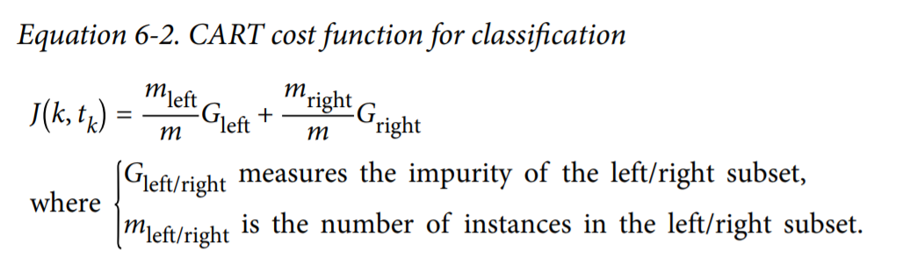

When we used decision trees for classification, we defined entropy as a measure of impurity to determine which feature split maximizes the information gain (IG). To use a decision tree for regression, however, we need an impurity metric that is suitable for continuous variables, so we define the impurity measure of a node, t, as the MSE instead:
$$
I(t) = MSE(t) = \frac{1}{N_t} \sum_{i э D_t} (y^{(i)} - \hat y ^{(i)})^2
\\
IG(D_p, x_i) = I(D_p) - \frac{N_{left}}{N_p}I(D_{left}) - \frac{N_{right}}{N_p}I(D_{right})\\
\hat y_t = \frac{1}{N_t}\sum y^{(i)}
$$
Here, 𝑁𝑡 is the number of training examples at node t, 𝐷𝑡 is the training subset at node t, 𝑦(𝑖) is the true target value, and 𝑦̂𝑡 is the predicted target value.

In the context of decision tree regression, the MSE is often referred to as within node variance, which is why the splitting criterion is also better known as variance reduction.


**Pruning**

Pruning consists of going back through the tree once it’s been created and removing branches that don’t contribute significantly enough to the error reduction by replacing them with leaf nodes.


### Random Forest

The random forest is based on applying bagging to decision trees with one important extension: in addition to sampling the records, the algorithm also samples the variables.  The random forest algorithm adds two more steps: the bagging and the bootstrap sampling of variables at each split: 

1. Take a bootstrap (with replacement) subsample from the records. 

2. For the first split, sample p < P variables at random without replacement. 

3. For each of the sampled variables Xj1, Xj2, ..., Xjp, apply the splitting algorithm:

   * For each value s_jk of X_jk:
     * Split the records in partition A with X < s as one partition, and the remaining records where X >= s as another partition. 
     * Measure the homogeneity of classes within each subpartition of A.

   * Select the value of s_jk that produces maximum within-partition homogeneity of class

4. Select the variable X_jk and the split value s_jk that produces maximum within-partition homogeneity of class. 
5. Proceed to the next split and repeat the previous steps, starting with step 2. 
6. Continue with additional splits following the same procedure until the tree is grown. 
7. Go back to step 1, take another bootstrap subsample, and start the process over again.

The random forest algorithm can be summarized in four simple steps: 

1. Draw a random bootstrap sample of size n (randomly choose n examples from the training dataset with replacement). 
2. Grow a decision tree from the bootstrap sample. At each node: 
   * Randomly select d features without replacement. 
   * Split the node using the feature that provides the best split according to the objective function, for instance, maximizing the information gain. 
3. Repeat the steps 1-2 k times. 
4. Aggregate the prediction by each tree to assign the class label by majority vote.


### K-means

The k-means algorithm belongs to the category of prototype-based clustering. 

Prototype-based clustering means that each cluster is represented by a prototype, which is usually either the centroid (average) of similar points with continuous features, or the medoid (the most representative or the point that minimizes the distance to all other points that belong to a particular cluster) in the case of categorical features. 

Thus, our goal is to group the examples based on their feature similarities, which can be achieved using the k-means algorithm, as summarized by the following four steps: 

1. Randomly pick k centroids from the examples as initial cluster centers. 
2. Assign each example to the nearest centroid, 𝜇(𝑗) ,𝑗 ∈ {1, … , 𝑘}. 
3. Move the centroids to the center of the examples that were assigned to it. 
4. Repeat steps 2 and 3 until the cluster assignments do not change or a user defined tolerance or maximum number of iterations is reached.

K-Means also can be described as a E-M algorithm.

Expectation–maximization (E–M) is a powerful algorithm that comes up in a variety of contexts within data science. k-means is a particularly simple and easy-to understand application of the algorithm, and we will walk through it briefly here. In short, the expectation–maximization approach consists of the following procedure: 

1. Guess some cluster centers 

2. Repeat until converged 

   * E-Step: assign points to the nearest cluster center 

   * M-Step: set the cluster centers to the mean

     

### K-means++

So far, we have discussed the classic k-means algorithm, which uses a random seed to place the initial centroids, which can sometimes result in bad clustering or slow convergence if the initial centroids are chosen poorly. One way to address this issue is to run the k-means algorithm multiple times on a dataset and choose the best performing model in terms of the SSE. 

Another strategy is to place the initial centroids far away from each other via the k-means++ algorithm, which leads to better and more consistent results than the classic k-means.

The initialization in k-means++ can be summarized as follows:

1. Initialize an empty set, M, to store the k centroids being selected. 

2. Randomly choose the first centroid, 𝝁(𝑗) , from the input examples and assign it to M. 

3. For each example, 𝒙(𝑖) , that is not in M, find the minimum squared distance, 𝑑(𝒙(𝑖) , 𝚳)^2 , to any of the centroids in M. 

4. To randomly select the next centroid, 𝝁^(𝑝) , use a weighted probability distribution equal to
   $$
   \frac{d(\bold \mu^{(p)}, \bold M)^2}{\sum_i d(\bold x^{(i)}, \bold M)^2}
   $$

5. Repeat steps 2 and 3 until k centroids are chosen. 

6. Proceed with the classic k-means algorithm.


### Hierarchical Clustering

* Dendrogram - A visual representation of the records and the hierarchy of clusters to which they belong.

* Dissimilarity - A measure of how close one cluster is to another.

Hierarchical clustering starts by setting each record as its own cluster and iterates to combine the least dissimilar clusters. The main algorithm for hierarchical clustering is the agglomerative algorithm, which iteratively merges similar clusters. 

The main steps of the agglomerative algorithm are: 

1. Create an initial set of clusters with each cluster consisting of a single record for all records in the data. 
2. Compute the dissimilarity D(C_k, C_l) between all pairs of clusters k, l. 
3. Merge the two clusters C_k and C_l that are least dissimilar as measured by D(C_k, C_l). 
4. If we have more than one cluster remaining, return to step 2. Otherwise, we are done.

There are four common measures of dissimilarity: complete linkage(1), single linkage(2), average linkage, and minimum variance.
$$
D(A, B) = max(d(a_i, b_i)) for:i,j
\\
D(A, B) = min(d(a_i, b_i)) for:i,j
\\
$$
The average linkage method is the average of all distance pairs and represents a compromise between the single and complete linkage methods. Finally, the minimum variance method, also referred to as Ward’s method, is similar to K-means since it minimizes the within-cluster sum of squares.

Start with every record in its own cluster. Progressively, clusters are joined to nearby clusters until all records belong to a single cluster (the agglomerative algorithm). The agglomeration history is retained and plotted, and the user (without specifying the number of clusters beforehand) can visualize the number and structure of clusters at different stages. Inter-cluster distances are computed in different ways, all relying on the set of all inter-record distances.

The two main approaches to hierarchical clustering are agglomerative and divisive hierarchical clustering. In divisive hierarchical clustering, we start with one cluster that encompasses the complete dataset, and we iteratively split the cluster into smaller clusters until each cluster only contains one example. In this section, we will focus on agglomerative clustering, which takes the opposite approach. We start with each example as an individual cluster and merge the closest pairs of clusters until only one cluster remains.

The two standard algorithms for agglomerative hierarchical clustering are single linkage and complete linkage. Using single linkage, we compute the distances between the most similar members for each pair of clusters and merge the two clusters for which the distance between the most similar members is the smallest. The complete linkage approach is similar to single linkage but, instead of comparing the most similar members in each pair of clusters, we compare the most dissimilar members to perform the merge. 


### Locating regions of high density via DBSCAN

Density-based spatial clustering of applications with noise (DBSCAN), which does not make assumptions about spherical clusters like k-means, nor does it partition the dataset into hierarchies that require a manual cut-off point. As its name implies, density-based clustering assigns cluster labels based on dense regions of points. In DBSCAN, the notion of density is defined as the number of points within a specified radius, 𝜀𝜀.

According to the DBSCAN algorithm, a special label is assigned to each example (data point) using the following criteria: 

* A point is considered a core point if at least a specified number (MinPts) of neighboring points fall within the specified radius, 𝜀𝜀. 
* A border point is a point that has fewer neighbors than MinPts within ε, but lies within the 𝜀𝜀 radius of a core point. 
* All other points that are neither core nor border points are considered noise points.

After labeling the points as core, border, or noise, the DBSCAN algorithm can be summarized in two simple steps: 

1. Form a separate cluster for each core point or connected group of core points. (Core points are connected if they are no farther away than 𝜀𝜀.) 
2. Assign each border point to the cluster of its corresponding core point.

With an increasing number of features in our dataset—assuming a fixed number of training examples—the negative effect of the curse of dimensionality increases. This is especially a problem if we are using the Euclidean distance metric. However, the problem of the curse of dimensionality is not unique to DBSCAN: it also affects other clustering algorithms that use the Euclidean distance metric, for example, k-means and hierarchical clustering algorithms. In addition, we have two hyperparameters in DBSCAN (MinPts and 𝜀𝜀) that need to be optimized to yield good clustering results. Finding a good combination of MinPts and 𝜀𝜀 can be problematic if the density differences in the dataset are relatively large.

DBSCAN is a density-based clustering algorithm. Instead of guessing how many clusters you need, by using DBSCAN, you define two hyperparameters: ‘ and n. You start by picking an example x from your dataset at random and assign it to cluster 1. Then you count how many examples have the distance from x less than or equal to ‘. If this quantity is greater than or equal to n, then you put all these ‘-neighbors to the same cluster 1. You then examine each member of cluster 1 and find their respective ‘-neighbors. If some member of cluster 1 has n or more ‘-neighbors, you expand cluster 1 by putting those ‘-neighbors to the cluster. You continue expanding cluster 1 until there are no more examples to put in it. In the latter case, you pick from the dataset another example not belonging to any cluster and put it to cluster 2. You continue like this until all examples either belong to some cluster or are marked as outliers. An outlier is an example whose ‘-neighborhood contains less than n examples.


### Gaussian Mixture Models

A Gaussian mixture model (GMM) attempts to find a mixture of multidimensional Gaussian probability distributions that best model any input dataset.  In the simplest case, GMMs can be used for finding clusters in the same manner as k-means.

Under the hood, a Gaussian mixture model is very similar to k-means: it uses an expectation–maximization approach that qualitatively does the following: 

1. Choose starting guesses for the location and shape 
2. Repeat until converged: 
   * E-step: for each point, find weights encoding the probability of membership in each cluster
   * M-step: for each cluster, update its location, normalization, and shape based on all data points, making use of the weights

The result of this is that each cluster is associated not with a hard-edged sphere, but with a smooth Gaussian model. Just as in the k-means expectation–maximization approach, this algorithm can sometimes miss the globally optimal solution, and thus in practice multiple random initializations are used.

**GMM as Density Estimation Though** 

GMM is often categorized as a clustering algorithm, fundamentally it is an algorithm for density estimation. That is to say, the result of a GMM fit to some data is technically not a clustering model, but a generative probabilistic model describing the distribution of the data.

**How many components?** 

The fact that GMM is a generative model gives us a natural means of determining the optimal number of components for a given dataset. A generative model is inherently a probability distribution for the dataset, and so we can simply evaluate the likelihood of the data under the model, using cross-validation to avoid overfitting. Another means of correcting for overfitting is to adjust the model likelihoods using some analytic criterion such as the Akaike information criterion (AIC) or the Bayesian information criterion (BIC). Scikit-Learn’s GMM estimator actually includes built-in methods that compute both of these, and so it is very easy to operate on this approach.

Notice the important point: this choice of number of components measures how well GMM works as a density estimator, not how well it works as a clustering algorithm. 


### Fuzzy K-means


Hard clustering describes a family of algorithms where each example in a dataset is assigned to exactly one cluster, as in the k-means and k-means++ algorithms that we discussed earlier in this chapter. In contrast, algorithms for soft clustering (sometimes also called fuzzy clustering) assign an example to one or more clusters. A popular example of soft clustering is the fuzzy C-means (FCM) algorithm (also called soft k-means or fuzzy k-means).  Almost a decade later, James C. Bedzek published his work on the improvement of the fuzzy clustering algorithm, which is now known as the FCM algorithm.

The FCM procedure is very similar to k-means. However, we replace the hard cluster assignment with probabilities for each point belonging to each cluster. Here, each value falls in the range [0, 1] and represents a probability of membership of the respective cluster centroid. The sum of the memberships for a given example is equal to 1. As with the k-means algorithm, we can summarize the FCM algorithm in four key steps: 

1. Specify the number of k centroids and randomly assign the cluster memberships for each point. 
2. Compute the cluster centroids, 𝝁(𝑗) ,𝑗 ∈ {1, … , 𝑘}. 
3. Update the cluster memberships for each point. 
4. Repeat steps 2 and 3 until the membership coefficients do not change or a user-defined tolerance or maximum number of iterations is reached.

The objective function of FCM—we abbreviate it as 𝐽𝑚—looks very similar to the within-cluster SSE that we minimize in k-means:
$$
J_m = \sum_{i=1}^n \sum_{j=1}^k w^{(i, j) ^m}||\bold x^{(i)} - \mu^{(j)}||^2_2
$$
However, note that the membership indicator, 𝑤𝑤(𝑖𝑖,𝑗𝑗) , is not a binary value as in k-means (𝑤𝑤(𝑖𝑖,𝑗𝑗) ∈ {0, 1}), but a real value that denotes the cluster membership probability (𝑤𝑤(𝑖𝑖,𝑗𝑗) ∈ [0, 1]). You also may have noticed that we added an additional exponent to 𝑤𝑤(𝑖𝑖,𝑗𝑗) ; the exponent m, any number greater than or equal to one (typically m = 2), is the so-called fuzziness coefficient (or simply fuzzifier), which controls the degree of fuzziness.

The larger the value of m, the smaller the cluster membership, 𝑤𝑤(𝑖𝑖,𝑗𝑗) , becomes, which leads to fuzzier clusters. The cluster membership probability itself is calculated as follows:
$$
w^{(i, j)} = [\sum_{c=1}^{k} (\frac{||\bold x ^ {(i)} - \bold \mu ^ {(j)} ||_2}{||\bold x ^ {(i)} - \bold \mu ^ {(c)} ||_2})^{\frac{2}{m-1}}] ^ {-1}
$$
The center, 𝝁^(𝑗𝑗) , of a cluster itself is calculated as the mean of all examples weighted by the degree to which each example belongs to that cluster (𝑤𝑤(𝑖𝑖,𝑗𝑗)𝑚𝑚 ):
$$
\mu ^ {(j)} = \frac{\sum_{i=1}^n w ^{(i, j)^m}x^{(i)}}{\sum_{i=1}^n w ^{(i, j)^m}}
$$

### 


### Кластеризация с помощью минимального остовного дерева

1. Строим взвешенный граф, где веса ребер - расстояния между объектами.
2. Строим минимальное отсовное дерево (алгоритм Крускала) для этого графа
3. Удаляем К-1 ребро с максимальным весом
4. Получаем К компонент связности, которые интерпретируем как кластеры


### Principal Components Analysis


1. Standardize the d-dimensional dataset. 

2. Construct the covariance matrix. For example, the covariance between two features, 𝑥𝑥𝑗𝑗 and 𝑥𝑥𝑘𝑘, on the population level can be calculated via the following equation:
   $$
   \sigma_{jk} = \frac{1}{n-1}\sum_{i=1}^{n}(x_j^{(i)}-\mu_j)(x_k^{(i)} - \mu_k)
   $$
    Note that the sample means are zero if we standardized the dataset. That's mean:

$$
   \sigma_{jk} = \frac{1}{n-1} \sum_{i=1}^n x_j^{(i)}x_k^{(i)}
$$


3. Decompose the covariance matrix into its eigenvectors and eigenvalues. 

4. Sort the eigenvalues by decreasing order to rank the corresponding eigenvectors. 

5. Select k eigenvectors, which correspond to the k largest eigenvalues, where k is the dimensionality of the new feature subspace (𝑘𝑘 ≤ 𝑑𝑑). 

6. Construct a projection matrix, W, from the "top" k eigenvectors.

7. Transform the d-dimensional input dataset, X, using the projection matrix, W, to obtain the new k-dimensional feature subspace.

```python
scaler = StandardScaler()
X_train = scaler.fit_transform(X_train)
X_test = scaler.transform(X_test)
cov_mat = np.cov(X_train.T)
eigen_vals, eigen_vecs = np.linalg.eig(cov_mat)
eigen_pairs = [(np.abs(eigen_vals[i]), eigen_vecs[:, i]) for i in range(len(eigen_vals))]
eigen_pairs.sort(key=lambda k: k[0], reverse=True)
w = np.hstack((eigen_pairs[0][1][:, np.newaxis], eigen_pairs[1][1][:, np.newaxis]))
X_train_pca = X_train.dot(w)
```

How PCA find the c1, c2 (principal component)? There is standard matrix factorization technique called *Singular Value Decomposition*, that decompose training set matrix X into the matrix multiplication of three matrices  U Σ V<sup>T</sup> where V contains all principal components that we are looking for.

```python
X_centered = X - X.mean(axis=0)
U, s, Vt = np.linalg.svd(X_centered)
c1 = Vt.T[:, 0]
c2 = Vt.T[:, 1]
```


### Linear Discriminant Analysis

It is a method that tries to maximize the distance of points belonging to different classes while minimizing the distance of points of the same class.

The general concept behind LDA is very similar to PCA, but whereas PCA attempts to find the orthogonal component axes of maximum variance in a dataset, the goal in LDA is to find the feature subspace that optimizes class separability.

One assumption in LDA is that the data is normally distributed. Also, we assume that the classes have identical covariance matrices and that the training examples are statistically independent of each other. However, even if one, or more, of those assumptions is (slightly) violated, LDA for dimensionality reduction can still work reasonably well.

Before we dive into the code implementation, let's briefly summarize the main steps that are required to perform LDA: 

1. Standardize the d-dimensional dataset (d is the number of features). 
2. For each class, compute the d-dimensional mean vector. 
3. Construct the between-class scatter matrix, 𝑺𝐵, and the within-class scatter matrix, 𝑺𝑤.
4. Compute the eigenvectors and corresponding eigenvalues of the matrix, 𝑺𝑊^(-1) * 𝑺𝐵. 
5. Sort the eigenvalues by decreasing order to rank the corresponding eigenvectors. 
6. Choose the k eigenvectors that correspond to the k largest eigenvalues to construct a 𝑑 × 𝑘-dimensional transformation matrix, W; the eigenvectors are the columns of this matrix. 
7. Project the examples onto the new feature subspace using the transformation matrix, W

 Each mean vector, 𝒎𝑖 , stores the mean feature value, 𝜇𝜇𝑚𝑚, with respect to the examples of class i.

Using the mean vectors, we can now compute the within-class scatter matrix, 𝑺𝑊:
$$
S_W = \sum_{i=1}^c S_i
\\
\\
S_i = \sum_{x э D_i} (x - m_i)(x - m_i)^T
$$
The assumption that we are making when we are computing the scatter matrices is that the class labels in the training dataset are uniformly distributed.  When we divide the scatter matrices by the number of class examples, 𝑛𝑖, we can see that computing the scatter matrix is in fact the same as computing the covariance matrix, Σ𝑖𝑖 —the covariance matrix is a normalized version of the scatter matrix.

After we compute the scaled within-class scatter matrix (or covariance matrix), we can move on to the next step and compute the between-class scatter matrix 𝑺𝑩:
$$
S_B = \sum_{i=1}^c n_i (m_i - m) (m_i - m)^T
$$
Here, m is the overall mean that is computed, including examples from all c classes.

The remaining steps of the LDA are similar to the steps of the PCA. However, instead of performing the eigendecomposition on the covariance matrix, we solve the generalized eigenvalue problem of the matrix, 𝑺𝑊^(-1) * 𝑺𝐵. 

```python
d = 13 # number of features
S_W = np.zeros((d, d))
for label, mv in zip(range(3), means):
    class_scatter = np.zeros((d, d))
    cnt = 0
    for row in features[target == label]:
        row, mv = row.reshape(d, 1), mv.reshape(d, 1)
        class_scatter += (row - mv).dot((row - mv).T)
        cnt += 1
    
    S_W += class_scatter / cnt

m = features.mean(axis=0)
S_B = np.zeros((d, d))
for i, mean in enumerate(means):
    n = features[target == i].shape[0]
    mean = mean.reshape(d, 1)
    m = m.reshape(d, 1)
    S_B += n*(mean - m).dot((mean-m).T)

matrix = np.linalg.inv(S_W).dot(S_B)
eigen_vals, eigen_vecs = np.linalg.eig(matrix)
eigen_pairs = [(np.abs(eigen_vals[i]), eigen_vecs[:,i]) 
               for i in range(len(eigen_vals))] 
eigen_pairs = sorted(eigen_pairs,key=lambda k: k[0], reverse=True)
w = np.hstack((eigen_pairs[0][1][:, np.newaxis].real, eigen_pairs[1][1][:, np.newaxis].real))
X_train_lda = features.dot(w)
```

### Kernel PCA


If we are dealing with nonlinear problems, which we may encounter rather frequently in real-world applications, linear transformation techniques for dimensionality reduction, such as PCA and LDA, may not be the best choice.

We perform a nonlinear mapping via KPCA that transforms the data onto a higher-dimensional space. We then use standard PCA in this higher dimensional space to project the data back onto a lower-dimensional space where the examples can be separated by a linear classifier (under the condition that the examples can be separated by density in the input space). However, one downside of this approach is that it is computationally very expensive, and this is where we use the kernel trick. Using the kernel trick, we can compute the similarity between two high-dimension feature vectors in the original feature space.

Covariance matrix:
$$
\sum = \frac{1}{n} \sum_{i=1}^n \bold x^{(i)} \bold x^{(i)^T}
$$
Bernhard Scholkopf generalized this approach (Kernel principal component analysis, B. Scholkopf, A. Smola, and K.R. Muller, pages 583-588, 1997) so that we can replace the dot products between examples in the original feature space with the nonlinear feature combinations via 𝜙:
$$
\sum = \frac{1}{n}\sum_{i=1}^{n} \phi(\bold x^{(i)}) \phi(\bold x^{(i)^T})
$$
To obtain the eigenvectors—the principal components—from this covariance matrix, we have to solve the following equation:
$$
\sum \bold v = \lambda \bold v
\\
=> \frac{1}{n}\sum_{i=1}^n \phi(\bold x^{(i)}) \phi(\bold x^{(i)^T})\bold v = \lambda \bold v
\\
\bold v = \frac{1}{n\lambda}\sum_{i=1}^n \phi(\bold x^{(i)}) \phi(\bold x^{(i)^T}) \bold v = \frac{1}{n}\sum_{i=1}^{n} \bold a^{(i)} \phi(\bold x ^ {(i)})
\\
\bold K = \phi(\bold X) \phi (\bold X)^ T
$$
Here, 𝜆𝜆 and v are the eigenvalues and eigenvectors of the covariance matrix, Σ, and **a** can be obtained by extracting the eigenvectors of the kernel (similarity) matrix, K, as you will see in the following paragraphs.


To summarize what we have learned so far, we can define the following three steps to implement an RBF  (function of similarity) KPCA: 

 1. We compute the kernel (similarity) matrix, K, where we need to calculate the following:
    $$
    k(x^{(i)}, x^{(j)}) = exp(-\gamma(||x^{(i)} - x^{(j)}||^2))
    $$
    For example, if our dataset contains 100 training examples, the symmetric kernel matrix of the pairwise similarities would be 100 × 100-dimensional.

2. We center the kernel matrix, K, using the following equation:
   $$
   \bold K' = \bold K - 1_n\bold K - \bold K1_n +1_n\bold K1_n
   $$
   Here, 𝟏𝒏 is an 𝑛𝑛 × 𝑛𝑛-dimensional matrix (the same dimensions as the kernel matrix) where all values are equal to 1/𝑛 .

3. We collect the top k eigenvectors of the centered kernel matrix based on their corresponding eigenvalues, which are ranked by decreasing magnitude. In contrast to standard PCA, the eigenvectors are not the principal component axes, but the examples already projected onto these axes.

```python
gamma = 15
n_components = 2
# Calculate pairwise squared Euclidean distances
# in the MxN dimensional dataset
sqdists = pdist(x, 'sqeuclidean')
# Convert pairwise distances into a square matrix
mat_sq_dist = squareform(sqdists)
# Compute the symmetric kernel matrix.
K = exp(-gamma * mat_sq_dist)
# Center the kernel matrix.
N = K.shape[0]
one_n = np.ones((N,N)) / N
K = K - one_n.dot(K) - K.dot(one_n) + one_n.dot(K).dot(one_n)
# Obtaining eigenpairs from the centered kernel matrix
# scipy.linalg.eigh returns them in ascending order
eigvals, eigvecs = eigh(K)
eigvals, eigvecs = eigvals[::-1], eigvecs[:, ::-1]
# Collect the top k eigenvectors (projected examples)
alphas = np.column_stack([eigvecs[:, i] for i in range(n_components)])
# Collect the corresponding eigenvalues
lambdas = [eigvals[i] for i in range(n_components)]

```

To project new data we have to calculate the pairwise RBF kernel (similarity) between each ith example in the training dataset and the new example, 𝒙𝒙′:
$$
\phi (x')^T v = \sum_i a^{(i)}\phi(x')^T \phi(x^{(i)}) = \sum_i a^{(i)} k(x', x^{(i)})
$$
After calculating the similarity between the new examples and the examples in the training dataset, we have to normalize the eigenvector, a, by its eigenvalue. 

```python
def project_x(x_new, X, gamma, alphas, lambdas):
	pair_dist = np.array([np.sum((x_new-row)**2) for row in X])
	k = np.exp(-gamma * pair_dist)
	return k.dot(alphas / lambdas)
```

### UMAP

The idea behind many of the modern dimensionality reduction algorithms, especially those designed specifically for visualization purposes, such as t-SNE and UMAP, is basically the same. We first design a similarity metric for two examples. For visualization purposes, besides the Euclidean distance between the two examples, this similarity metric often reflects some local properties of the two examples, such as the density of other examples around them.

In UMAP, this similarity metric w is defined as follows,
$$
w(x_i, x_j) = w_i(x_i, x_j) + w_j(x_j, x_i) - w_i(x_i, x_j)w_j(x_j, x_i)
$$
The function wi(xi, xj ) is defined as,
$$
w_i(x_i, x_j) = exp(-\frac{d(x_i, x_j) - p_i}{\sigma_i})
$$
Let w denote the similarity of two examples in the original high-dimensional space and let w' be the similarity given by the same eq. 5 in the new low-dimensional space. Because the values of w and w' lie in the range between 0 and 1, we can see them as probabilities of two binary random variables. A widely used metric of similarity between two probability distributions is cross-entropy:
$$
C_{w, w'} = \sum_{i=1}^N \sum_{j=1}^N [w(x_i, x_j) ln(\frac{w(x_i,x_j)}{w'(x'_i, x'_j)}) + (1 - w(x_i, x_j))ln(\frac{1 - w(x_i,x_j)}{1 - w'(x'_i, x'_j)}))]
$$


# Models fitting and estimating


### Train/validation split


**Cross-validation (кросс проверка)**

Cross-validation works like follows. First, you fix the values of the hyperparameters you want to evaluate. Then you split your training set into several subsets of the same size. Each subset is called a fold. Typically, five-fold cross-validation is used in practice. With five-fold cross-validation, you randomly split your training data into five folds: {F1, F2,...,F5}. Each Fk, k = 1,..., 5 contains 20% of your training data. Then you train five models as follows. To train the first model, f1, you use all examples from folds F2, F3, F4, and F5 as the training set and the examples from F1 as the validation set. To train the second model, f2, you use the examples from folds F1, F3, F4, and F5 to train and the examples from F2 as the validation set. You continue building models iteratively like this and compute the value of the metric of interest on each validation set, from F1 to F5. Then you average the five values of the metric to get the final value

**Hold-out validation**

**Leave-one-out**

**q-fold Cross-validation (Поблочная кросс-проверка)**

**t * q-fold Cross-validation (Многократная поблочная кросс-проверка)**


### Maximum likelihood

Consider a set of *m* examples X drawn independently from the true but unknow data generating distribution p_{data}(x). The maximum likelihood estimator for θ is then given as:
$$
\theta_{ML} = argmax_{\theta} p_{model}(X; \theta) = argmax_{\theta} \prod_{i=1}^m p_{model} (x^{(i)};\theta)
$$
Maximizing likelihood corresponds exactly to minimizing the cross-entropy between distributions (for example MSE is the cross-entropy between empirical and Gaussian distributions). We can thus see maximum likelihood as an attempt to make the model distribution match the empirical distribution.

The likelihood function indicates how likely the observed sample is as a function of possible parameter values. Therefore, maximizing the likelihood function determines the parameters that are most likely to produce the observed data. From a statistical point of view, MLE is usually recommended for large samples because it is versatile, applicable to most models and different types of data, and produces the most precise estimates.

Least squares estimates are calculated by fitting a regression line to the points from a data set that has the minimal sum of the deviations squared (least square error). In reliability analysis, the line and the data are plotted on a probability plot.

**Maximum likelihood properties**

1. If T is the maximum likelihood estimator of parameter \theta and g(\theta) is an invertible function of \theta then g(T) is the maximum likelihood estimator of g(\theta).
2. The maximum likelihood estimator T may be biased. But asymptotically (as the size n of the dataset goes to infinity) maximum likelihood estimators are unbiased.
3. Maximum likelihood estimators have asymptotically the smallest variance among unbiased estimators.


**Для регрессии** 

Модель данных с некоррелированным гауссовким шумом:
$$
y(x_i) = f(x_i, \alpha) + \epsilon, \epsilon = N(0, \sigma_i^2)
$$
Метод максимума правдоподобия и метод наименьших квадратов:
$$
L(\epsilon_1, ... , \epsilon_n|\alpha) = \prod_{i=1}^l \frac{1}{\sigma_i \sqrt{2\pi}}exp(-\frac{1}{2\sigma^2_i}\epsilon_i^2) \rightarrow max_{\alpha};
\\
-lnL(\epsilon_1, ... , \epsilon_n|\alpha) = const(\alpha) + \frac{1}{2}\sum_{i=1}^l \frac{1}{\sigma^2_i}(f(x_i, \alpha) - y_i)^2 \rightarrow min_{\alpha}
$$
Постановки ММП и МНК совпадают, причем веса объектов обратно пропорциональны дисперсии шума.

**Для классификации**

Можем линейную модель с заданной функцией потерь переинтерпретировать как параметрическую модель вероятности класса у.

Максимизация правдоподобия:
$$
L(w) = \sum_{i=1}^l logP(y_i|x_i, w) \rightarrow max_w
$$
Минимизация имперического риска:
$$
Q(w) = \sum_{i=1}^l L(y_ig(x_i, w)) \rightarrow min_w
$$
Эти два принципа эквивалентны, если положить
$$
-logP(y_i|x_i, w) = L(y_ig(x_i, w))
$$


###  Maximum a Posteriori Estimation


While the most principled approach is to make predictions using the full Bayesian posterior distribution over the parameter θ, it is still often desirable to have a single point estimate. One common reason for desiring a point estimate is that most operations involving the Bayesian posterior for most interesting models are intractable, and a point estimate offers a tractable approximation. Rather than simply returning to the maximum likelihood estimate, we can still gain some of the benefit of the Bayesian approach by allowing the prior to influence the choice of the point estimate.

The MAP estimate chooses the point of maximal posterior probability (or maximal probability density in the more common case of continuous θ):
$$
\theta_{MAP} = argmax_{\theta} p(\theta | x) = argmax_{\theta}p(x|\theta) + log(p(\theta))
$$
As with full Bayesian inference, MAP Bayesian inference has the advantage of leveraging information that is brought by the prior and cannot be found in the training data. This additional information helps to reduce the variance in the MAP point estimate (in comparison to the ML estimate). However, it does so at the price of increased bias. Many regularized estimation strategies, such as maximum likelihood learning regularized with weight decay, can be interpreted as making the MAP approximation to Bayesian inference.


### Gradient Descent


### Newton's Method


```python
from autograd import grad
from autograd import hessian

# import NumPy library
import numpy as np
# Newton ’s method
def newtons_method (g, max_its, w):
    # compute gradient/ Hessian using autograd
    gradient = grad(g)
    hess = hessian (g)
    
    # set numerical stability parameter
    epsilon = 10 **(-7)
    if ’epsilon ’ in kwargs:
        epsilon = kwargs[’epsilon ’]

    # run the Newton ’s method loop
    weight_history = [w] # container for weight history
    cost_history = [g(w)] # container for cost function history

    for k in range( max_its ):
        # evaluate the gradient and hessian
        grad_eval = gradient (w)
        hess_eval = hess(w)

        # reshape hessian to square matrix
        hess_eval .shape = (int((np. size( hess_eval ))**(0 .5)),int((np.size( hess_eval ))**(0 .5)))

        # solve second -order system for weight update
        A = hess_eval + epsilon* np. eye(w. size)
        b = grad_eval
        w = np. linalg. solve(A, np .dot(A ,w)-b)

        # record weight and cost
        weight_history. append(w)
        cost_history.append(g(w))
        
    return weight_history, cost_history
```


Newton’s method is a powerful algorithm that makes enormous progress towards finding a function’s minimum at each step, compared to zero- and first order methods that can require a large number of steps to make equivalent progress. However, Newton’s method suffers from its own unique weaknesses – primarily in dealing with nonconvexity, as well as scaling with input dimension.


### Iteratively Reweighted Least Squares

(МНК с итерационным перевзвешиванием объектов)

Что делать, если модель регрессии не линейная или функция потерь не квадратичная? Общий рецепт такой: применение метода Ньютона-Рафсона приводит к итерационному процессу, на каждом шаге которого решается задача линейной регрессии. Смысл её сводится к тому, чтобы поточнее настроиться на тех объектах, на которых модель в текущем её приближении работает недостаточно хорошо. В этот общий сценарий неплохо вписывается серия важных частных случаев. Нелинейная регрессия с квадратичной функцией потерь. Логистическая регрессия. Обобщённая линейная модель (GLM), в которой прогнозируемая величина описывается экспоненциальным семейством распределений. Логистическая регрессия является частным случаем GLM, и, благодаря этому факту, мы теперь понимаем, почему вероятность классов выражается через сигмоиду от дискриминантной функции

**Вход**: F, y - матрица объекты признаки и вектор ответов

**Выход**: w - вектор коэффициентов линейной коомбинации.

1. w = (F^T F) ^ {-1} F^T y - начальное приближение, обычный МНК
2. для t = 1, 2, 3...
   * \sigma_i = \sigma(y_i w^T x)  для всех i
   * \gamma_i = \sqrt{(1 - \sigma_i) \sigma_i} для всех i
   * ~F = diag(\gamma_1, ... \gamma_n)F
   * ~y_i = y_i \sqrt{(1 - \sigma_i) \sigma_i} для всех i
   * выбрать градиентный шаг h_t
   * w = w + h_t (~F^T ~F)^{-1} ~F^T ~y
   * если \sigma_i мало изменилось, выйти из цикла


### Regression metrics

* Residual standard error - The same as the RMSE, but adjusted for degrees of freedom.

* R-squared - The proportion of variance explained by the model, from 0 to 1. It is useful mainly in explanatory uses of regression where you want to assess how well the model fits the data.

* t-statistic - The coefficient for a predictor, divided by the standard error of the coefficient, giving a metric to compare the importance of variables in the model. The t-statistic—and its mirror image, the p-value—measures the extent to which a coefficient is “statistically significant”—that is, outside the range of what a random chance arrangement of predictor and target variable might produce. The higher the t-statistic (and the lower the p-value), the more significant the predictor.

* Weighted regression - Regression with the records having different weights.

  

$$
MSE = \frac{\sum_{i=1}^{n}(y_i - \hat y_i)^2}{n}
\\
RMSE = \sqrt{\frac{\sum_{i=1}^{n}(y_i - \hat y_i)^2}{n}}
\\
R^2 = 1 - \frac{\sum_{i = 1}^{n}(y_i - \hat y_i)^2}{\sum_{i = 1}^{n}(y_i - \bar y_i)^2}
\\
t_b = \frac{\hat b}{RMSE(\hat b)} 
\\
AIC = 2P + nlog(RSS/n)
$$

AIC - Akaike's information criteria, penalizes adding terms to a model. P - is the number of variables and n is the number of records.

How do we find the model that minimizes AIC? One approach is to search through all possible models, called all subset regression. This is computationally expensive and is not feasible for problems with large data and many variables. An attractive alternative is to use stepwise regression, which successively adds and drops predictors to find a model that lowers AIC.

Simpler yet are forward selection and backward selection. In forward selection, you start with no predictors and add them one-by-one, at each step adding the predictor that has the largest contribution to R^2, stopping when the contribution is no longer statistically significant. In backward selection, or backward elimination, you start with the full model and take away predictors that are not statistically significant until you are left with a model in which all predictors are statistically significant.

Penalized regression is similar in spirit to AIC. Instead of explicitly searching through a discrete set of models, the model-fitting equation incorporates a constraint that penalizes the model for too many variables (parameters). Rather than eliminating predictor variables entirely—as with stepwise, forward, and backward selection—penalized regression applies the penalty by reducing coefficients, in some cases to near zero. Common penalized regression methods are ridge regression and lasso regression.


### Regression residuals plot

Since our model uses multiple explanatory variables, we can't visualize the linear regression line (or hyperplane, to be precise) in a two-dimensional plot, but we can plot the residuals (the differences or vertical distances between the actual and predicted values) versus the predicted values to diagnose our regression model. Residual plots are a commonly used graphical tool for diagnosing regression models. They can help to detect nonlinearity and outliers, and check whether the errors are randomly distributed.

```python
plt.scatter(y_train_pred, y_train_pred - y_train,
			c='steelblue', marker='o', edgecolor='white',
			label='Training data')
plt.scatter(y_test_pred, y_test_pred - y_test,
			c='limegreen', marker='s', edgecolor='white',
			label='Test data')
plt.xlabel('Predicted values')
plt.ylabel('Residuals')
plt.legend(loc='upper left')
plt.hlines(y=0, xmin=-10, xmax=50, color='black', lw=2)
plt.xlim([-10, 50])
plt.show()
```

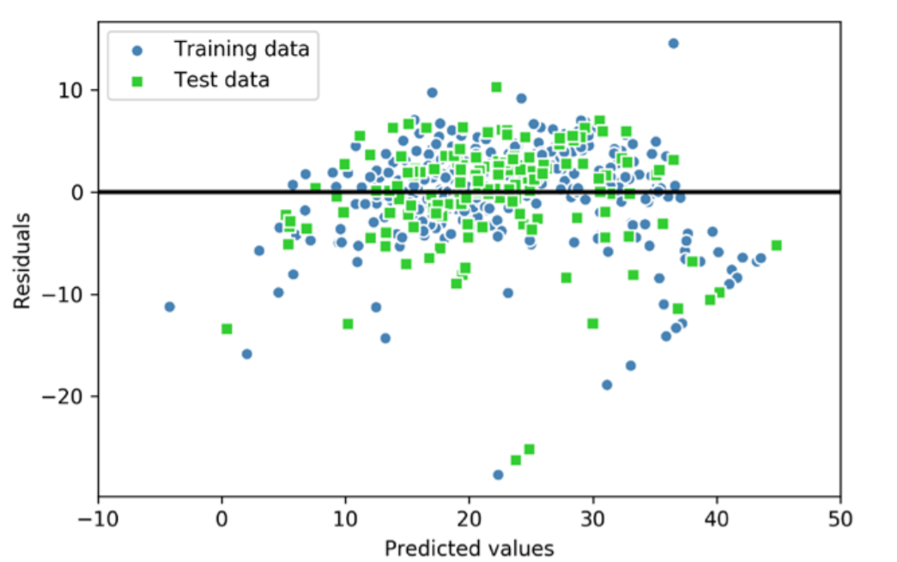

In the case of a perfect prediction, the residuals would be exactly zero, which we will probably never encounter in realistic and practical applications. However, for a good regression model, we would expect the errors to be randomly distributed and the residuals to be randomly scattered around the centerline. If we see patterns in a residual plot, it means that our model is unable to capture some explanatory information, which has leaked into the residuals, as you can slightly see in our previous residual plot. Furthermore, we can also use residual plots to detect outliers, which are represented by the points with a large deviation from the centerline.


## 


### Classification metrics

For classification, things are a little bit more complicated. The most widely used metrics and tools to assess the classification model are: 

* confusion matrix
* accuracy - не учитывается ни дисбаланс классов, ни цена ошибки на объектах разных классов.
* cost-sensitive accuracy
* precision/recall
* area under the ROC curve.


**Precision, Recall, Sensitivity, Specificity (Точность, Полнота, Чувствительность, Специфичность)**
$$
accuracy = \frac{TP+TN}{TP+TN+FP+FN}
\\
precision = \frac{TP}{TP + FP}
\\
recall = \frac{TP}{TP + FN}
\\
sensitivity = \frac{TP}{TP+FN}
\\
specificity = \frac{TN}{TN + FP}
\\
F1 = 2 \frac{precision*recall}{precision+recall}
$$

Precision - количество сбитых самолетов / общее количество выстрелов

Recall - количество сбитых самолетов / общее количество самолетов

The precision is the proportion of relevant documents in the list of all returned documents. The recall is the ratio of the relevant documents returned by the search engine to the total number of the relevant documents that could have been returned.

However, scikit-learn also implements macro and micro averaging methods to extend those scoring metrics to multiclass problems via one-vs.-all (OvA) classification. The micro-average is calculated from the individual TPs, TNs, FPs, and FNs of the system. For example, the micro-average of the precision score in a k-class system can be calculated as follows:
$$
precision_{micro} = \frac{TP_1 + ... + TP_k}{TP_1 + ... + TP_k + FP_1 + ... FP_k}
\\
precision_{macro} = \frac{precision_1 + ... precision_k}{k}
$$


**Cost-sensitive accuracy**

For dealing with the situation in which different classes have different importance, a useful metric is cost-sensitive accuracy. To compute a cost-sensitive accuracy, you first assign a cost (a positive number) to both types of mistakes: FP and FN. You then compute the counts TP, TN, FP, FN as usual and multiply the counts for FP and FN by the corresponding cost before calculating the accuracy.

**Area under the ROC Curve (AUC)**

The ROC curve (stands for “receiver operating characteristic,” the term comes from radar engineering) is a commonly used method to assess the performance of classification models. ROC curves use a combination of the true positive rate (defined exactly as recall) and false positive rate (the proportion of negative examples predicted incorrectly) to build up a summary picture of the classification performance. 
$$
TPR = \frac{TP}{(TP+FN)}
\\
FPR = \frac{FP}{(FP+TN)}
$$
TPR - чувствительность, FPR - специфичность.

ROC curves can only be used to assess classifiers that return some confidence score (or a probability) of prediction. For example, logistic regression, neural networks, and decision trees (and ensemble models based on decision trees) can be assessed using ROC curves.

To draw a ROC curve, you first discretize the range of the confidence score. If this range for a model is [0, 1], then you can discretize it like this: [0, 0.1, 0.2, 0.3, 0.4, 0.5, 0.6, 0.7, 0.8, 0.9, 1]. Then, you use each discrete value as the prediction threshold and predict the labels of examples in your dataset using the model and this threshold. For example, if you want to compute TPR and FPR for the threshold equal to 0.7, you apply the model to each example, get the score, and, if the score if higher than or equal to 0.7, you predict the positive class; otherwise, you predict the negative class.


### Quantifying the quality of clustering via silhouette plots

Another intrinsic metric to evaluate the quality of a clustering is silhouette analysis, which can also be applied to clustering algorithms other than k-means, which we will discuss later in this chapter. Silhouette analysis can be used as a graphical tool to plot a measure of how tightly grouped the examples in the clusters are. To calculate the silhouette coefficient of a single example in our dataset, we can apply the following three steps:

1. Calculate the cluster cohesion, 𝑎^(𝑖) , as the average distance between an example, 𝒙^(𝑖) , and all other points in the same cluster. 

2. Calculate the cluster separation, 𝑏^(𝑖) , from the next closest cluster as the average distance between the example, 𝒙^(i) , and all examples in the nearest cluster. 

3. Calculate the silhouette, 𝑠^(𝑖) , as the difference between cluster cohesion and separation divided by the greater of the two, as shown here:
   $$
   s^{(i)} = \frac{b^{(i)} - a^{(i)}}{max(b^{(i)}, a^{(i)})}
   $$

The silhouette coefficient is bounded in the range –1 to 1. Based on the preceding equation, we can see that the silhouette coefficient is 0 if the cluster separation and cohesion are equal (𝑏𝑏(𝑖𝑖) = 𝑎𝑎(𝑖𝑖) ). Furthermore, we get close to an ideal silhouette coefficient of 1 if 𝑏𝑏(𝑖𝑖) ≫ 𝑎𝑎(𝑖𝑖) , since 𝑏𝑏(𝑖𝑖) quantifies how dissimilar an example is from other clusters, and 𝑎𝑎(𝑖𝑖) tells us how similar it is to the other examples in its own cluster.


# Models improvement


### Regularization

Regularization, significantly reduces the variance of the model, without substantial increase in its bias (this means we avoid overfitting). 

**L1, L2 regularization:**


$$
L1 = ||w|| = \sum_{j=1}^m |w_j|
\\
L2 = \frac{\lambda}{2}||\bold w||^2 = \frac{\lambda}{2}\sum_{j=1}^{m}w_j^2
$$
So we add regularization term to loss function with some parameter lambda. This means we penalized model for large values of weights. Lambda is the tuning parameter that decides how much we want to penalize the flexibility of our model.  Regression example:
$$
J(\bold w)_{Ridge} = \sum_{i=1}^n (y^{(i)} - \hat y^{(i)})^2 +\lambda ||\bold w||_2^2
\\
J(\bold w)_{Lasso} = \sum_{i=1}^n (y^{(i)} - \hat y^{(i)})^2 +\lambda ||\bold w||_1
\\
J(\bold w)_{ElasticNet} = \sum_{i=1}^n (y^{(i)} - \hat y^{(i)})^2 + \lambda_1\sum_{j=1}^{m} w_j^2 + \lambda_2 \sum_{j=1}^{m} |w_j|
$$
In contrast to L2 regularization, L1 regularization usually yields sparse feature vectors and most feature weights will be zero.

С вероятностной точки зрения L2 регуляризация это предположение о том, что вектор параметров w имеет гауссовское распределение с центром в нуле и по всем координатам одинаковые дисперсии:
$$
p(w;C) = \frac{1}{(2\pi C)^{n/2}}exp(-\frac{||w||^2}{2C})
\\
-ln(p(w; C)) = \frac{1}{2C}||w||^2
$$
С вероятностной точки зрения L1 регуляризация это предположение о том, что вектор параметров w имеет распределение Лапласа с центром в нуле и по всем координатам одинаковые дисперсии:
$$
p(w;C) = \frac{1}{(2C)^{n}}exp(-\frac{||w||}{C})
\\
-ln(p(w; C)) = \frac{1}{C}||w||
$$
Где С - гиперпараметр, 1/С - коэффициент регуляризации.

**Another regularization techniques: ** 

1. Injecting noise at the input

2. Injecting noise at the output. For example, label smoothing regularizes a model based on a softmax with k output values by replacing the hard 0 and 1 classification targets with targets of:
   $$
   \frac{\epsilon}{k}
   \\
   1 - \frac{k - 1}k \epsilon
   $$
   respectively.

3. Semi-supervised learning. In the paradigm of semi-supervised learning, both unlabeled examples from P(x) and labeled examples from P(x, y) are used to estimate P(y | x) or predict y from x.  In the context of deep learning, semi-supervised learning usually refers to learning a representation h = f(x). The goal is to learn a representation so that examples from the same class have similar representations.

**For neural network:**


The concept of **dropout** is very simple. Each time you run a training example through the network, you temporarily exclude at random some units from the computation. The higher the percentage of units excluded the higher the regularization effect. Neural network libraries allow you to add a dropout layer between two successive layers, or you can specify the dropout parameter for the layer. The dropout parameter is in the range [0, 1] and it has to be found experimentally by tuning it on the validation data. 

**Early stopping** is the way to train a neural network by saving the preliminary model after every epoch and assessing the performance of the preliminary model on the validation set. As the number of epochs increases, the cost decreases. The decreased cost means that the model fits the training data well. However, at some point, after some epoch e, the model can start overfitting: the cost keeps decreasing, but the performance of the model on the validation data deteriorates. If you keep, in a file, the version of the model after each epoch, you can stop the training once you start observing a decreased performance on the validation set. Alternatively, you can keep running the training process for a fixed number of epochs and then, in the end, you pick the best model. Models saved after each epoch are called checkpoints. Some machine learning practitioners rely on this technique very often; others try to properly regularize the model to avoid such undesirable behavior.

**Batch normalization** (which rather has to be called batch standardization) is a technique that consists of standardizing the outputs of each layer before the units of the subsequent layer receive them as input. In practice, batch normalization results in a faster and more stable training, as well as in some regularization effect. So it’s always a good idea to try to use batch normalization. In neural network libraries, you can often insert a batch normalization layer between two layers. 

Another regularization technique that can be applied not just to neural networks, but to virtually any learning algorithm, is called **data augmentation**. This technique is often used to regularize models that work with images. Once you have your original labeled training set, you can create a synthetic example from an original example by applying various transformations to the original image: zooming it slightly, rotating, flipping, darkening, and so on. You keep the original label in these synthetic examples. In practice, this often results in increased performance of the model.


### Hyperparameter Tuning


Select parameter with validation curve:

```python
from sklearn.model_selection import validation_curve
param_range = [0.001, 0.01, 0.1, 1.0, 10.0, 100.0]
train_scores, test_scores = validation_curve(
												estimator=pipe_lr,
												X=X_train,
												y=y_train,
												param_name='logisticregression__C',
												param_range=param_range,
												cv=10)
train_mean = np.mean(train_scores, axis=1)
train_std = np.std(train_scores, axis=1)
test_mean = np.mean(test_scores, axis=1)
test_std = np.std(test_scores, axis=1)
plt.plot(param_range, train_mean,
		color='blue', marker='o',
		markersize=5, label='Training accuracy')
plt.fill_between(param_range, train_mean + train_std,
					train_mean - train_std, alpha=0.15,
					color='blue')
plt.plot(param_range, test_mean,
			color='green', linestyle='--',
			marker='s', markersize=5,
			label='Validation accuracy')
plt.fill_between(param_range,
					test_mean + test_std,
					test_mean - test_std,
					alpha=0.15, color='green')
plt.grid()
plt.xscale('log')
plt.legend(loc='lower right')
plt.xlabel('Parameter C')
plt.ylabel('Accuracy')
plt.ylim([0.8, 1.0])
plt.show()
```

Similar to the learning_curve function, the validation_curve function uses stratified k-fold cross-validation by default to estimate the performance of the classifier. Inside the validation_curve function, we specified the parameter that we wanted to evaluate. In this case, it is C, the inverse regularization parameter of the LogisticRegression classifier, which we wrote as 'logisticregression__C' to access the LogisticRegression object inside the scikit-learn pipeline for a specified value range that we set via the param_range parameter.

**Tuning hyperparameters via grid search**

```python
from sklearn.model_selection import GridSearchCV
from sklearn.svm import SVC
pipe_svc = make_pipeline(StandardScaler(),
						SVC(random_state=1))
						
param_range = [0.0001, 0.001, 0.01, 0.1,
						1.0, 10.0, 100.0, 1000.0]
						
param_grid = [{'svc__C': param_range,
						'svc__kernel': ['linear']},
						{'svc__C': param_range,
						'svc__gamma': param_range,
						'svc__kernel': ['rbf']}]
						
gs = GridSearchCV(estimator=pipe_svc,
						param_grid=param_grid,
						scoring='accuracy',
						cv=10,
						refit=True,
						n_jobs=-1)
```


### Bagging

The simple version of ensembles is as follows: 

1. Develop a predictive model and record the predictions for a given data set. 
2. Repeat for multiple models, on the same data. 
3. For each record to be predicted, take an average (or a weighted average, or a majority vote) of the predictions.

Bagging, which stands for “bootstrap aggregating,” was introduced by Leo Breiman in 1994. Suppose we have a response Y and P predictor variables X = X1, X2, ..., Xp with n records. Bagging is like the basic algorithm for ensembles, except that, instead of fitting the various models to the same data, each new model is fit to a bootstrap resample. Here is the algorithm presented more formally: 

1. Initialize M, the number of models to be fit, and n, the number of records to choose (n < N). Set the iteration m = 1. 
2. Take a bootstrap resample (i.e., with replacement) of n records from the training data to form a subsample Ym and Xm (the bag). 
3. Train a model using Ym and Xm to create a set of decision rules f. 
4. Increment the model counter m = m + 1. If m <= M, go to step 1. 

In the case where f predicts the probability Y = 1, the bagged estimate is given by:
$$
\hat f = \frac{1}{M}(\hat f_1(X) + \hat f_2(X) + ... + \hat f_M(X))
$$

### Boosting

The basic idea behind the various boosting algorithms is essentially the same. The easiest to understand is Adaboost, which proceeds as follows: 

1. Initialize M, the maximum number of models to be fit, and set the iteration counter m = 1. Initialize the observation weights w_i = 1/N for i = 1, 2, 3 ... N. Initialize the ensemble model \hat F_0 = 0. 

2. Train a model f_m using the observation weights w1, w2, w3, ..., wn that minimizes the weighted error e defined by summing the weights for the misclassified observations. 

3. Add the model to the ensemble:
   $$
   \hat F_m = \hat F_{m-1} + \alpha_m f_m \\ where\\
   \alpha_m = \frac{log1-e_m}{e_m}
   $$

4. Update the weights w1, w2, ..., wn, so that the weights are increased for the observations that were misclassified. The size of the increase depends on alpha_m with larger values of alpha_m leading to bigger weights. 

5. Increment the model counter m = m + 1. If m <= M, go to step 1.

The boosted estimate is given by:
$$
\hat F =  \alpha_1 \hat f_1 + \alpha_2 \hat f_2 + ... + \alpha_M \hat f_M
$$


In contrast to bagging, the initial formulation of the boosting algorithm uses random subsets of training examples drawn from the training dataset without replacement; the original boosting procedure can be summarized in the following fou2r key steps: 

1. Draw a random subset (sample) of training examples, 𝑑𝑑1, without replacement from the training dataset, D, to train a weak learner, 𝐶𝐶1. 
2. Draw a second random training subset, 𝑑𝑑2, without replacement from the training dataset and add 50 percent of the examples that were previously misclassified to train a weak learner, 𝐶𝐶2. 
3. Find the training examples, 𝑑𝑑3, in the training dataset, D, which 𝐶𝐶1 and 𝐶𝐶2 disagree upon, to train a third weak learner, 𝐶𝐶3. 
4. Combine the weak learners 𝐶𝐶1, 𝐶𝐶2, and 𝐶𝐶3 via majority voting.

Now that we have a better understanding of the basic concept of AdaBoost, let's take a more detailed look at the algorithm using pseudo code. For clarity, we will denote element-wise multiplication by the cross symbol (×) and the dot-product between two vectors by a dot symbol (∙):

1. Set the weight vector, **w**, to uniform weights, where sum of weights = 1

2. For j in m boosting rounds do following:

   * Train a weighted weak learner:  C_j = train(X, y, w)

   * Predict class labels: y^hat = predict(C_j, X)

   * Compute weighted error rate: 
     $$
     \epsilon = w * (\hat y != y)
     $$

   * Compute coefficient:
     $$
     \alpha_j = 0.5 log(\frac{1 - \epsilon}{\epsilon})
     $$

   * Update weights:
     $$
     w := w×exp(-\alpha_j × \hat y × y)
     $$

   * Normalize weights to sum to 1:
     $$
     w := \frac{w}{\sum_i w_i}
     $$

3. Compute the final prediction:
   $$
   \hat y = (\sum_{j=1}^{m}(\alpha_j × predict(C_j, X)) > 0)
   $$

Note that the expression (𝒚̂ ≠ 𝒚) in step 2c refers to a binary vector consisting of 1s and 0s, where a 1 is assigned if the prediction is incorrect and 0 is assigned otherwise.

### Combining models

There are three typical ways to combine models:

1. **Averaging** works for regression as well as those classification models that return classification scores. You simply apply all your models, let’s call them base models, to the input x and then average the predictions. To see if the averaged model works better than each individual algorithm, you test it on the validation set using a metric of your choice. 

2. **Blending** - all models predictions have weights, then averaging predictions * weights

3. **Majority vote** works for classification models. You apply all your base models to the input x and then return the majority class among all predictions. In the case of a tie, you either randomly pick one of the classes, or, you return an error message (if the fact of misclassifying would incur a significant cost). 

4. **Stacking** consists of building a meta-model that takes the output of base models as input. Let’s say you want to combine classifiers f1 and f2, both predicting the same set of classes. To create a training example (xˆi, yˆi) for the stacked model, set xˆi = [f1(x), f2(x)] and yˆi = yi.


## Practical methodology


We recommend the following practical design process: 

* Determine your goals—what error metric to use, and your target value for this error metric. These goals and error metrics should be driven by the problem that the application is intended to solve. 
* Establish a working end-to-end pipeline as soon as possible, including the estimation of the appropriate performance metrics. 
* Instrument the system well to determine bottlenecks in performance. Diagnose which components are performing worse than expected and whether it is due to overfitting, underfitting, or a defect in the data or software. 
* Repeatedly make incremental changes such as gathering new data, adjusting hyperparameters, or changing algorithms, based on specific findings from your instrumentation.


#### Performance metrics


How can one determine a reasonable level of performance to expect? Typically, in the academic setting, we have some estimate of the error rate that is attainable based on previously published benchmark results. In the real-word setting, we have some idea of the error rate that is necessary for an application to be safe, cost-effective, or appealing to consumers.

Another important consideration besides the target value of the performance metric is the choice of which metric to use. Several different performance metrics may be used to measure the effectiveness of a complete application that includes machine learning components. These performance metrics are usually different from the cost function used to train the model.


#### Default Baseline Models


Depending on the complexity of your problem, you may even want to begin without using deep learning. If your problem has a chance of being solved by just choosing a few linear weights correctly, you may want to begin with a simple statistical model like logistic regression.

First, choose the general category of model based on the structure of your data. If you want to perform supervised learning with fixed-size vectors as input, use a feedforward network with fully connected layers. If the input has known topological structure (for example, if the input is an image), use a convolutional network. In these cases, you should begin by using some kind of piecewise linear unit (ReLUs or their generalizations like Leaky ReLUs, PreLus and maxout). If your input or output is a sequence, use a gated recurrent net (LSTM or GRU).

A reasonable choice of optimization algorithm is SGD with momentum with a decaying learning rate (popular decay schemes that perform better or worse on different problems include decaying linearly until reaching a fixed minimum learning rate, decaying exponentially, or decreasing the learning rate by a factor of 2-10 each time validation error plateaus). Another very reasonable alternative is Adam. Batch normalization can have a dramatic effect on optimization performance, especially for convolutional networks and networks with sigmoidal nonlinearities. While it is reasonable to omit batch normalization from the very first baseline, it should be introduced quickly if optimization appears to be problematic. 


#### Determining Whether to Gather More Data


First, determine whether the performance on the training set is acceptable. If performance on the training set is poor, the learning algorithm is not using the training data that is already available, so there is no reason to gather more data. Instead, try increasing the size of the model by adding more layers or adding more hidden units to each layer. Also, try improving the learning algorithm, for example by tuning the learning rate hyperparameter. If large models and carefully tuned optimization algorithms do not work well, then the problem might be the quality of the training data. The data may be too noisy or may not include the right inputs needed to predict the desired outputs. This suggests starting over, collecting cleaner data or collecting a richer set of features. 

If you find that the gap between train and test performance is still unacceptable even after tuning the regularization hyperparameters, then gathering more data is advisable.

If gathering much more data is not feasible, the only other way to improve generalization error is to improve the learning algorithm itself. This becomes the domain of research and not the domain of advice for applied practitioners.


#### Selecting Hyperparameters


There are two basic approaches to choosing these hyperparameters: choosing them manually and choosing them automatically.

To set hyperparameters **manually**, one must understand the relationship between hyperparameters, training error, generalization error and computational resources (memory and runtime).

| Hyperparameter           | Increases capacity when. . . | Reason                                                       | Caveats                                                      |
| ------------------------ | ---------------------------- | ------------------------------------------------------------ | ------------------------------------------------------------ |
| Number of hid- den units | increased                    | Increasing the number of hidden units increases the representational capacity of the model. | Increasing the number of hidden units increases both the time and memory cost of essentially every operation on the model. |
| Learning rate            | tuned optimally              | An improper learning rate, whether too high or too low, results in a model with low effective capacity due to optimization failure |                                                              |
| Convolution kernel width | increased                    | Increasing the kernel width increases the number of parameters in the model | A wider kernel results in a narrower output dimension, reducing model capacity unless you use implicit zero padding to re- duce this effect. Wider kernels require more memory for parameter storage and increase runtime, but a narrower output reduces memory cost. |
| Implicit zero padding    | increased                    | Adding implicit zeros before convolution keeps the representation size large | Increased time and memory cost of most operations.           |
| Weight decay coefficient | decreased                    | Decreasing the weight de- cay coefficient frees the model parameters to be- come larger |                                                              |
| Dropout rate             | decreased                    | Dropping units less often gives the units more opportunities to “conspire” with each other to fit the training set |                                                              |


Manual hyperparameter tuning can work very well when the user has a good starting point, such as one determined by others having worked on the same type of application and architecture, or when the user has months or years of experience in exploring hyperparameter values for neural networks applied to similar tasks. However, for many applications, these starting points are not available. In these cases, **automated** algorithms can find useful values of the hyperparameters:

1. Grid Search
2. Random Search
3. Model-Based Hyperparameter Optimization


#### Debugging strategies


1. Visualize the model in action
2. Visualize the worst mistakes
   1. Reasoning about software using train and test error. It is often difficult to determine whether the underlying software is correctly implemented. Some clues can be obtained from the train and test error. If training error is low but test error is high, then it is likely that that the training procedure works correctly, and the model is overfitting for fundamental algorithmic reasons. An alternative possibility is that the test error is measured incorrectly due to a problem with saving the model after training then reloading it for test set evaluation, or if the test data was prepared differently from the training data.
3. Fit a tiny dataset
4. Compare back-propagated derivatives to numerical derivatives
5. Monitor histograms of activations and gradient. It is often useful to visualize statistics of neural network activations and gradients, collected over a large amount of training iterations (maybe one epoch). The pre-activation value of hidden units can tell us if the units saturate, or how often they do. In a deep network where the propagated gradients quickly grow or quickly vanish, optimization may be hampered. Finally, it is useful to compare the magnitude of parameter gradients to the magnitude of the parameters themselves.
6. 


## Neural Networks


### MLP units choice


#### Output units

The choice of cost function is tightly coupled with the choice of output unit. Most of the time, we simply use the cross-entropy between the data distribution and the model distribution. The choice of how to represent the output then determines the form of the cross-entropy function.

**Linear unit** -  if linear output layers used to produce the mean of conditional Gaussian distribution - minimizing the log-likelihood is then equivalent to maximizing the mean squared error.

**Sigmoid unit** (binary classification) - the loss for maximum likelihood learning of Bernoulli parametrized by a sigmoid is:
$$
J(\theta) = -logP(y|\bold x) = -log(\sigma((2y-1)z)) = \gamma ((1-2y)z)
$$
**Softmax unit** (n-classes classification) 

#### Hidden units

**Rectified Linear Units** (RELU) - best default choice. *g(z) = max{0, z}*. One drawback to relu is that they cannot learn via gradient based methods on examples for which their activation is zero.

Three generalization of relu are based on using non-zero slope \alpha_i when z_i < 0: h_i = g(z, \alpha) = max(0, z_i) + \alpha min(0, z_i)

**Absolute RELU** fixes \alpha = -1 to obtain g(z) = |z| - it is used for ibject recognition from images, where it makes sense to seek features that are invariant under a polarity reversal of the input illumination.

**Leaky RELU** - fixes \alpha to a small value like 0.01 

**Parametric RELU** - treat \alpha as a learnable parameter


### Implementing a Multilayer Artificial Neural Network from Scratch


Let's summarize the MLP learning procedure in three simple steps: 

1. Starting at the input layer, we forward propagate the patterns of the training data through the network to generate an output. 
   $$
   z_1^{(h)} = a_0^{(in)}w_{0, 1}^{(in)} + a_1^{(in)}w_{1, 1}^{(in)} + ... + a_m^{(in)}w_{m, 1}^{(in)}
   \\
   a_1^{(h)} = \phi(z_1^{(h)})
   $$
   Here, 𝑧𝑧1 (ℎ) is the net input and 𝜙𝜙(∙) is the activation function, which has to be differentiable to learn the weights that connect the neurons using a gradient-based approach. For example:
   $$
   \phi(z) = \frac{1}{1+e^{-z}}
   $$
   For purposes of code efficiency and readability, we will now write the activation in a more compact form using the concepts of basic linear algebra:
   $$
   \bold Z ^{(h)} = \bold A^{(in)} \bold W^{(h)}
   \\
   \bold A ^ {(h)} = \phi(\bold Z^{(h)})
   \\
   \bold Z ^{(out)} = \bold A^{(h)} \bold W^{(out)}
   \\
   \bold A ^ {(out)} = \phi(\bold Z^{(out)})
   $$
   Here, 𝒂^(𝑖n) is our 1 × 𝑚 dimensional feature vector of a sample 𝒙^(𝑖n) plus a bias unit. 𝑾^(ℎ) is an 𝑚 × 𝑑 dimensional weight matrix where d is the number of units in the hidden layer.

   

2. Based on the network's output, we calculate the error that we want to minimize using a cost function that we will describe later. 

3. We backpropagate the error, find its derivative with respect to each weight in the network, and update the model. In backpropagation, we propagate the error from right to left. We start by calculating the error vector of the output layer: (* - element-wise multiplication)
   $$
   \bold \delta^{(out)} = \bold a ^{(out)} - \bold y
   \\
   \delta ^{(h)} = \delta ^{(out)} (\bold W ^{(out)})^T * \frac{\delta\phi(z^{(h)})}{\delta z^{(h)}}
   \\
   \frac{\delta\phi(z^{(h)})}{\delta z^{(h)}} = (a^{(h)} * (1-a^{(h)}))
   $$
   Eventually, after obtaining the 𝛿𝛿 terms, we can now write the derivation of the cost function as follows:
   $$
   \frac{\delta}{\delta w_{i,j}^{(out)}} J(\bold W) = a_j^{(h)}\delta_i^{(out)}
   \\
   \frac{\delta}{\delta w_{i,j}^{(h)}} J(\bold W) = a_j^{(in)}\delta_i^{(h)}
   $$
   Next, we need to accumulate the partial derivative of every node in each layer and the error of the node in the next layer. However, remember that we need to compute ∆𝑖𝑖,𝑗𝑗 (𝑙𝑙) for every sample in the training dataset. Thus, it is easier to implement it as a vectorized version like in our NeuralNetMLP code implementation:
   $$
   ∆^{(h)} = (\bold A^{(in)})^T \delta^{(h)}
   \\
   ∆^{(out)} = (\bold A^{(h)})^T \delta^{(out)}
   $$
   And after we have accumulated the partial derivatives, we can add the following regularization term: (Please note that the bias units are usually not regularized.)
   $$
   ∆ ^{(l)} = ∆ ^{(l)} + \lambda^{(l)}\bold W^{(l)}
   \\
   \bold W^{(l)} = \bold W^{(l)} - \eta∆ ^{(l)}
   $$
   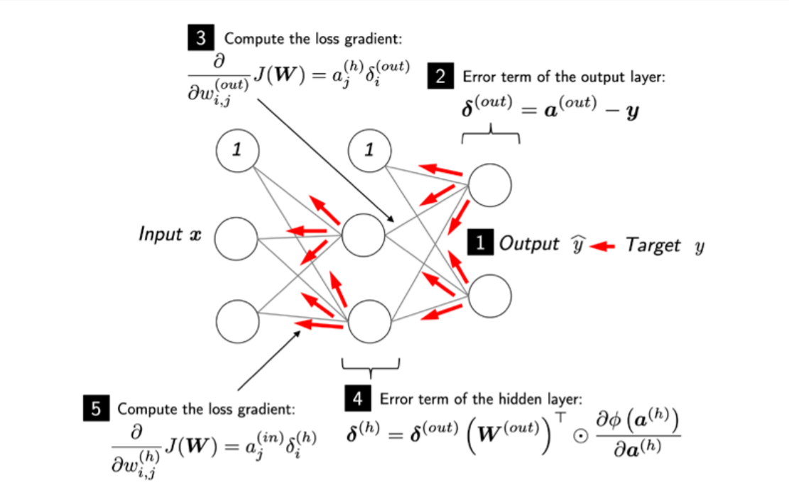
   
   **Forward propagation algorithm:**
   
   ```pseudocode
   for i = 1, 2, ..., n_i do
   	u[i] = x[i]
   end for
   
   for i = n_i + 1, ..., n do
   	A[i] = {u[j]|j ∈ Pa(u[i])}
   	u[i] = f(A[i])
   end for
   
   return u[n]
   ```
   
   * u[n] - scalar is the quantity whose gradient we want to obtain, with respect to the n_i input nodes u[1] to u[n_i].
   * A[i] - is the set of all nodes that are parents of u[i]
   
   **Simplified version of the backprop algorithm:**
   
   1. Run forward propagation to obtain the activations of the network
   2. Initialize grad_table, a data structure that will store the derivatives that have been computed.
   
   ```pseudocode
   grad_table[u[n]] = 1
   for j = n-1 down to 1 do
   	The next line computes du[n]/du[j] = \sum_{i:j∈Pa(u[i])} du[n]/du[i] * du[i]/du[j] using stored 		values:
   	grad_table[u[j]] = \sum_{i:j∈Pa(u[i])} grad_table[u[i]] * du[i]/du[j]
   end for
   return {grad_table[u[i]] | i = 1, ..., n}
   ```
   
   **General backprop algorithm:**
   
   **Require:** T, the target set of variables whose gradient must be computed.
   
   **Require:** G, the computational graph
   
   **Require:** z, the variable to be differentiated
   
   Let G' be G pruned to contain only nodes that ancestors of z and descendants of nodes in T.
   
   Initialize grad_table, a data structure associating tensors to their gradients
   
   ```pseudocode
   grad_table[z] = 1
   for V in T do
   	build_grad(V, G, G`, grad_table)
   end for
   return grad_table
   ```
   
    **build_grad function:**
   
   **Require:** V, the variable whose gradient should be added to G and grad_table. 
   
   **Require:** G, the graph to modify. 
   
   **Require:** G 0, the restriction of G to nodes that participate in the gradient. 
   
   **Require:** grad_table, a data structure mapping nodes to their gradients
   
   ```pseudocode
   if V is in grad_table then
   	return grad_table[V]
   end if
   
   i = 1
   for C in get_consumers(V, G`) do
   	op = get_operation(C)
   	D = build_grad(C, G, G`, grad_table)
   	g[i] = op.bprop(get_inputs(C, G`), V, D)
   	i = i + 1
   end for
   
   g = sum(g[i])
   grad_table[V] = g[i]
   insert g and the operations created it into G
   return G
   ```
   
   * get_operation - This returns the operation that computes V, represented by the edges coming into V in the computational graph.
   * get_consumers - This returns the list of variables that are children of V in the computational graph G.
   * get_inputs - This returns the list of variables that are parents of V in the computational graph G.
   
   
   
   
   
   **Code for this implementation in python-playground/mini_projects/ml_models_implementations/neural_network.py**
   
   
   
   

### Activation functions

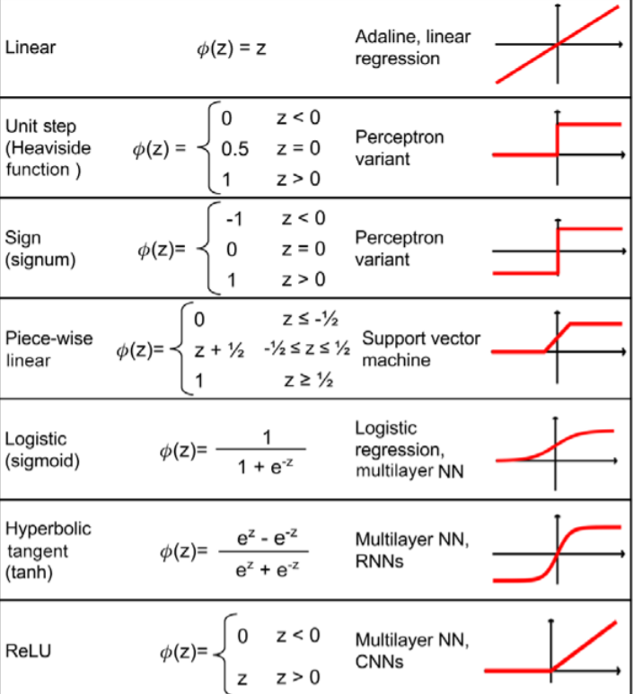


### Exploding gradient and vanishing gradient

Deep learning refers to training neural networks with more than two non-output layers. In the past, it became more difficult to train such networks as the number of layers grew. The two biggest challenges were referred to as the problems of exploding gradient and vanishing gradient as gradient descent was used to train the network parameters. 

While the problem of exploding gradient was easier to deal with by applying simple techniques like gradient clipping and L1 or L2 regularization, the problem of vanishing gradient remained intractable for decades.

During gradient descent, the neural network’s parameters receive an update proportional to the partial derivative of the cost function with respect to the current parameter in each iteration of training. The problem is that in some cases, the gradient will be vanishingly small, effectively preventing some parameters from changing their value. In the worst case, this may completely stop the neural network from further training.

However, the modern implementations of neural network learning algorithms allow you to eectively train very deep neural networks (up to hundreds of layers). This is due to several improvements combined together, including ReLU, LSTM (and other gated units; we consider them below), as well as techniques such as skip connections used in residual neural networks, as well as advanced modifications of the gradient descent algorithm


### Transformer


**Self-attention**

More formally, the output of self-attention is the weighted sum of all input sequences. For instance, for the ith input element, the corresponding output value is computed as follows:
$$
\bold o ^{(i)} = \sum_{j=0}^T\bold W_{ij}\bold x^{(j)}
$$
Here, the weights, 𝑊𝑖j, are computed based on the similarity between the current input element, 𝒙𝒙(𝑖𝑖) , and all other elements in the input sequence. More concretely, this similarity is computed as the dot product between the current input element, 𝒙^(𝑖) , and another element in the input sequence, 𝒙^(𝑗) :
$$
\omega_{ij} = \bold x^{(i)^T}\bold x^{(j)}
$$
After computing these similarity-based weights for the ith input and all inputs in the sequence (𝒙^(𝑖) to 𝒙^(𝑇) ), the "raw" weights (𝜔i0 to 𝜔𝑖T) are then normalized using the familiar softmax function, as follows:
$$
W_{ij} = \frac{exp(\omega_{ij})}{\sum_{j=0}^T exp(\omega_{ij})} = softmax([\omega_{ij}]_{j=0...T})
$$
To recap, let's summarize the three main steps behind the self-attention operation: 

1. For a given input element, 𝒙^(𝑖) , and each jth element in the range [0, T], compute the dot product, 𝒙^(𝑖)^⊤ 𝒙(𝑗) 

2. Obtain the weight, 𝑊𝑖j, by normalizing the dot products using the softmax function 

3. Compute the output, 𝒐(𝑖) , as the weighted sum over the entire input sequence:
   $$
   \bold o ^{(i)} = \sum_{j=0}^T W_{ij}\bold x^{j}
   $$

These steps are further illustrated in the following figure:

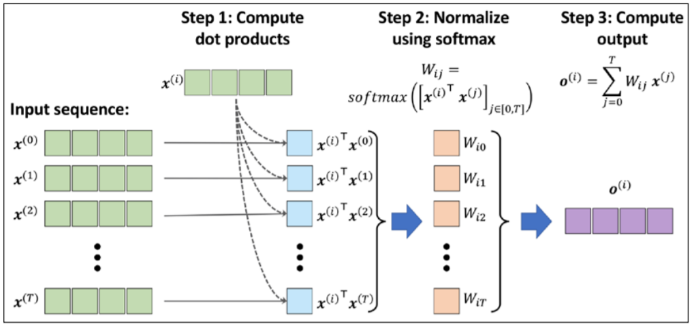

 To make the self-attention mechanism more flexible and amenable to model optimization, we will introduce three additional weight matrices that can be fit as model parameters during model training. We denote these three weight matrices as 𝑼𝑼𝑞𝑞, 𝑼𝑼𝑘𝑘, and 𝑼𝑼𝑣𝑣. They are used to project the inputs into query, key, and value sequence elements:

* query sequence: q^(i) = U_q * x^(i) for i in [0, ..., T]
* key sequence: k^(i) = U_k * x^(i) for i in [0, ... ,T]
* value sequence v^(i) = U_v * x^(i) for i in [0, ..., T]


Another trick that greatly improves the discriminatory power of the self-attention mechanism is multi-head attention (MHA), which combines multiple self-attention operations together.

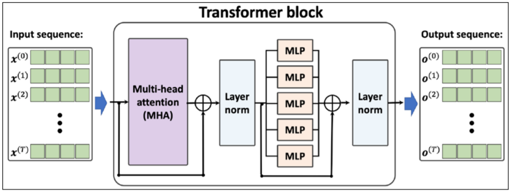

First, the input sequence is passed to the MHA layers, which is based on the self-attention mechanism that we discussed earlier. In addition, the input sequences are added to the output of the MHA layers via the residual connections—this ensures that the earlier layers will receive sufficient gradient signals during training, which is a common trick that is used to improve training speed and convergence.

After the input sequences are added to the output of the MHA layers, the outputs are normalized via layer normalization. These normalized signals then go through a series of MLP (that is, fully connected) layers, which also have a residual connection. Finally, the output from the residual block is normalized again and returned as the output sequence, which can be used for sequence classification or sequence generation.


## Generative Adversarial Networks for Synthesizing New Data


### Starting with autoencoders


Autoencoders can be used as a dimensionality reduction technique as well. In fact, when there is no nonlinearity in either of the two subnetworks (encoder and decoder), then the autoencoder approach is almost identical to PCA. 


### Generative models for synthesizing new data


Autoencoders are deterministic models, which means that after an autoencoder is trained, given an input, x, it will be able to reconstruct the input from its compressed version in a lower-dimensional space. Therefore, it cannot generate new data beyond reconstructing its input through the transformation of the compressed representation. A generative model, on the other hand, can generate a new example, 𝒙𝒙̃, from a random vector, z (corresponding to the latent representation).

However, the major difference between the two is that we do not know the distribution of z in the autoencoder, while in a generative model, the distribution of z is fully characterizable. It is possible to generalize an autoencoder into a generative model, though. One approach is VAEs.

In a VAE receiving an input example, x, the encoder network is modified in such a way that it computes two moments of the distribution of the latent vector: the mean, 𝝁𝝁, and variance, 𝝈𝝈2. During the training of a VAE, the network is forced to match these moments with those of a standard normal distribution (that is, zero mean and unit variance). Then, after the VAE model is trained, the encoder is discarded, and we can use the decoder network to generate new examples, 𝒙𝒙̃, by feeding random z vectors from the "learned" Gaussian distribution.


The objective function of GANs:
$$
V(\theta^{(D)}, \theta^{(G)}) = E_{\bold x ..p_{data}(x)}[log(D(x))] + E_{z..p_z(z)}[log(1 - D(G(z)))]
$$


One training step of a GAN model with such a value function requires two optimization steps: (1) maximizing the payoff for the discriminator and (2) minimizing the payoff for the generator. 

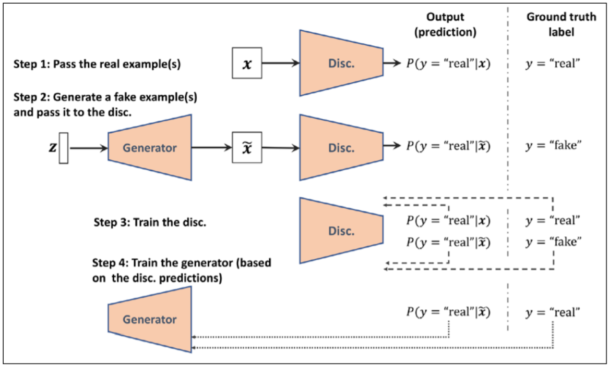


### Batch Normalization

One of the main ideas behind BatchNorm is normalizing the layer inputs and preventing changes in their distribution during training, which enables faster and better convergence.

Assume that we have the net preactivation feature maps obtained after a convolutional layer in a four-dimensional tensor, Z, with the shape [𝑚𝑚 × ℎ × 𝑤𝑤 × 𝑐𝑐] , where m is the number of examples in the batch (i.e., batch size), ℎ × 𝑤𝑤 is the spatial dimension of the feature maps, and c is the number of channels. BatchNorm can be summarized in three steps, as follows:

1. Compute the mean and standard deviation of the net inputs for each mini-batch:
   $$
   \mu_B = \frac{1}{m * h*w}\sum_{i,j,k}Z^{[i,j,k,]}
   \\
   \sigma_B^2 = \frac{1}{m * h*w}\sum_{i,j,k}(Z^{[i,j,k,]} - \mu_B)^2
   $$

2. Standardized the net inputs for all example in the batch

3. Scale and shifts the normalized net inputs using two learnable parameter vector, \gamma and \beta, of size c (number of channels):
   $$
   \bold A^{[i]}_{pre} = \gamma \bold Z_{std} ^{[i]} + \beta
   $$


### Temporal difference learning


In TD learning, we can leverage some of the learned properties to update the estimated values before reaching the end of the episode. 

Let's first revisit the value prediction by MC. At the end of each episode, we are able to estimate the return 𝐺𝐺𝑡𝑡 for each time step t. Therefore, we can update our estimates for the visited states as follows:
$$
V(S_t) = V(S_t) + \alpha(G_t - V(S_t))
$$


## Convolutional Neural Networks


Certain types of NNs, such as CNNs, are able to automatically learn the features from raw data that are most useful for a particular task. For this reason, it's common to consider CNN layers as feature extractors: the early layers (those right after the input layer) extract low-level features from raw data, and the later layers (often fully connected layers like in a multilayer perceptron (MLP)) use these features to predict a continuous target value or class label.

#### **Discrete convolutions in one dimension**

A discrete convolution for two vectors, x and w, is denoted by 𝒚𝒚 = 𝒙𝒙 ∗ 𝒘𝒘, in which vector x is our input (sometimes called signal) and w is called the filter or kernel. A discrete convolution is mathematically defined as follows:
$$
y = x*w => y[i] = \sum_{k=-\inf}^{+\inf}x[i-k]w[k]
$$
The sum from -inf to +inf solves with padding:

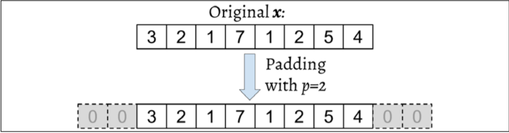

Let's assume that the original input, x, and filter, w, have n and m elements, respectively, where 𝑚 ≤ 𝑛. Therefore, the padded vector, 𝒙^𝑝, has size n + 2p. The practical formula for computing a discrete convolution will change to the following:
$$
y = x*w =>y[i] = \sum_{k=0}^{k = m-1} x^p[i+m-k]w[k]
$$
Now that we have solved the infinite index issue, the second issue is indexing x with i + m – k. The important point to notice here is that x and w are indexed in different directions in this summation. Computing the sum with one index going in the reverse direction is equivalent to computing the sum with both indices in the forward direction after flipping one of those vectors, x or w, after they are padded. 

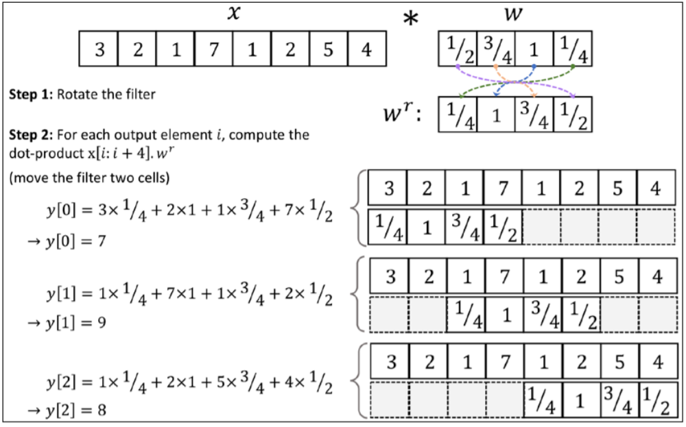

There are three modes of padding that are commonly used in practice: full, same, and valid: 

* In full mode, the padding parameter, p, is set to p = m – 1. Full padding increases the dimensions of the output; thus, it is rarely used in CNN architectures. 
* Same padding is usually used to ensure that the output vector has the same size as the input vector, x. In this case, the padding parameter, p, is computed according to the filter size, along with the requirement that the input size and output size are the same. 
* Finally, computing a convolution in the valid mode refers to the case where p = 0 (no padding).

In practice, it is recommended that you preserve the spatial size using same padding for the convolutional layers and decrease the spatial size via pooling layers instead.


#### Performing a discrete convolution in 2D

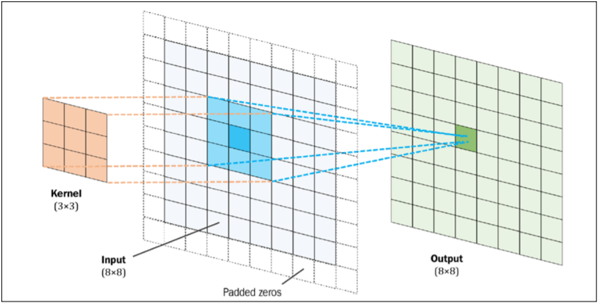


```python
import numpy as np
import scipy.signal

def conv2d(X, W, p=(0,0), s=(1,1)):
  W_rot = np.array(W)[::-1, ::-1]
  X_orig = np.array(X)
  n1 = X_orig.shape[0] + 2*p[0]
  n2 = X_orig.shape[0] + 2*p[1]
  X_padded = np.zeros(shape=(n1, n2))
  X_padded[p[0]:p[0]+X_orig.shape[0],
           p[1]:p[1]+X_orig.shape[1]] = X_orig
  res = []
  for i in range(0, int((X_padded.shape[0] - \
                         W_rot.shape[0])/s[0])+1, s[0]):
    res.append([])
    for j in range(0, int((X_padded.shape[1] - \
                           W_rot.shape[1])/s[1])+1, s[1]):
      X_sub = X_padded[i:i+W_rot.shape[0], j:j+W_rot.shape[1]]
      res[-1].append(np.sum(X_sub*W_rot))
  return np.array(res)
```

#### Determining the size of the convolution output

The output size of a convolution is determined by the total number of times that we shift the filter, w, along the input vector. Let's assume that the input vector is of size n and the filter is of size m. Then, the size of the output resulting from 𝒚𝒚 = 𝒙𝒙 ∗ 𝒘𝒘, with padding, p, and stride, s, would be determined as follows:
$$
o = floor(\frac{n + 2p - m}{s}) + 1
$$


### Transposed convolution

 While a convolution operation is usually used to downsample the feature space, a transposed convolution operation is usually used for upsampling the feature space. Upsampling feature maps using transposed convolution works by inserting 0s between the elements of the input feature maps.

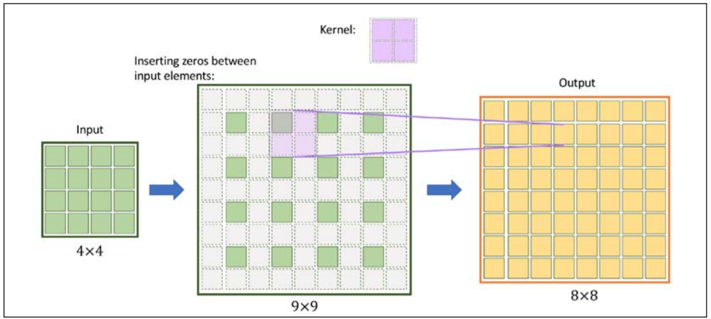


#### Subsampling layers

Subsampling is typically applied in two forms of pooling operations in CNNs: max-pooling and mean-pooling (also known as average-pooling).

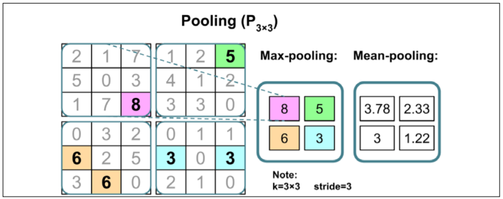

Traditionally, pooling is assumed to be nonoverlapping. Pooling is typically performed on nonoverlapping neighborhoods, which can be done by setting the stride parameter equal to the pooling size.


#### Implementing CNN

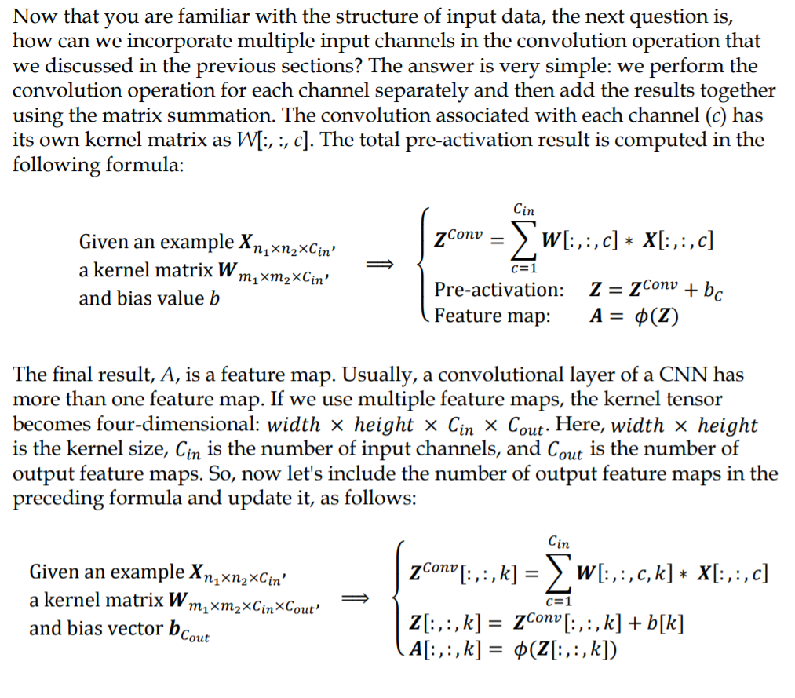


## Recurrent Neural Networks

Recurrent neural networks (RNNs) are used to label, classify, or generate sequences.


Each training example is a matrix in which each row is a feature vector. For simplicity, let’s illustrate this matrix as a sequence of vectors X = [x1, x2,..., xt≠1, xt , xt+1,..., xlengthX ], where lengthX is the length of the input sequence. If our input example X is a text sentence, then feature vector xt for each t = 1, . . . , lengthX represents a word in the sentence at position t. As depicted in Figure 8, in an RNN, the feature vectors from an input example are “read” by the neural network sequentially in the order of the timesteps. The index t denotes a timestep. To update the state ht l,u at each timestep t in each unit u of each layer l we first calculate a linear combination of the input feature vector with the state vector ht≠1 l,u of this same layer from the previous timestep, t ≠ 1. The linear combination of two vectors is calculated using two parameter vectors wl,u, ul,u and a parameter bl,u. The value of ht l,u is then obtained by applying activation function g1 to the result of the linear combination. A typical choice for function g1 is tanh. The output yt l is typically a vector calculated for the whole layer l at once. To obtain yt l, we use activation function g2 that takes a vector as input and returns a dierent vector of the same dimensionality. The function g2 is applied to a linear combination of the state vector values ht l,u calculated using a parameter matrix Vl and a parameter vector cl,u. 

#### **Different architectures of RNN**

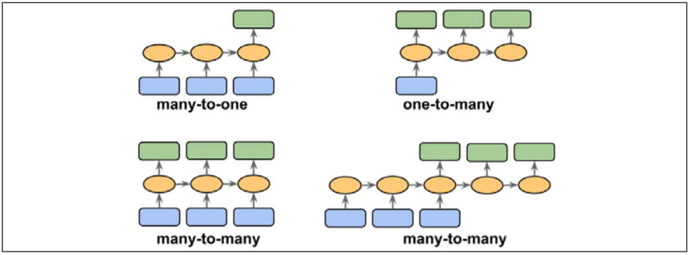

* Many-to-one: The input data is a sequence, but the output is a fixed-size vector or scalar, not a sequence. For example, in sentiment analysis, the input is text-based (for example, a movie review) and the output is a class label (for example, a label denoting whether a reviewer liked the movie). 
* One-to-many: The input data is in standard format and not a sequence, but the output is a sequence. An example of this category is image captioning— the input is an image and the output is an English phrase summarizing the content of that image
* Many-to-many: Both the input and output arrays are sequences. This category can be further divided based on whether the input and output are synchronized. An example of a synchronized many-to-many modeling task is video classification, where each frame in a video is labeled. An example of a delayed many-to-many modeling task would be translating one language into another. For instance, an entire English sentence must be read and processed by a machine before its translation into German is produced.

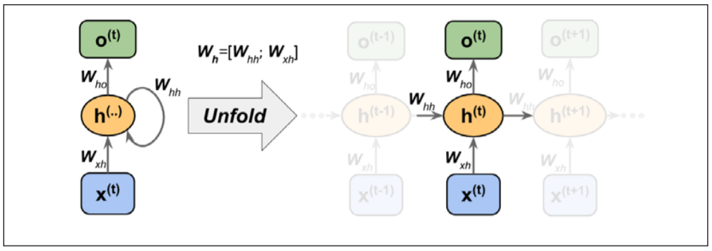

Each directed edge (the connections between boxes) in the representation of an RNN that we just looked at is associated with a weight matrix. Those weights do not depend on time, t; therefore, they are shared across the time axis. The different weight matrices in a single-layer RNN are as follows:

* 𝑾𝑥ℎ: The weight matrix between the input, 𝒙(𝑡) , and the hidden layer, h 
* 𝑾ℎℎ: The weight matrix associated with the recurrent edge 
* 𝑾ℎ𝑜: The weight matrix between the hidden layer and output layer

Computing the activations:
$$
\bold z_h^{(t)} = \bold W _{xh} \bold x^{(t)} + \bold W_{hh} \bold h ^{t-1} + \bold b _h
\\
\bold h^{(t)} = \phi_h(\bold z_h^{(t)})
$$
#### **Backpropagation through time**

The derivation of the gradients might be a bit complicated, but the basic idea is that the overall loss, L, is the sum of all the loss functions at times t = 1 to t = T. Since the loss at time t is dependent on the hidden units at all previous time steps 1 : t, the gradient will be computed as follows:
$$
L = \sum_{t=1}^T L^{(t)}
\\
\frac{dL^{(t)}}{d\bold W_{hh}} = \frac{dL^{(t)}}{d\bold o^{(t)}} \frac{d\bold o^{(t)}}{d\bold h^{(t)}}(\sum_{k=1}^t \frac {d\bold h^{(t)}}{d\bold h^{(k)}} \frac{d\bold h^{(k)}}{d\bold W_{hh}})
\\
\frac {d\bold h^{(t)}}{d\bold h^{(k)}} = \prod_{i=k+1}^{t} \frac {d\bold h^{(i)}}{d\bold h^{(i-1)}}
$$

#### **Hidden-recurrence versus output-recurrence**

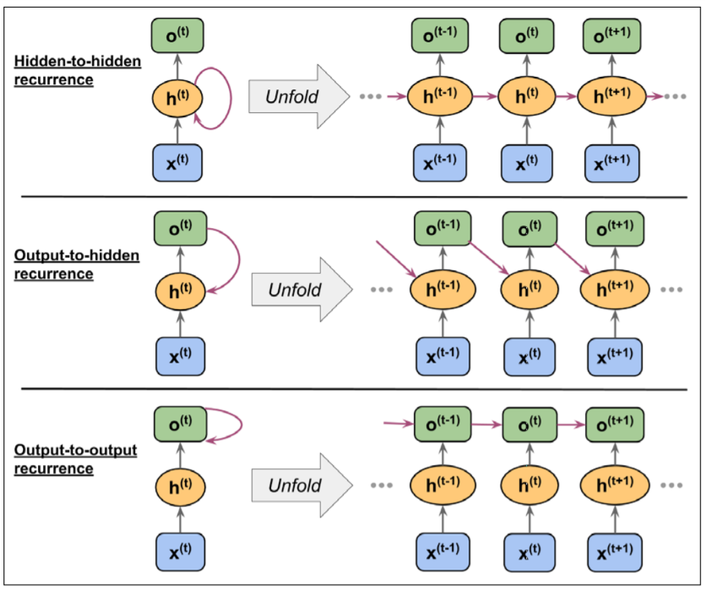

#### LSTM

The most effective recurrent neural network models used in practice are gated RNNs. These include the long short-term memory (LSTM) networks and networks based on the gated recurrent unit (GRU). The beauty of using gated units in RNNs is that such networks can store information in their units for future use, much like bits in a computer’s memory

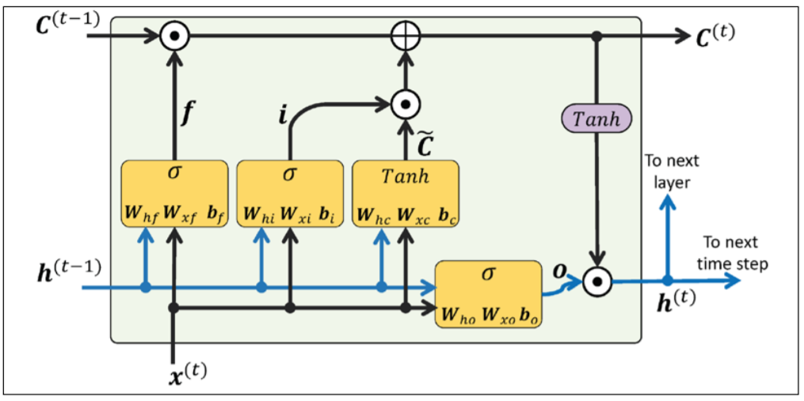


In an LSTM cell, there are three different types of gates, which are known as the forget gate, the input gate, and the output gate: 

* The forget gate ( 𝒇𝑡) allows the memory cell to reset the cell state without growing indefinitely. In fact, the forget gate decides which information is allowed to go through and which information to suppress. Now, 𝒇𝑡 is computed as follows:
  $$
  \bold f_t = \sigma(\bold W_{xf} \bold x^{(t)} + \bold W_{hf} \bold h ^{(t-1)} + \bold b_f)
  $$

* The input gate (𝒊𝑡) and candidate value {\hat C_t} are responsible for updating the cell state. They are computed as follows:
  $$
  \bold i _t = \sigma (\bold W _{xi} \bold x^{(t)} + \bold W _{hi}\bold h ^{(t-1)} + \bold b_i)
  \\
  \bold{\hat C_t} = tanh(\bold W_{xc}\bold x^{(t)} + \bold W_{hc} \bold h^{(t-1)} +\bold b_c)
  $$
  The cell state at time t is computed as follows:
  $$
  C^{(t)} = (C^{(t-1)} ⊙f_t) ⨁ (i_t ⊙{\hat  C_t})
  $$

* The output gate (𝒐𝑡) decides how to update the values of hidden units:
  $$
  \bold o_t = \sigma(\bold W_{xo} \bold x^{(t)} + \bold W_{ho} \bold h ^{(t-1)} + \bold b_o)
  $$

Given this, the hidden units at the current time step are computed as follows: 
$$
\bold h_t = \bold o_t ⊙ tanh(\bold C ^{(t)})
$$


```python
# import necessary libraries
import numpy as np
import tensorflow as tf
from google.colab import drive
import os
drive.mount('drive')
os.chdir('drive/My Drive/vern/')


#read file
with open('1268-0.txt', 'r') as tf:
  text = tf.read()

#crop useful text
start_index = text.find('THE MYSTERIOUS ISLAND')
end_index = text.find('End of the Project Gutenberg')
text = text[start_index:end_index]
#find unique characters in text
char_set = set(text)
#create dict to convert characters to integers
char_sorted = sorted(char_set)
chr2int = {ch:i for i, ch in enumerate(char_sorted)}
char_array = np.array(char_sorted)
int2chr = {i:ch for i, ch in enumerate(char_sorted)}
#encode data, create tensor
text_encoded = np.array([chr2int[ch] for ch in text], dtype=np.int32)
ds_text_encoded = tf.data.Dataset.from_tensor_slices(text_encoded)
#create x (input) and y(target) sequences
seq_length = 40
chunk_size = seq_length + 1
ds_chunks = ds_text_encoded.batch(chunk_size, drop_remainder=True)
def split_input_target(chunk):
  input_seq = chunk[:-1]
  target_seq = chunk[1:]
  return input_seq, target_seq
ds_sequences = ds_chunks.map(split_input_target)

#create batches
BATCH_SIZE = 64
BUFFER_SIZE = 10000
ds = ds_sequences.shuffle(BUFFER_SIZE).batch(BATCH_SIZE)

#build model
def build_model(vocab_size, embedding_dim,rnn_units):
  model = tf.keras.models.Sequential([
                                      tf.keras.layers.Embedding(vocab_size, embedding_dim),
                                      tf.keras.layers.LSTM(rnn_units,
                                                           return_sequences=True),
                                      tf.keras.layers.Dense(vocab_size)
  ])
  return model

charset_size = len(char_array)
embedding_dim = 256
rnn_units = 512

tf.random.set_seed(1)
#compile and train
model = build_model(charset_size, embedding_dim, rnn_units)
model.compile(optimizer='adam',
              loss=tf.keras.losses.SparseCategoricalCrossentropy(from_logits=True))
model.fit(ds, epochs=20)
```

Other important extensions to RNNs include bi-directional RNNs, RNNs with attention and sequence-to-sequence RNN models. The latter, in particular, are frequently used to build neural machine translation models and other models for text to text transformations. A generalization of an RNN is a recursive neural network.


## Reinforcement Learning


### Markov decision processes


The Markov decision process, or MDP, is simply a process that models how the AI interacts with the environment over time.

The standard approach for solving MDP problems is by using dynamic programming, but RL offers some key advantages over dynamic programming.

The types of problems that require learning an interactive and sequential decision making process, where the decision at time step t affects the subsequent situations, are mathematically formalized as Markov decision processes (MDPs).
$$
p(s',r|s,a) =^{def} P(S_{t+1}=s', R_{t+1} = r | S_t = s, A_t = a) 
$$
Where p() - conditional probability over the preceding state S_t and taken action A_t.

This probability distribution completely defines the dynamics of the environment (or model of the environment) because, based on this distribution, all transition probabilities of the environment can be computed. Therefore, the environment dynamics are a central criterion for categorizing different RL methods. The types of RL methods that require a model of the environment or try to learn a model of the environment (that is, the environment dynamics) are called model-based methods, as opposed to model-free methods.

The environment dynamics can be considered deterministic if particular actions for given states are always or never taken, that is,p () ∈ {0,1}. Otherwise, in the more general case, the environment would have stochastic behavior.

A Markov process can be represented as a directed cyclic graph in which the nodes in the graph represent the different states of the environment. The edges of the graph (that is, the connections between the nodes) represent the transition probabilities between the states.


As the agent interacts with the environment, the sequence of observations or states forms a trajectory. There are two types of trajectories. If an agent's trajectory can be divided into subparts such that each starts at time t = 0 and ends in a terminal state 𝑆_𝑇 (at t = T), the task is called an episodic task. On the other hand, if the trajectory is infinitely continuous without a terminal state, the task is called a continuing task. The task related to a learning agent for the game of chess is an episodic task, whereas a cleaning robot that is keeping a house tidy is typically performing a continuing task. 


The so-called **return** at time t is the cumulated reward obtained from the entire duration of an episode. The return at time t can then be calculated from the immediate reward as well as the subsequent ones, as follows:
$$
G_t = R_{t+1} + \gamma R_{t+2} + \gamma^2 R_{t+3} + ... = \sum_{k=0}\gamma^k R_{t+k+1}
$$
Here, 𝛾𝛾 is the discount factor in range [0, 1]. The parameter 𝛾𝛾 indicates how much the future rewards are "worth" at the current moment (time t). Note that by setting 𝛾𝛾 = 0, we would imply that we do not care about future rewards

A **policy** typically denoted by 𝜋𝜋(𝑎𝑎|𝑠𝑠) is a function that determines the next action to take, which can be either deterministic, or stochastic (that is, the probability for taking the next action). A stochastic policy then has a probability distribution over actions that an agent can take at a given state:
$$
\pi(a|s) = P[A=a|S=s]
$$
The **value function**, also referred to as the state-value function, measures the goodness of each state—in other words, how good or bad it is to be in a particular state. Now, based on the return 𝐺𝐺𝑡𝑡, we define the value function of state s as the expected return (the average return over all possible episodes) after following policy 𝜋𝜋:
$$
v_{\pi}(s) = E_{\pi}[G_t | S_t = s] = E_{\pi}[\sum_{k=0} \gamma^{k+1} R_{t+k+1} | S_t = s]
$$
Moreover, we can also define a value for each state-action pair, which is called the action-value function and is denoted by 𝑞𝑞𝜋𝜋(𝑠𝑠, 𝑎𝑎). The action-value function refers to the expected return 𝐺𝐺𝑡𝑡 when the agent is at state 𝑆𝑆𝑡𝑡 = 𝑠𝑠 and takes action 𝐴𝐴𝑡𝑡 = 𝑎𝑎. Extending the definition of state-value function to state-action pairs, we get the following:
$$
q_{\pi}(s, a) = E_{\pi}[G_t | S_t = s, A_t = a] = E_{\pi}[\sum_{k=0} \gamma^{k+1} R_{t+k+1} | S_t = s, A_t = a]
$$
In short, the return is the weighted sum of rewards for an entire episode, which would be equal to the discounted final reward in our chess example (since there is only one reward). The value function is the expectation over all possible episodes, which basically computes how "valuable" it is on average to make a certain move.


### The Thompson Sampling model


Each slot machine has its own Beta distribution. Over the rounds, the Beta distribution of the slot machine with the highest conversion rate will be progressively shifted to the right, and the Beta distributions of the strategies with lower conversion rates will be progressively shifted to the left. Therefore,  the slot machine with the highest conversion rate will be selected more and more.

```python
# Importing the libraries
import numpy as np

# Setting conversion rates and the number of samples
conversionRates = [0.15, 0.04, 0.13, 0.11, 0.05]
N = 10000
d = len(conversionRates)

# Creating the dataset
X = np.zeros((N, d))
for i in range(N):
 for j in range(d):
 if np.random.rand() < conversionRates[j]:
 X[i][j] = 1

# Making arrays to count our losses and wins
nPosReward = np.zeros(d)
nNegReward = np.zeros(d)

# Taking our best slot machine through beta distribution and updating
its losses and wins
for i in range(N):
 selected = 0
 maxRandom = 0
    
 for j in range(d):
 	randomBeta = np.random.beta(nPosReward[j] + 1, nNegReward[j] + 1)
 	if randomBeta > maxRandom:
 		maxRandom = randomBeta
 		selected = j
        
 if X[i][selected] == 1:
 	nPosReward[selected] += 1
 else:
 	nNegReward[selected] += 1
    
# Showing which slot machine is considered the best
nSelected = nPosReward + nNegReward
for i in range(d):
 print('Machine number ' + str(i + 1) + ' was selected ' + str(nSelected[i]) + ' times')

print('Conclusion: Best machine is machine number ' + str(np.argmax(nSelected) + 1))
```


### Q-Learning


Q-learning fundamentals:

1. Q-learning is a Reinforcement Learning model. 
2. Q-learning works on the inputs (states) and outputs (actions) principle. 
3. Q-learning works on a predefined environment, including the states (the inputs), the actions (the outputs), and the rewards. 
4. Q-learning is modeled by a Markov decision process. 
5. Q-learning uses a training mode, during which the parameters that are learned are called the Q-values, and an inference mode.
6. There are a finite number of states (there is not an infinity of possible inputs). 
7. There are a finite number of actions (only a certain number of actions can be performed).


**Example: The Maze**


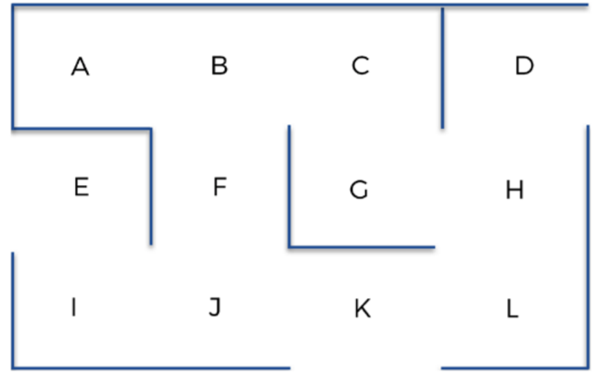


**The state**, at a specific time or specific iteration, is simply going to be the position of the AI at that time (letter A-L where agent in specific time).

**The actions** are simply going to be the next moves the AI can make to go from one location to the next.

**The reward:**

1. Initialize the matrix (where the rows correspond to the states, columns correspond to the actions) with 1 to the actions robot can perform and 0 to the actions robot cannot perform. 
2. Put very high reward to goal location (G state).  

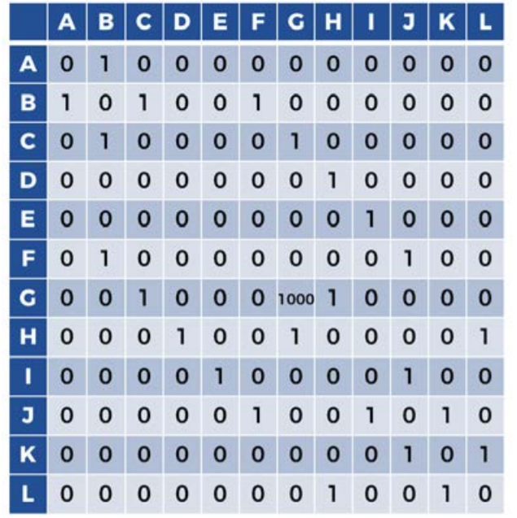


**Building AI:**


1. **The Q-value** - to each couple of state and action (s, a) we are going to associated a numeric value Q(s, a).

   The Q-values measure the accumulation of "good surprise" or "frustration" associated with the couple of action and state ( ) ,t t s a . In the "good surprise" case of a high temporal difference, the AI is reinforced, and in the "frustration" case of a low temporal difference, the AI is weakened. We want to learn the Q-values that will give the AI the maximum "good surprise," and that's exactly what the Bellman equation does by updating the Q-values at each iteration.

2. **The temporal difference** - lets say we are in specific state s_t, at a specific time t. Let's just perform random action.  The temporal difference (TD) represents how well the AI is learning.

   The TD:
   $$
   TD_t(s_t, a_t) = [R(s_t, a_t) + \gamma max_a(Q(s_{t+1}, a))] - Q(s_t, a_t)
   $$

   * [...] - the reward obtained by performing action a in the state s, plus the Q-value of the best action performed in future state. discounted by a factor gamma {0, 1}.
   * Q(s_t, a_t) - the Q-value of the action a_t, performing in the state s_t.

   

   Here's how it works exactly, with respect to the training process (during which the Q-values are learned): 

   1. At the beginning of the training, the Q-values are set to zero. Since the AI is looking to get the good rewards (here 1 or 1000), it is looking for the high temporal differences. Accordingly, if in the first iterations,  TD_t (s_t, a_t) is high, the AI gets a "pleasant surprise" because that means the AI was able to find a good reward. On the other hand, if TD_t (s_t, a_t)  is small, the AI gets a "frustration." 
   2. When the AI gets a great reward, the specific Q-value of the (state, action) that led to that great reward increases, so the AI can remember how it got to that high reward (you'll see exactly how it increases in the next section). For example, let's say that it was the action t a performed in the state t s that led to that high reward R(s_t, a_t) . That would mean the Q-value Q(s_t, a_t) increases automatically (remember, you'll see how in the next section). Those increased Q-values are important information, because they indicate to the AI which transitions lead to the good rewards.
   3. The next step of the AI is not only to look for the great rewards, but also to look at the same time for the high Q-values. Why? Because the high Q-values are the ones that lead to the great reward. In fact, the high Q-values are the ones that lead to higher Q-values, themselves leading to even higher Q-values, themselves leading eventually to the highest reward (1000). That's the role of gamma Q()  in the temporal difference formula. The AI looks for the high Q-values, and as soon as it finds them, the Q-values of the (state, action) that led to these high Q-values will increase again, since they indicate the right path towards the goal. 
   4. At some point, the AI will know all the transitions that lead to the good rewards and high Q-values. Since the Q-values of these transitions have already been increased over time, the temporal differences decrease in the end. In fact, the closer we get to the final goal, the smaller the temporal differences become.

3. **The Bellman equation**.

   In order to perform better and better actions that will lead the AI to reach its goal, you have to increase the Q-values of actions when you find high temporal differences. At each iteration, you update the Q-values from time t-1 (previous iteration) to t (current iteration) through the following equation, called the Bellman equation:
   $$
   Q_t(s_t, a_t) = Q_{t-1}(s_t, a_t) + \alpha TD_t(s_t, a_t)
   $$

4. 

**Training mode:**

1. Initialization: for all couples of states and actions, the Q-values are initialize to 0.

2. At each iteration t >= 1 repeat:

   2.1. Select random state s_t from possible states

   2.2. Perform random action a_t, that can lead to next possible state

   2.3. Reach state s_t+1, get reward R(s_t, a_t)

   2.4. Compute TD

   2.5. Update Q-learning by applying Bellman equation

**Inference mode:**

1. In state s_t perform action a_t, that has highest Q-value for state s_t.


### Deep Q-learning

Initialization: 

1. Initialize the memory of the experience replay to an empty list M. 
2. Choose a maximum size for the memory. 

At each time t, we repeat the following process, until the end of the epoch: 

1. Predict the Q-values of the current state s_t. 

2. Perform the action selected by the Softmax method:
   $$
   a_t = Softmax(Q(s_t, a))
   $$

3. Get the reward R(s_t, a_t).

4. Reach the next state s_t+1.

5. Append the transition (s_t, a_t, r_t, s_t+1) to the memory M. 

6. Take a random batch B ⊂ M of transitions. For all the transitions of batch B:

   * Get the predictions: Q(s_tB, a_tB)

   * Get the targets:
     $$
     R(s_t, a_t) + \gamma max_a(Q(s_{t_B}, a_{t_B}))
     $$

   * Compute the loss between the predictions and target, over whole batch B:
     $$
     Loss = \frac{1}{2} \sum_B (R(s_{t_B}, a_{t_B}) + \gamma max_a (Q(s_{t_B+1}, a)) - Q(s_{t_B}, a_{t_B}))^2 = \frac{1}{2} \sum_B TD_{t_B}(s_{t_B}, a_{t_B})^2
     $$

   * Back-propagate this loss error back into neural network, and through SGD update the weights according to how much contributed to the loss error.


### Reinforcement Learning with Monte Carlo

For MC-based RL, we define an agent class that follows a probabilistic policy, 𝜋𝜋, and based on this policy, our agent takes an action at each step. This results in a simulated episode.

After generating a set of episodes, for each state, s, the set of episodes that all pass through state s is considered for calculating the value of state s. Let's assume that a lookup table is used for obtaining the value corresponding to the value function, 𝑉𝑉(𝑆𝑆𝑡𝑡 = 𝑠𝑠). MC updates for estimating the value function are based on the total return obtained in that episode starting from the first time that state s is visited. This algorithm is called first-visit Monte Carlo value prediction.

MC control refers to the optimization procedure for improving a policy. Similar to the policy iteration approach in previous section (Dynamic programming), we can repeatedly alternate between policy evaluation and policy improvement until we reach the optimal policy. So, starting from a random policy, 𝜋𝜋0, the process of alternating between policy evaluation and policy improvement can be illustrated as follows:

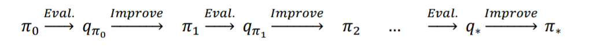

Given an action-value function, q(s, a), we can generate a greedy (deterministic) policy as follows:
$$
\pi (s) = argmax(q (s,a))
$$
In order to avoid the lack-of-exploration problem, and to consider the non-visited state-action pairs as discussed earlier, we can let the non-optimal actions have a small chance (𝜖𝜖) to be chosen. This is called the 𝜖𝜖-greedy policy, according to which, all non-optimal actions at state s have a minimal (1)  probability of being selected (instead of 0), and the optimal action has a probability of (2) (instead of 1).
$$
\frac{\epsilon}{|A(s)|} (1)
\\
1 - \frac{(|A(s)| - 1)*\epsilon}{|A(s)|}(2)
$$


## Computer Vision


### Histogram of Oriented Gradients

The Histogram of Gradients is a straightforward feature extraction procedure that was developed in the context of identifying pedestrians within images. HOG involves the following steps: 

1. Optionally prenormalize images. This leads to features that resist dependence on variations in illumination.
2. Convolve the image with two filters that are sensitive to horizontal and vertical brightness gradients. These capture edge, contour, and texture information. 
3. Subdivide the image into cells of a predetermined size, and compute a histogram of the gradient orientations within each cell.
4. Normalize the histograms in each cell by comparing to the block of neighboring cells. This further suppresses the effect of illumination across the image. 
5. Construct a one-dimensional feature vector from the information in each cell.

```python
from skimage import data, color, feature
import skimage.data
 
image = color.rgb2gray(data.chelsea())
hog_vec, hog_vis = feature.hog(image, visualise=True)

fig, ax = plt.subplots(1, 2, figsize=(12, 6),
                       subplot_kw=dict(xticks=[], yticks=[]))

ax[0].imshow(image, cmap='gray')
ax[0].set_title('input image')

ax[1].imshow(hog_vis)
ax[1].set_title('visualization of HOG features');

```

**HOG in Action: A Simple Face Detector** 

Using these HOG features, we can build up a simple facial detection algorithm with any Scikit-Learn estimator; here we will use a linear support vector machine. 

The steps are as follows: 

1. Obtain a set of image thumbnails of faces to constitute “positive” training samples. 
2. Obtain a set of image thumbnails of nonfaces to constitute “negative” training samples. 
3. Extract HOG features from these training samples.
4. Train a linear SVM classifier on these samples.
5. For an “unknown” image, pass a sliding window across the image, using the model to evaluate whether that window contains a face or not. 
6. If detections overlap, combine them into a single window.


## Natural language processing


### Latent Dirichlet Allocation

LDA is a generative probabilistic model that tries to find groups of words that appear frequently together across different documents. These frequently appearing words represent our topics, assuming that each document is a mixture of different words. The input to an LDA is the bag-of-words model that we discussed earlier in this chapter. Given a bag-of-words matrix as input, LDA decomposes it into two new matrices: 

* A document-to-topic matrix 
* A word-to-topic matrix

LDA decomposes the bag-of-words matrix in such a way that if we multiply those two matrices together, we will be able to reproduce the input, the bag-of-words matrix, with the lowest possible error. 


In particular, we have a collection of documents, each of which is a list of words. And we have a corresponding collection of document_topics that assigns a topic (here a number between 0 and K – 1) to each word in each document. We can estimate the likelihood that topic 1 produces a certain word by comparing how many times topic 1 produces that word with how many times topic 1 produces any word. 

We start by assigning every word in every document a topic completely at random. Now we go through each document one word at a time. For that word and document, we construct weights for each topic that depend on the (current) distribution of topics in that document and the (current) distribution of words for that topic. We then use those weights to sample a new topic for that word. If we iterate this process many times, we will end up with a joint sample from the topic–word distribution and the document– topic distribution.


## MapReduce


Imagine we have a collection of items we’d like to process somehow. For instance, the items might be website logs, the texts of various books, image files, or anything else. A basic version of the MapReduce algorithm consists of the following steps: 

1. Use a mapper function to turn each item into zero or more key/value pairs. (Often this is called the map function, but there is already a Python function called map and we don’t need to confuse the two.) 
2. Collect together all the pairs with identical keys. 
3. Use a reducer function on each collection of grouped values to produce output values for the corresponding key.

### Example: Counting Words

For example, your VP of Content wants to know what sorts of things people are talking about in their status updates. First, we need a function that turns a document into a sequence of key/value pairs. We’ll want our output to be grouped by word, which means that the keys should be words. And for each word, we’ll just emit the value 1 to indicate that this pair corresponds to one occurrence of the word:

```python
from typing import Iterator, Tuple
def wc_mapper(document: str) -> Iterator[Tuple[str, int]]:
 """For each word in the document, emit (word, 1)"""
 for word in tokenize(document):
 yield (word, 1)
```

Skipping the “plumbing” step 2 for the moment, imagine that for some word we’ve collected a list of the corresponding counts we emitted. To produce the overall count for that word, then, we just need:

```python
from typing import Iterable
def wc_reducer(word: str,
               counts: Iterable[int]) -> Iterator[Tuple[str, int]]:
 """Sum up the counts for a word"""
 yield (word, sum(counts))
```

Returning to step 2, we now need to collect the results from wc_mapper and feed them to wc_reducer. Let’s think about how we would do this on just one computer:

```python
from collections import defaultdict
def word_count(documents: List[str]) -> List[Tuple[str, int]]:
 """Count the words in the input documents using MapReduce"""
 collector = defaultdict(list) # To store grouped values
 for document in documents:
 	for word, count in wc_mapper(document):
 		collector[word].append(count)
 return [output
         for word, counts in collector.items()
         for output in wc_reducer(word, counts)]
```


